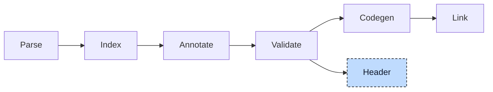

# Header Generator

A project can call functions that are written in C and linked in as a library, and C code can call the functions and read the variables of a project. Both sides need the same declarations. For

```iecst
FUNCTION scale : DINT
    VAR_INPUT
        value : DINT;
        factor : INT;
    END_VAR
    VAR_IN_OUT
        total : DINT;
    END_VAR
END_FUNCTION
```

the C side needs `int32_t scale(int32_t value, int16_t factor, int32_t* total);`, and has to get it right: `INT` is 16 bits, an in-out parameter is a pointer, and the name is not mangled. Writing these by hand for every function, struct, and function block is error-prone, so the compiler writes them. The header generator takes the parsed and indexed project and renders its declarations as a C header, using the same layout and calling rules that codegen applies.



The generator runs after validation, in place of codegen: the run stops once the headers are written and no object file is produced. It reads the declarations of every unit and the global index; the bodies are never looked at.


## Invocation

There are two ways to ask for headers, and both stop the pipeline after validation:

| Command | Headers | Name |
|---|---|---|
| `plc --generate-headers a.st b.st` | one per source file, next to it | `a.h`, `b.h` |
| `plc --generate-headers a.st b.st -o api` | one combined header | `api.h` |
| `plc generate plc.json headers` | one per file of the build description | source name, or `--header-prefix` |

`--header-output <dir>` moves the headers into a directory that is created when missing. A unit whose declarations are all external or included, such as an `-i` include file, produces an empty model and no file. The include guard is the header path in upper case with every other character turned into `_`: `motor.h` gets `MOTOR_H_`.

Only C is implemented; `--header-language rust` is accepted by the command line and rejected by the generator. The `--include-stubs` flag is parsed and ignored.


## From declarations to a template

Generation has two halves. The first walks the unit and fills a language-neutral model of what the header must contain; the second renders that model through a text template for the target language. The model is small:

```rust
pub struct TemplateData {
    /// Aliases (typedefs), structs, and enums
    pub user_defined_types: UserDefinedTypes,

    /// extern declarations, including one instance per program
    pub global_variables: Vec<Variable>,

    /// Prototypes: functions, function block bodies, methods, actions
    pub functions: Vec<Function>,
}

pub struct Variable {
    /// Already a C type name, such as `int32_t` or `Point*`
    pub data_type: String,

    pub name: String,

    /// Default, Array(size), MultidimensionalArray(sizes), Declaration(value), Variadic, or Struct
    pub variable_type: VariableType,
}
```

The walk visits the global variable blocks, then the user types, then the POUs and their implementations. Declarations with external or include linkage belong to another compilation and are skipped, as are the constructor POUs that the [init participant](../participants/06-init.md) generated and every type whose name starts with `__`, with one exception: the anonymous array types the parser creates for multi-dimensional arrays are kept, because their sizes are needed.

Every type name passes through one translation. Built-in types are mapped by their index record: an integer becomes `intN_t` or `uintN_t` from its size and signedness, `BOOL` becomes `bool`, `REAL` and `LREAL` become `float_t` and `double_t`, the date and time types become `time_t`, `STRING` becomes `char` and `WSTRING` becomes `int16_t` with the length plus one as array size. A name that is not built in is a user type and is kept as it is. Array bounds and string lengths that are constant expressions rather than literals are evaluated through the index, so `STRING[MESSAGE_LEN]` with `MESSAGE_LEN : DINT := 80` becomes `char[81]`; a bound that is not constant stops the run with an error.


## The example, rendered

The project below exercises every construct the generator knows. The C on the right of each part is the real output, trimmed.

```iecst
TYPE Speed : (Slow, Fast := 10, Turbo); END_TYPE

TYPE Point : STRUCT
    x : DINT;
    label : STRING[20];
END_STRUCT END_TYPE

TYPE Message : STRING[80]; END_TYPE
TYPE Grid : ARRAY[0..1, 0..2] OF DINT; END_TYPE
TYPE PointRef : REF_TO Point; END_TYPE
TYPE Percent : INT(0..100); END_TYPE

VAR_GLOBAL
    counter : DINT;
    origin : Point;
    callback : __FPOINTER scale;
END_VAR

FUNCTION scale : DINT
    VAR_INPUT
        value : DINT;
    END_VAR
    VAR_INPUT {ref}
        p : Point;
    END_VAR
    VAR_IN_OUT
        total : DINT;
    END_VAR
    VAR_OUTPUT
        overflow : BOOL;
    END_VAR
END_FUNCTION

FUNCTION sum : DINT
    VAR_INPUT
        args : {sized} DINT...;
    END_VAR
END_FUNCTION

FUNCTION_BLOCK Buffer
    VAR_INPUT
        limit : INT;
    END_VAR
    VAR
        count : DINT;
    END_VAR
    METHOD push : BOOL
        VAR_INPUT
            value : DINT;
        END_VAR
    END_METHOD
END_FUNCTION_BLOCK

ACTIONS Buffer
    ACTION reset
    END_ACTION
END_ACTIONS

FUNCTION_BLOCK RingBuffer EXTENDS Buffer
    VAR
        head : DINT;
    END_VAR
END_FUNCTION_BLOCK

PROGRAM main
    VAR
        i : DINT;
    END_VAR
END_PROGRAM
```

**Named types** become typedefs. An enum is a typedef of its numeric type plus one `#define` per variant, named `Type_Variant` so that variants of different enums cannot clash. A variant without a value gets the previous value plus one, which is the same rule the index pre-processor applies:

```c
typedef char Message[81];
typedef int16_t Percent;
typedef Point* PointRef;
typedef int32_t Grid[2][3];

typedef int32_t Speed;
#define Speed_Slow ((Speed)0)
#define Speed_Fast ((Speed)10)
#define Speed_Turbo ((Speed)11)

typedef struct {
    int32_t x;
    char label[21];
} Point;
```

**Stateful POUs** follow the split that the [Codegen](../pipeline/05-codegen.md) chapter describes. A function block or program is a struct with the `_type` suffix, holding inputs, outputs, in-outs, and locals in declaration order, and its body is a function that takes a pointer to that struct. The `__vtable` member that the polymorphism lowerer added is rendered as `uint64_t*`, and an extended block embeds its parent as the `__Base` member, again with the `_type` suffix. A program also gets an `extern` for its instance. Methods and actions take the instance pointer first and are named `Parent__member`, the C spelling of the qualified name:

```c
typedef struct {
    uint64_t* __vtable;
    int16_t limit;
    int32_t count;
} Buffer_type;

typedef struct {
    Buffer_type __Buffer;
    int32_t head;
} RingBuffer_type;

typedef struct {
    int32_t i;
} main_type;

extern main_type main_instance;

void Buffer(Buffer_type* self);
bool Buffer__push(Buffer_type* self, int32_t value);
void RingBuffer(RingBuffer_type* self);
void main(main_type* self);
void Buffer__reset(Buffer_type* self);
```

**Functions** are prototypes. The parameters are the inputs, in-outs, and outputs in declaration order; the locals are left out because a function keeps them on its stack. An input is passed by value, a `{ref}` input, an in-out, and an output are pointers. Structs, arrays, and strings are pointers in every position, and an array or string parameter gets a comment with its capacity, because C cannot see it in the type. A sized variadic `{sized} T...` becomes a count and a pointer, an unsized one becomes `...`:

```c
int32_t scale(int32_t value, Point* p, int32_t* total, bool* overflow);

int32_t sum(int32_t args_count, int32_t* args);
```

**Globals** are `extern` declarations with their C type. A variable declared as `__FPOINTER f` refers to a function, so the generator adds a function pointer typedef named `f_ptr` with the signature of `f`, once per header, and declares the variable with it:

```c
typedef int32_t (*scale_ptr)(int32_t, Point*, int32_t*, bool*);

extern int32_t counter;
extern Point origin;
extern scale_ptr callback;
```

Before rendering, the aliases are sorted so that a typedef comes after the typedefs it uses, and the generated aliases that nothing refers to are dropped. The template then writes the file: the fixed preamble with the include guard and the standard headers, aliases, enums, structs, globals, and functions, in that order, inside an `extern "C"` block.

> **Developer Note**
>
> Only the aliases are ordered by dependency. Structs, function block structs, and function pointer typedefs are written in declaration order, so a header whose types refer to types declared later in the source does not compile as C and has to be reordered by hand. Function block instances inside a program or struct are also declared with the block's name instead of its `_type` struct. Both are recorded in the known bugs.


## Combining headers

With `-o`, the headers of all units are generated first, one model each, and then merged into one: the alias, struct, enum, global, and function lists are concatenated in unit order and rendered once, into the directory of the first unit that produced anything, or into `--header-output`. Nothing is deduplicated, because a name can only be declared once in a project anyway.


## Where it lives

| What | Where |
|---|---|
| Header generator | `compiler/plc_header_generator` |
| Generate step, command line | `compiler/plc_driver` |
