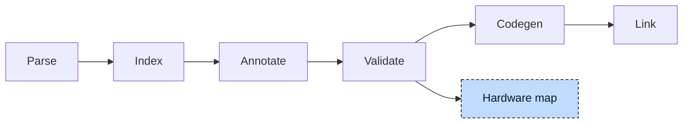

# Hardware Map

A variable bound to a hardware address does not own its storage. For

```iecst
VAR_GLOBAL
    start AT %IX0.0 : BOOL;
END_VAR
```

the [Index](../pipeline/02-index.md) chapter showed what pre-processing does: the address gets a generated global `__PI_0_0` that holds the value, and `start` becomes a pointer that is set to it by the constructor. The binary and its debug information therefore know `start` only as a pointer and `__PI_0_0` as the byte behind input 0.0. A monitoring tool that wants to show "start" to the user has to know that the two belong together, and the only place where the rule that turned `%IX0.0` into `__PI_0_0` exists is the compiler. The hardware map publishes that knowledge: one file that lists, for every hardware-bound variable, its user-facing name, its generated global, and its address.



The map is written after validation and before codegen, from the index alone; it needs no generated code, so `plc --check --hwmap-file=map.json` produces it without an object file, and a normal build writes it next to the binary.


## The map

The chapter follows one project with every kind of binding:

```iecst
FUNCTION_BLOCK Sensor
    VAR
        raw AT %I* : INT;
        alarm AT %QX3.1 : BOOL;
    END_VAR
END_FUNCTION_BLOCK

VAR_GLOBAL
    start AT %IX0.0 : BOOL;
    speed, speedCopy AT %QW2.5 : WORD;
    counter AT %MD1 : DWORD;
    sensors : ARRAY[0..1] OF Sensor;
END_VAR

VAR_CONFIG
    sensors[0].raw AT %IW5.0 : INT;
    sensors[1].raw AT %IW5.1 : INT;
END_VAR

PROGRAM main
    VAR
        stop AT %IX0.1 : BOOL;
    END_VAR
END_PROGRAM
```

Every entry has the same five fields. `name` is the path a user would type, `mangled_name` is the global as it appears in the binary, `address` is the source form of the address, and `direction` and `access_type` are the two letters of the address spelled out:

```json
{
  "VariableMap": [
    { "name": "start",            "mangled_name": "__PI_0_0", "address": "%IX0.0", "direction": "Input",  "access_type": "Bit"   },
    { "name": "speed",            "mangled_name": "__PI_2_5", "address": "%QW2.5", "direction": "Output", "access_type": "Word"  },
    { "name": "speedCopy",        "mangled_name": "__PI_2_5", "address": "%QW2.5", "direction": "Output", "access_type": "Word"  },
    { "name": "counter",          "mangled_name": "__M_1",    "address": "%MD1",   "direction": "Memory", "access_type": "DWord" },
    { "name": "sensors[0].alarm", "mangled_name": "__PI_3_1", "address": "%QX3.1", "direction": "Output", "access_type": "Bit"   },
    { "name": "sensors[1].alarm", "mangled_name": "__PI_3_1", "address": "%QX3.1", "direction": "Output", "access_type": "Bit"   },
    { "name": "main.stop",        "mangled_name": "__PI_0_1", "address": "%IX0.1", "direction": "Input",  "access_type": "Bit"   },
    { "name": "sensors[0].raw",   "mangled_name": "__PI_5_0", "address": "%IW5.0", "direction": "Input",  "access_type": "Word"  },
    { "name": "sensors[1].raw",   "mangled_name": "__PI_5_1", "address": "%IW5.1", "direction": "Input",  "access_type": "Word"  }
  ]
}
```

Two things stand out. `speed` and `speedCopy` share one address and therefore one generated global; the map lists both names, and a tool that subscribes to either reads `__PI_2_5`. And `sensors[0].alarm` and `sensors[1].alarm` also share `__PI_3_1`: the address is a property of the function block declaration, so every instance points at the same byte.

The generated name is the direction prefix and the address segments joined with underscores: inputs and outputs both get `__PI_` (they are one process image), memory gets `__M_`, and `%G` globals get `__G_`. The access width is not part of the name, which is why `%QW2.5` and a `%QX2.5` would collide; the [Index](../pipeline/02-index.md) chapter's pre-processing owns this rule, and the map calls the same function, so the two cannot drift apart.


## Collecting the entries

The index has an iterator over all variable instances of the project, which walks into program instances, global function block instances, and their members, and the map is built from it in two passes.

The first pass takes every instance whose declaration carries a direct address and skips the templates (`AT %I*`), because a template has no address until a `VAR_CONFIG` block gives it one. The address segments are constant expressions in the index (they went through the constant evaluator, so `AT %IX0.0` is stored as two evaluated integers), and the instance path is expanded over every array dimension: the one declaration `alarm` in `Sensor` yields `sensors[0].alarm` and `sensors[1].alarm`, because `sensors` has two elements. A three-dimensional array of blocks yields one name per element, in `[i,j,k]` form.

The second pass takes the `VAR_CONFIG` entries. Each names one instance path and one concrete address, so no expansion is needed beyond arrays in the path itself, and the generated global is the one pre-processing created for the configuration entry. An instance that appears in both passes is not possible by construction (a template has no direct address), but the map still deduplicates on the pair of name and generated global.


## Files and formats

`--hwmap-file=<path>` selects JSON or TOML by the extension; any other extension is E134. Without a value, the map is written next to the output as `<output>.hwmap.json`, so `plc main.st -o main.so --hwmap-file` gives `main.so.hwmap.json`. The `=` is required; `--hwmap-file map.json` makes `map.json` a source file. The TOML form is the same list as an array of tables:

```toml
[[VariableMap]]
name = "start"
mangled_name = "__PI_0_0"
address = "%IX0.0"
direction = "Input"
access_type = "Bit"
```

> **Developer Note**
>
> `--hardware-conf=<path>` is the older form of the same idea and is deprecated. It writes a `HardwareConfiguration` list without the generated names and with the address as a list of segment strings, and it lists templates with an empty address, which the new map leaves out because a template maps to nothing. It prints a deprecation warning and will be removed.


## Where it lives

| What | Where |
|---|---|
| Hardware map, deprecated hardware configuration, instance path expansion | `src/hw_map.rs`, `src/hardware_binding.rs`, `src/expression_path.rs` |
| Name mangling and pre-processing of addresses | `compiler/plc_ast` |
| Command line and write step | `compiler/plc_driver` |
