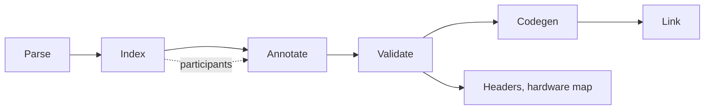

# Overview

The compiler turns IEC 61131-3 Structured Text into machine code through LLVM. It is a classic multi-pass compiler with one unusual property: there is no intermediate representation. The syntax tree that the parser builds is the only program representation, and every later stage annotates it or rewrites it in place until codegen reads it out as LLVM IR.

**The pipeline** is one fixed sequence of stages, and the [Pipeline](pipeline/README.md) part has one chapter per stage. The [Driver](pipeline/00-driver.md) reads the command line or a build description and runs the stages. The [Lexer and Parser](pipeline/01-lexer-parser.md) turn every file into a syntax tree whose nodes carry unique ids. The [Index](pipeline/02-index.md) collects every declaration of the project into one symbol table and evaluates constants. The [Resolver](pipeline/03-resolver.md) attaches an annotation to every expression that says what it refers to, what type it has, and what type it must become. [Validation](pipeline/04-validation.md) checks the rules against index and annotations and stops the run on errors. [Codegen](pipeline/05-codegen.md) emits one LLVM module per file, and the [Linker](pipeline/06-linker.md) joins the objects with an external linker.

**Participants** are plug-ins that rewrite the tree before and after the index and annotate stages. Everything the later stages should not have to know about is lowered away here: loops become one loop shape, properties become methods, `EXTENDS` becomes an embedded member, virtual calls become table lookups, initializers become constructor functions. Each rewrite may send the project back through index and annotate, so those two stages run many times per build. The [Participants](participants/README.md) part has one chapter per participant, in the order the driver runs them.

**Outputs** other than an object file branch off after validation: a C header with the declarations of the project for code that links against it, and a hardware map that connects hardware-bound variable names with the globals the compiler generated for them. The [Outputs](outputs/README.md) part covers both.

**Internals** cut across the stages. Each chapter in the [Internals](internals/README.md) part takes one language construct, a function block, an array, a string, and follows it from its declaration through the index, the annotations, the lowering, and the LLVM IR it becomes.

Four flags show the program at the stage boundaries and are the fastest way to check any claim in this book: `--ast` prints the trees as parsed, `--ast-lowered` prints them after all participants have run, `--ir` writes the LLVM IR, and `--check` stops after validation.
