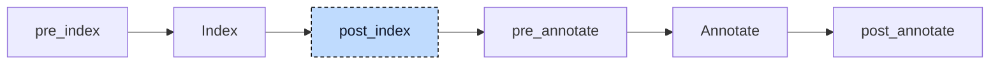

# CFC

A Continuous Function Chart is a diagram, not a text. Its file is XML: the POU's interface as a text declaration, and its body as a network of elements with numbered pins and the wires between them. The network

```
          myAdd (0)
        +--------------------+
in1 --> | in1          myAdd | --> function_call (1)
in2 --> | in2   myAddDoubled | --> doubledOut (2)
        +--------------------+
```

calls `myAdd` with the function's two inputs and routes its return value to the function's result and its output `myAddDoubled` to the output `doubledOut`. The numbers in parentheses are the evaluation priorities the user assigned. Trimmed to what matters, the document reads:

```xml
<ppx:Function name="function_call">
    <ppx:AddData>
        <ppx:Data>
            <bmx:TextDeclaration>FUNCTION function_call : INT
VAR_INPUT
    in1, in2 : DINT;
END_VAR
VAR_OUTPUT
    doubledOut : DINT;
END_VAR</bmx:TextDeclaration>
        </ppx:Data>
    </ppx:AddData>
    <ppx:MainBody><ppx:BodyContent><ppx:Network>
        <ppx:FbdObject xsi:type="ppx:Block" typeName="myAdd" globalId="1">
            <ppx:InputVariables>
                <ppx:InputVariable parameterName="in1">
                    <ppx:ConnectionPointIn><ppx:Connection refConnectionPointOutId="2"/></ppx:ConnectionPointIn>
                </ppx:InputVariable>
                ...
            </ppx:InputVariables>
            <ppx:OutputVariables>
                <ppx:OutputVariable parameterName="">
                    <ppx:ConnectionPointOut connectionPointOutId="4"/>
                </ppx:OutputVariable>
                <ppx:OutputVariable parameterName="myAddDoubled">
                    <ppx:ConnectionPointOut connectionPointOutId="5"/>
                </ppx:OutputVariable>
            </ppx:OutputVariables>
        </ppx:FbdObject>
        <ppx:FbdObject xsi:type="ppx:DataSource" identifier="in1" globalId="6">
            <ppx:ConnectionPointOut connectionPointOutId="2"/>
        </ppx:FbdObject>
        <ppx:FbdObject xsi:type="ppx:DataSink" identifier="doubledOut" globalId="9">
            <ppx:ConnectionPointIn><ppx:Connection refConnectionPointOutId="5"/></ppx:ConnectionPointIn>
        </ppx:FbdObject>
        ...
    </ppx:Network></ppx:BodyContent></ppx:MainBody>
</ppx:Function>
```

Every element has a `globalId`, every output pin a `connectionPointOutId`, and every input pin names the output pin it reads from. The declaration is ordinary Structured Text without its closing keyword; the return pin of a block is the output pin without a name. Nothing after the parser knows about pins or wires. The CFC participant turns the network into a statement list, so that from the index on a `.cfc` file is a POU like any other:

```iecst
FUNCTION function_call : INT
VAR_INPUT
    in1, in2 : DINT;
END_VAR
VAR_OUTPUT
    doubledOut : DINT;
END_VAR
VAR
    __out_myAdd_1 : INT;
    __out_myAddDoubled_1 : DINT;
END_VAR
    __out_myAdd_1 := myAdd(in1 := in1, in2 := in2, myAddDoubled => __out_myAddDoubled_1);
    function_call := __out_myAdd_1;
    doubledOut := __out_myAddDoubled_1;
END_FUNCTION
```



The participant enters the pipeline twice, and only the second entry is a hook. The parse step routes every source with a `.cfc`, `.fbd`, or `.xml` extension to the CFC crate instead of the text parser. That entry deserializes the document, parses the text declaration with the compiler's own parser, and returns a unit with the POU's declaration and an empty body, so that the index learns the POU's name, parameters, and return type. The body cannot be produced yet: turning a block into a call needs to know whether the block names a function, a function block, or a program, and what its outputs are, and only the index knows that. At `post_index` the participant transpiles every CFC document against the index, replaces the parse step's unit with the full one, indexes the project again so the bodies and their temporaries are known, and then runs the inference rounds for generic temporaries described below. Its diagnostics are collected after annotation like those of the other participants. A project without CFC sources passes through the hook unchanged.


## Transformation

The work is split into a resolver that makes every decision and a transpiler that makes none. The resolver reads the deserialized document and produces a small intermediate form: a list of statements of five kinds, assignment, return, jump, label, and call, each tagged with the element's priority, plus a list of temporaries to declare. The transpiler renders that list into AST nodes and puts them into the unit's empty body. Everything below happens in the resolver unless said otherwise.

### Elements and wires

Each element is classified by its `xsi:type`:

| Element | Role | Result |
|---|---|---|
| `DataSource` | a value: a variable or literal, read by others | nothing on its own |
| `DataSink` | a variable that receives a value | one assignment |
| `Block` | a call of a function, function block, program, or action | one call |
| `Connector`, `Continuation` | a named wire break: the connector receives, continuations of the same label re-emit | nothing; wires pass through |
| `Return` | a conditional return | one `RETURN` with a condition |
| `CfcJump`, `CfcLabel` | a conditional jump and its target | one jump, one label |
| `Unconnected` | an element the user placed but never wired | a warning |

The resolver first surveys the network: which element owns each output pin id, which pins are block outputs, which connector owns each label, and the set of label names and jump targets. With that map, consuming an element's input is a trace: start at the output pin id the input names and follow it until a producer is reached. Two kinds of element are stepped over. A continuation is replaced by whatever feeds the connector of the same label, so a connector pair behaves like a wire. An `ENO` pin of a block is replaced by whatever feeds that block's `EN` pin, because `ENO` mirrors the guard (see below). Both hops are cycle-guarded; a continuation without a connector, a connector without an input, or a block whose `ENO` leads back to itself is a dead end reported once per element, however many consumers reach it. A trace ends at a block output pin, which is read as described under blocks, or at a plain element, whose `identifier` text is parsed with the compiler's expression parser. The trace also collects the negation bubbles along the way: each bubble on the producer, on the consumer, or on a hopped pin wraps the value in one more `NOT`.

A sink is the traced value assigned to the sink's own identifier:

```
foo --> x>            bar := foo;
>x --> bar (0)        baz := foo;
>x --> baz (1)
```

A sink or source may hold only a literal or a reference; an expression such as `in1 + 1` in an element is rejected (E083), because the diagram is expected to model arithmetic as blocks. The condition of a return or jump is the exception and accepts any expression. A sink with a storage mode does not assign the value but uses it as a guard, `Set` storing `TRUE` and `Reset` storing `FALSE`, and a sink in `Reference` mode stores the address with `REF=`:

```
a --> [S] b (0)       IF a THEN
                          b := TRUE;
                      END_IF
```

Returns, jumps, and labels render directly. A jump without a wired condition is kept with a `FALSE` guard, so the label it targets stays a valid statement, and a warning says the jump can never be taken:

```
myCondition --> JMP skipAssignment (0)      IF myCondition THEN GOTO skipAssignment;
x --> y (1)                                 y := x;
LABEL skipAssignment (2)                    LABEL: skipAssignment
```

### Blocks

A block names its callee in `typeName`, and a function block instance additionally in `instanceName`. The index decides how the block is rendered. A callee that is a function, and has no instance name, is stateless: its outputs exist only during the call, so every output that some consumer reads is captured into a temporary named `__out_<pin>_<globalId>`, declared in a `VAR` block of the POU with the type the callee declares for that output. The return pin is captured by assigning the call, every other output with `=>`. A fan-out therefore calls once and reads twice, and an input wired back from the block's own output reads last cycle's temporary before the call overwrites it:

```
        myAdd (0)
      +--------------------+          __out_myAdd_1 := myAdd(in1 := a, in2 := b, myAddDoubled => );
a --> | in1          myAdd | --+--> x (1)   x := __out_myAdd_1;
b --> | in2   myAddDoubled |   '--> y (2)   y := __out_myAdd_1;
      +--------------------+
```

An unwired input of a function is passed as an empty argument, `in2 := `, so the callee's default applies; an unread output is discarded with an empty `=>`. A variadic callee such as `ADD` gets bare values in pin order instead of named arguments, and an unwired variadic pin is dropped.

A callee with state, a function block instance or a program, keeps its outputs in the instance, so no temporaries are needed: the call passes the wired inputs only, and a consumer of an output reads the member `inst.out` directly, or `counter.out` for a program. An action is called as `inst.act` and read through its owner:

```
localIn --> in [inst : counter] out (0) --> localOut (1)      inst(in := localIn);
                                                              localOut := inst.out;
```

Two programs wired in a cycle are legal for the same reason: each reads the other's member from the previous evaluation, and the priorities decide who runs first.

A block with the execution control flag has an `EN` input and an `ENO` output among its pins. `EN` is never passed as an argument; it becomes an `IF` around the whole call, capture included, so a skipped call leaves its temporaries untouched. `ENO` is not a value of the callee: a consumer wired to it is traced through to the `EN` source, so `done := trigger` below reads the same variable that guards the call, and a chain of blocks each enabled by the previous one's `ENO` renders as a sequence of `IF trigger` guards:

```
              myAdd (0)
            +---------------------------+     IF trigger THEN
trigger --> | EN                    ENO | --> done (2)    __out_myAdd_7 := myAdd(in1 := a, in2 := b, myAddDoubled => );
      a --> | in1                 myAdd | --> sum (1)  END_IF
      b --> | in2          myAddDoubled |         sum := __out_myAdd_7;
            +---------------------------+         done := trigger;
```

The flag decides whether a pin named `EN` is the control pin; without the flag, `EN` and `ENO` are ordinary parameters.

### Order

The statements and the temporaries are sorted by the evaluation priority of their element; elements without a priority come last, in document order. Nothing else reorders them. No data-flow order is derived from the wires: the priorities the user set in the diagram are the order of the statement list.

### Rendering

The transpiler turns each statement into an AST node with the constructors the parser uses, so the result is indistinguishable from parsed text. Every statement carries a location of a kind that only this participant creates: the `globalId` of the element instead of a line and column. A diagnostic on such a node is printed as `file.cfc: Block 6` without a source snippet. The temporaries go into one additional `VAR` block, and the statement list replaces the empty body the parse step left.

### Generic temporaries

A temporary takes the type the callee declares for the output. When the callee is generic, `myGenAdd<T: ANY_NUM> : T`, that type is the generic parameter itself, and the temporary is declared as `__myGenAdd__T`, a type that codegen cannot lay out. The concrete type is decided by the arguments at the call site, which the resolver does not know. After the re-index, the participant therefore runs inference rounds on the transpiled units: each round annotates the unit, and for every temporary that is still generic and whose call reads no other still-generic temporary, takes the concrete type the annotator derived for the capture, patches the declaration in the unit, and publishes the new type into the index in place, without another re-index. A chain of generic calls resolves one link per round, from its concrete inputs onwards:

```
__out_myGenAdd_1 := myGenAdd(a := a, b := b);                  (* a, b : INT   -> round 1: INT  *)
__out_myGenAdd_5 := myGenAdd(a := __out_myGenAdd_1, b := c);   (* c : DINT     -> round 2: DINT *)
```

The rounds stop when a round patches nothing. A temporary that is still generic then, because nothing but its own generic outputs feeds the call, is reported in terms of the block the user placed (E149).


## Interactions

The participant is registered first and runs at `post_index`, so the `pre_index` participants have already processed the interface-only unit the parse step produced. The transpiled unit that replaces it is a fresh parse of the declaration plus the rendered body; from the re-index on, every later participant sees the CFC POU as ordinary declarations and statements. Calls of CFC POUs from Structured Text resolve against the parse step's unit already, because the declaration is complete before the body exists.

The generic lowerer, at `post_annotate`, replaces the generic calls in the rendered body by calls of concrete implementations. It relies on the inference rounds having replaced every generic temporary type first; the concrete declarations are what let the annotator type those calls.

The transpiler does not generate loops, and the control statements it generates, `IF` guards, `RETURN`, jumps and labels, are shapes the later participants and codegen already accept from parsed text.


## Validation

The participant validates the diagram while it still is one, because after transpilation there are no elements, pins, or wires left to check, and a message about a temporary would name something the user never wrote. Its diagnostics cover the wiring: a connector label claimed twice (E081), a continuation with no connector (E082), an expression where only a name or literal is allowed (E083), an element that is placed but not wired (E084), a return without a condition (E085), a connector without an input (E086), a jump to a label nobody defines (E142), a label no jump targets (E143), a label defined twice (E144), a jump without a condition (E145), a block whose type the index does not know (E146), a wired output the callee does not declare (E147), a generic output no round could type (E149), an execution-controlled block whose `EN` is unwired (E152), an `ENO` chain that loops (E153), a negation bubble on a reference assignment (E154), and a block with two unnamed return pins (E155). Everything about the rendered statements themselves, unknown variables, type mismatches, wrong argument counts, is left to the validation stage, which reports it at the element's block location.
