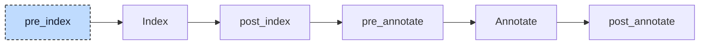

# Loop Desugar

Structured Text has three loop statements, `WHILE`, `REPEAT`, and `FOR`, and they differ in where the condition is checked and how the counter moves. Codegen knows only one loop shape: a block that runs forever until an `EXIT` leaves it. In

```iecst
FOR i := 10 TO 1 BY -3 DO
    sum := sum + i;
END_FOR
```

the counter starts at `10`, moves down by `3` on every iteration, and the loop ends once `i` is below `1`. Nothing in that sentence is a plain jump. The loop desugarer rewrites every loop into the one shape codegen understands, `WHILE TRUE DO ... END_WHILE`, and makes the condition checks, the counter update, and the direction explicit statements inside it.



The participant uses one hook, `pre_index`, and runs once. The rewrite needs no information about the program: it only moves and wraps the nodes the parser produced, so it can happen before the index exists, and nothing has to be rebuilt afterwards. It makes three passes over every unit, one per loop kind, in the order `WHILE`, `REPEAT`, `FOR`. Each pass visits the body of a loop before the loop itself, so nested loops are rewritten from the inside out.


## Transformation

**`WHILE`** checks its condition before every iteration. The condition moves into the body as a guard that leaves the loop when it is false:

```diff
-WHILE count < limit DO
+WHILE TRUE DO
+    IF NOT count < limit THEN
+        EXIT;
+    END_IF
     count := count + 1;
 END_WHILE
```

**`REPEAT`** runs its body once before it checks anything. The direct translation, body first and `IF cond THEN EXIT` last, would be wrong: a `CONTINUE` in the body jumps to the start of the next iteration and would skip the check. The desugarer therefore checks at the top, but only from the second iteration on, and remembers in a temporary whether the first iteration has happened:

```diff
+alloca __ran_once_0 : BOOL;
-REPEAT
+WHILE TRUE DO
+    IF __ran_once_0 THEN
+        IF n >= 4 THEN
+            EXIT;
+        END_IF
+    END_IF
+    __ran_once_0 := TRUE;
     n := n + 1;
-UNTIL n >= 4
-END_REPEAT
+END_WHILE
```

**`FOR`** gets two temporaries. `__ran_once_N` again marks the first iteration, so that the counter is incremented at the top of every iteration except the first; the increment at the top, not at the end, is what makes `CONTINUE` correct. `__is_incrementing_N` remembers, once and before the loop, whether the step is positive, because the exit test differs by direction:

```diff
+alloca __ran_once_0 : BOOL;
+alloca __is_incrementing_0 : BOOL;
-FOR i := 10 TO 1 BY -3 DO
+i := 10;
+__is_incrementing_0 := -3 > 0;
+WHILE TRUE DO
+    IF __ran_once_0 THEN
+        i := i + -3;
+    END_IF
+    __ran_once_0 := TRUE;
+    IF __is_incrementing_0 THEN
+        IF i > 1 THEN
+            EXIT;
+        END_IF
+    ELSE
+        IF i < 1 THEN
+            EXIT;
+        END_IF
+    END_IF
     sum := sum + i;
-END_FOR
+END_WHILE
```

Without `BY`, the step is the literal `1` and the direction flag is set to `TRUE` directly. The step and the end value stay expressions in the tree, so a variable step or end is read again on every iteration, as in the source. A step of `0` counts as not incrementing: the loop exits as soon as the counter is below the end value, so `FOR i := 1 TO 3 BY 0` runs zero times instead of forever. An `EXIT` or `CONTINUE` written by the user stays where it was and now refers to the generated `WHILE`.

The `alloca` lines are allocation statements, a node kind that has no spelling in Structured Text. They declare a variable in the middle of a body instead of in a `VAR` block. The resolver treats one like a local variable of the POU, named `main.__ran_once_0`, and codegen reserves a stack slot for it at the start of the function, initialized to `FALSE`, that lives for the whole call. The numbering is one counter shared by all `REPEAT` and `FOR` loops of the run, so every temporary has a unique name.

Every generated node carries an internal source location, and the replacement `WHILE` takes the location of the loop it replaces. The user's condition keeps its own location inside the guard. A debugger stepping through the program therefore stops on `WHILE count < limit`, on `UNTIL n >= 4`, and on the `FOR` header, but not on the generated flag assignments or the back edge of the loop.


## Interactions

Codegen relies on this participant completely. Its loop generator accepts only a `WHILE` loop whose condition is the literal `TRUE`; a `FOR` or `REPEAT` reaching codegen is a bug in the pipeline. The init participant, which runs later and generates constructors that loop over array elements, writes its loops in the `WHILE TRUE` form directly, because the desugarer will not run again. The control statement participant also runs later and sees only the rewritten loops.

Because the rewrite happens before indexing, no later stage ever sees a `FOR` or `REPEAT` node. The resolver has code that hints the start, end, and step of a `FOR` loop with the counter's type, and the validator has a check that these values are integers (E094). In the compiler both are unreachable; they run only in unit tests that validate without the participants. A `FOR` loop over a `REAL` counter currently compiles without a diagnostic.
