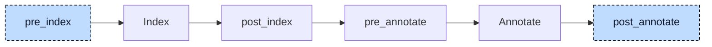

# Property Lowerer

A property gives a function block a member that reads like a variable but runs code. In

```iecst
FUNCTION_BLOCK fb
    VAR
        raw : DINT;
    END_VAR

    PROPERTY_GET scaled : DINT
        scaled := raw * 10;
    END_PROPERTY

    PROPERTY_SET scaled : DINT
        raw := scaled / 10;
    END_PROPERTY
END_FUNCTION_BLOCK
```

the statement `inst.scaled := 50` must run the `PROPERTY_SET` body and `x := inst.scaled` must run the `PROPERTY_GET` body. The index, the resolver, and codegen have no notion of a property. The property lowerer turns each accessor block into a method, `fb.__get_scaled` and `fb.__set_scaled`, and each use of the property into a call to one of them.



The participant uses two hooks. At `pre_index` it needs only the parsed tree: it rewrites every accessor block into a method declaration and implementation, so the index registers them like methods the user wrote and the resolver can find them. At `post_annotate` it needs the annotation map. The resolver marks every reference that names a property with a property annotation that carries the accessor to call, `__get_scaled` for a read and `__set_scaled` for the target of an assignment. The lowerer replaces each such reference with a call statement and then sends the project through annotate again, so the new calls are resolved; the index is not rebuilt because no declaration changed. Inside an assignment the participant lowers the index expressions of the target first, then the right-hand side, then the assignment itself; inside a reference it lowers the base and the index before the reference. `inst.foo[inst.bar]` therefore becomes `inst.__get_foo()[inst.__get_bar()]`, and `inst.scaled := inst.scaled + 1` becomes `inst.__set_scaled(inst.__get_scaled() + 1)`. Its diagnostics are collected by the driver after the last `post_annotate` hook.


## Transformation

**Getter to method.** Inside the accessor body the property name is used like a variable (`scaled := raw * 10`). The getter becomes a method with the property's type as return type; the lowerer adds a local variable with the property's name and type behind the user's own variable blocks, so the body compiles unchanged, and appends an assignment that moves the value into the method's return:

```diff
-PROPERTY_GET scaled : DINT
+METHOD __get_scaled : DINT
+    VAR
+        scaled : DINT;
+    END_VAR
+
     scaled := raw * 10;
-END_PROPERTY
+    __get_scaled := scaled;
+END_METHOD
```

**Setter to method.** In the setter body the property name stands for the incoming value, so it becomes a by-value input parameter, and the method has no return type:

```diff
-PROPERTY_SET scaled : DINT
+METHOD __set_scaled
+    VAR_INPUT
+        scaled : DINT;
+    END_VAR
+
     raw := scaled / 10;
-END_PROPERTY
+END_METHOD
```

The generated methods are named `<parent>.__get_<property>` and `<parent>.__set_<property>` and are appended to the unit's POU and implementation lists. Their kind is `Method`, and the kind additionally records the property name and whether it is the getter or the setter; the validator uses this to name an accessor as a property instead of a method in its messages. The property block itself stays on the function block, so the validator can still check the definition. Properties are accepted in a `FUNCTION_BLOCK`, a `CLASS`, a `PROGRAM`, and an `INTERFACE`. For an interface only the method declarations are generated and added to the interface's method list, because an interface property has no body (the parser rejects statements there).

**Read to getter call.** Every reference with a getter annotation is replaced by a call without arguments, wherever it stands: as an operand, as a call argument, as an array index, or as the base of an index access:

```diff
-x := inst.scaled;
+x := inst.__get_scaled();
```

The call takes the location of the reference it replaces. Inside the body of the function block or one of its actions, the unqualified `scaled` becomes `__get_scaled()` without a base; the resolver looks the property up in the parent POU of a method or action.

**Assignment to setter call.** When the target of an assignment carries a setter annotation, the whole assignment is replaced by a call statement whose only argument is the right-hand side; the call takes the location of the assignment:

```diff
-inst.scaled := 50;
+inst.__set_scaled(50);
```

Inside its own accessors the property name is not lowered. `scaled := raw * 10` in the getter stays an assignment to the added local variable, because the resolver tries variables before properties. A different property named in an accessor body is lowered like everywhere else.

A property with only one accessor is still lowered in both directions. When the requested accessor is missing but the other one exists, the resolver annotates the reference with the missing accessor's name anyway, the lowerer generates the call, and the validator reports `PROPERTY_GET for property scaled is not defined` (E048) instead of a generic unresolved reference. The added variable block and the appended return assignment carry internal source locations; the methods take the location of the property name.


## Interactions

The participant relies on the resolver, not on the participants before it: the resolver has a dedicated property resolution strategy for member accesses that asks for the setter when the reference is the target of an assignment and for the getter otherwise, and searches the accessor method on the type of the base, in the parent POU when the reference stands in a method or action, along the `EXTENDS` chain, and along the interface hierarchy. The lowerer itself never searches the index; it only reads the annotations.

Later participants see methods and calls, not properties. The polymorphism lowerer adds the accessor methods to the method tables it builds for the block and for its interfaces, so `iface.value := 3` on an interface variable becomes an indirect call to `__set_value`, and an unqualified `scaled := 2` in the function block body becomes a call through the block's own method table. When a getter returns an array or a struct, the aggregate type lowerer turns its return into a by-reference parameter named `__get_data`; codegen recognizes the `__get_` and `__set_` prefix on such a parameter and skips the null initialization it gives other reference parameters. Codegen otherwise treats the methods like any other method.

The [validator](../pipeline/04-validation.md) checks the property blocks that stayed on the POU and the interface: only `VAR` blocks in an accessor (E116), the same type in getter and setter, in an overriding property, and across extended interfaces (E112), at most one getter and one setter (E004), no clash between a property and a variable along the `EXTENDS` chain (E021). It excludes accessor methods from the ambiguous-callable check and from the abstract-signature check, because the property checks cover them, and it maps an unresolved `__get_x` or `__set_x` call operator to the E048 message shown above.

The rewrite runs once. The first resolver pass cannot type `a.kid` when `kid` is a property, because a property annotation carries no type, so in `a.kid.value` the reference `value` stays unresolved until the annotation after the rewrite. By then the lowerer has finished, and `value` reaches codegen as a plain member reference with a property annotation; codegen aborts on it. A property whose base is itself a property is therefore not supported.


## Validation

Before it rewrites an assignment, the participant walks the base chain of the target. If any base is annotated as a property, as in `inst.data[1] := 5` or `inst.point.x := 4`, it reports `Properties can only be assigned as a whole, not through member or index access` (E128) and leaves the statement alone; a setter receives one complete value, so there is no element or member to write into. The check lives here because it needs the assignment in its source form together with the property annotations of the first resolver pass; the [validator](../pipeline/04-validation.md) runs after all participants, on a tree in which assignments to properties have become calls.
