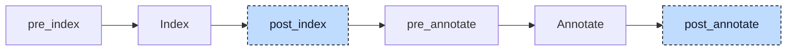

# Polymorphism

A variable of a class or function block type can point at an instance of a derived type, and a variable of an interface type can hold any instance whose type implements the interface. In

```iecst
INTERFACE Shape
    METHOD area : DINT
    END_METHOD
END_INTERFACE

FUNCTION_BLOCK Rect IMPLEMENTS Shape
    VAR_INPUT
        w, h : DINT := 2;
    END_VAR
    METHOD area : DINT
        area := w * h;
    END_METHOD
    METHOD describe
        printf('area=%d$N', area());
    END_METHOD
END_FUNCTION_BLOCK

FUNCTION_BLOCK Square EXTENDS Rect
    METHOD area : DINT
        area := w * w;
    END_METHOD
END_FUNCTION_BLOCK

FUNCTION main : DINT
    VAR
        square : Square;
        rectPtr : POINTER TO Rect;
        shape : Shape;
    END_VAR
    rectPtr := ADR(square);
    rectPtr^.describe();
    shape := square;
    printf('%d$N', shape.area());
END_FUNCTION
```

`rectPtr` is declared as a pointer to `Rect` but points at a `Square`. The call `rectPtr^.describe()` must run `Rect.describe`, the only `describe` there is, but the `area()` inside it must run `Square.area`. The variable `shape` must call `Square.area` too, and would call `Rect.area` after `shape := rect`. Codegen knows only calls to a function named at compile time. The polymorphism lowerer makes the run-time choice explicit: it generates tables of function pointers, one per type, stores the address of the right table in every instance, and rewrites every call whose target may vary into a load from a table followed by an indirect call.



The participant uses two hooks. At `post_index` the table generators add the table struct types and their global instances to the units; they need the index to know which methods a type has and which interfaces it implements, and the project is indexed again afterwards so that the new names exist. At `post_annotate`, when every expression has a type, the dispatch lowerers rewrite declarations, assignments, and calls, first for interfaces and then for classes and function blocks. The project is then indexed and annotated again, because the rewrite introduces new types and new expressions. The participant also reports diagnostics of its own; the Validation section explains why.


## Transformation

### Method tables

The table for a class or function block is called a method table, `__vtable` in the code. The generator makes three additions for every class and function block at `post_index`.

First, every root type, one without `EXTENDS`, gets a new variable block in front of its own blocks with one member:

```diff
 FUNCTION_BLOCK Rect IMPLEMENTS Shape
+    VAR
+        __vtable : POINTER TO __VOID;
+    END_VAR
     VAR_INPUT
         w, h : DINT := 2;
     END_VAR
```

A derived type such as `Square` gets no member of its own; it reaches `__vtable` through the embedded base that the inheritance lowerer creates later. The member is an untyped pointer because the table stored in it differs by type: a `Square` instance holds the address of a `Square` table in the `__vtable` member it inherited from `Rect`.

Second, the generator creates one struct type per class or function block. A function block gets a `__body` member first, because an instance can be called; a class gets none. Then follows one member per method, in a fixed order: the inherited methods first, from the top of the chain down, then the type's own methods. A method that overrides an inherited one keeps the slot of the inherited one. Every member is a function pointer, spelled `__FPOINTER` here, with an initializer that names the implementation:

```iecst
TYPE __vtable_Rect : STRUCT
    __body : __FPOINTER Rect := ADR(Rect);
    area : __FPOINTER Rect.area := ADR(Rect.area);
    describe : __FPOINTER Rect.describe := ADR(Rect.describe);
END_STRUCT END_TYPE

TYPE __vtable_Square : STRUCT
    __body : __FPOINTER Square := ADR(Square);
    area : __FPOINTER Square.area := ADR(Square.area);
    describe : __FPOINTER Rect.describe := ADR(Rect.describe);
END_STRUCT END_TYPE
```

Third, one global variable per type holds the table, `__vtable_Rect_instance : __vtable_Rect` and `__vtable_Square_instance : __vtable_Square`, in the unit that declares the type. A type from an include file or with `{external}` linkage gets its instance declared in an external block, because the library defines it.

The fixed order makes the tables of a chain compatible. Read slot by slot, the table of `Square` starts with exactly the slots of the table of `Rect`:

| Slot | `__vtable_Rect` | `__vtable_Square` |
|---|---|---|
| 0 | `__body`, `Rect` | `__body`, `Square` |
| 1 | `area`, `Rect.area` | `area`, `Square.area` |
| 2 | `describe`, `Rect.describe` | `describe`, `Rect.describe` |

Code that knows only `Rect` can therefore read a `Square` table as a `__vtable_Rect` and finds `area` in slot 1 in both cases. The call rewrite relies on this.

At `post_annotate` the dispatch lowerer rewrites two kinds of call. The first is a call through a pointer to a class or function block, or through a `REFERENCE TO` one: `rectPtr^.describe()`, or `rectPtr^()` for the body. The second is a call of a method by its bare name inside a method or a function block body, `area()` in `describe`, because the instance the method runs on may be of a derived type. Calls on an instance variable, `square.area()`, stay direct, because the type of the instance is exact; so do calls through `SUPER^`, calls written as `THIS^.area()`, and calls of a function pointer variable. The rewrite of a pointer call is:

```diff
-rectPtr^.describe();
+__vtable_Rect#(rectPtr^.__vtable^).describe^(Rect#(rectPtr^));
```

Read from the inside out: the instance `rectPtr^` becomes the first argument, cast to the type that declares the method, because the method expects that type; the base of the call becomes the `__vtable` member of the instance, dereferenced; that untyped pointer is cast to the table type of the pointer's declared type, `__vtable_Rect`, not of the instance's; and the method member is dereferenced, which makes the call an indirect call through the function pointer in the slot. At run time the slot holds `Rect.describe` for both a `Rect` and a `Square`.

Inside a method the missing base is `THIS^`:

```diff
-printf('area=%d$N', area());
+printf('area=%d$N', __vtable_Rect#(THIS^.__vtable^).area^(Rect#(THIS^)));
```

For a `Square` instance, `THIS^.__vtable` holds the address of `__vtable_Square_instance`, whose slot 1 is `Square.area`. A call of a function block body through a pointer uses the `__body` slot, and its arguments stay named, because codegen assigns them to the instance before the call:

```diff
-rectPtr^(w := 5);
+__vtable_Rect#(rectPtr^.__vtable^).__body^(rectPtr^, w := 5);
```

The tables are only declared here; storing addresses in them and in every `__vtable` member is done by the constructors the init participant generates (see Interactions).

### Interface tables

A method table does not work for interfaces. An interface variable may hold instances of unrelated types, and two unrelated types have no common slot order: one implementer of `Shape` and a second interface `Named` may have `area` in slot 1 and `name` in slot 2, another may have them the other way round. The generator therefore creates one table type per interface, with the slots of that interface only, and one instance per pair of interface and implementing type.

The struct type is named after the interface and placed in the unit that declares it. Its members are the interface's methods, those inherited from parent interfaces first, in the order of the `EXTENDS` list, then its own, each name once. Before the methods, an interface that extends others gets one untyped pointer per ancestor interface, in alphabetical order, named `__upcast_<Ancestor>`:

```iecst
TYPE __itable_Shape : STRUCT
    area : __FPOINTER Shape.area;
END_STRUCT END_TYPE

TYPE __itable_NamedShape : STRUCT
    __upcast_Named : POINTER TO __VOID;
    __upcast_Shape : POINTER TO __VOID;
    area : __FPOINTER Shape.area;
    name : __FPOINTER Named.name;
END_STRUCT END_TYPE
```

The function pointers reference the interface's own methods. The index registers `Shape.area` as a method without a body, and codegen makes a declaration for it, so the signature exists for the indirect call.

The instances are placed in the unit of the implementing type, one per interface the type implements directly, through a parent interface, or through a base type. The initializer names, for every slot, the most derived implementation found by walking up the type's chain, and for every upcast member the instance of the ancestor interface for the same type:

```iecst
VAR_GLOBAL
    __itable_Shape_Rect_instance : __itable_Shape := (area := ADR(Rect.area));
    __itable_Shape_Square_instance : __itable_Shape := (area := ADR(Square.area));
    __itable_NamedShape_Circle_instance : __itable_NamedShape := (
        __upcast_Named := ADR(__itable_Named_Circle_instance),
        __upcast_Shape := ADR(__itable_Shape_Circle_instance),
        area := ADR(Circle.area),
        name := ADR(Circle.name));
END_VAR
```

`Square` never names `Shape`, but it implements it through `Rect`, so it gets an instance too, with its own `area`.

An interface has no state, so an interface variable cannot hold an instance. At `post_annotate` every declaration that references an interface type, in a variable block, a parameter, a return type, an array element, or a struct member, is changed to the struct `__FATPOINTER`, which pairs the address of the instance with the address of its table:

```diff
 VAR
-    shape : Shape;
+    shape : __FATPOINTER;
 END_VAR
```

```iecst
TYPE __FATPOINTER : STRUCT
    data : POINTER TO __VOID;
    table : POINTER TO __VOID;
END_STRUCT END_TYPE
```

The struct is added to the first unit of the project, and only when at least one such declaration was found. Four rewrites use it.

**Assignment of an instance** becomes two assignments. The interface comes from the type of the left side, the table instance from the declared type of the right side:

```diff
-shape := square;
+shape.data := ADR(square);
+shape.table := ADR(__itable_Shape_Square_instance);
```

An assignment between two variables of the same interface stays a plain struct copy.

**Method call** through an interface variable is rewritten like a method table call, with the two fields in place of the instance and its `__vtable`:

```diff
-printf('%d$N', shape.area());
+printf('%d$N', __itable_Shape#(shape.table^).area^(shape.data^));
```

**Call argument.** When an instance is passed where an interface is expected, the caller has no fat pointer to hand over. The lowerer allocates a temporary, fills it, and passes it. The three statements are placed before the statement that contains the call, also when the call sits in the condition of an `IF`; a named argument is treated the same way for its right side. The temporaries are numbered with one counter for the whole compilation:

```diff
-describe(square);
+alloca __fatpointer_0 : __FATPOINTER;
+__fatpointer_0.data := ADR(square);
+__fatpointer_0.table := ADR(__itable_Shape_Square_instance);
+describe(__fatpointer_0);
```

**Upcast.** When a variable of a child interface is assigned to a variable of a parent interface, or passed where the parent is expected, both sides are fat pointers, but the table of the child cannot be read as the table of the parent, for the same reason that made interface tables necessary. The instance is known only at run time, so the parent's table is read from the `__upcast` member of the child's table:

```diff
-shape := namedShape;
+shape.data := namedShape.data;
+shape.table := __itable_NamedShape#(namedShape.table^).__upcast_Shape;
```

The interface lowerer runs before the method table lowerer within the hook, so that the method table lowerer sees only calls on classes and function blocks.


## Interactions

The property lowerer runs at `pre_index` and has already turned every property into `__get_x` and `__set_x` methods, so they get a slot in the method table like any other method, and a property read through a pointer is dispatched.

The init participant, registered later in the same hook, does the storing. The constructor of every class and function block ends with `self.__vtable := ADR(__vtable_Rect_instance)`. For a derived type the constructor of the base runs first and stores the base's table, then the derived constructor overwrites the same member through the embedded base: `self.__Rect.__vtable := ADR(__vtable_Square_instance)`. The member initializers of the table structs and the initializers of the interface table instances become constructors too, and `__FATPOINTER` gets one like any struct; all of them run from the global constructors before the program starts.

The inheritance lowerer, also later, resolves the members the rewrite introduced: `rectPtr^.__vtable` on a `Square`, which has no member of that name, becomes `rectPtr^.__Rect.__vtable`. The re-annotation at the end of this participant finds the inherited member; the inheritance lowerer spells out the path.

The aggregate return lowerer sees the indirect calls like any other call; an interface method that returns a `STRING` gets its result parameter inserted after the instance argument.

Codegen generates an indirect call when the call operator is a dereferenced function pointer. It takes the instance from the first argument, the function type from the declaration of the method the pointer type names, `Rect.area` or `Shape.area`, and passes the remaining arguments as for a direct method call; for a `__body` slot it stores the named arguments into the instance first. The `Rect#(...)` cast gives the instance argument the type this declaration expects. A method of an interface has no struct type; its instance parameter is an untyped pointer, which is what `shape.data^` provides. All generated types have internal locations and are left out of the debug information.


## Validation

The participant reports E126 when an instance is assigned or passed to an interface its type does not implement, and when an interface variable is assigned or passed to an unrelated or a child interface; it reports E129 when an interface variable is called directly, `shape()`. These checks run inside the interface lowerer and not in the validation stage, because after the rewrite the validator would see only `__FATPOINTER` on both sides and could not name the interfaces in its message. When a check fails the lowerer drops the statement, or replaces the argument with an unfilled temporary, so that the later stages report nothing about the rewritten form, and hands the diagnostics to the driver through its `diagnostics` hook.

The checks on `IMPLEMENTS` itself stay in the validation stage: E110 for an interface on a type other than a class or function block, E111 and E112 for missing or conflicting methods, and E118 for parameters that do not match the interface's declaration. They do not depend on the rewrite.
