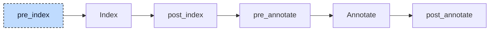

# Control Statements

An `IF` statement with `ELSIF` branches is one node in the tree: a list of condition-and-body pairs plus an optional `ELSE` body. That flat list is a problem for a later participant. The aggregate-return lowerer moves calls that return a `STRING`, array, or struct out of an expression into separate statements that run before the statement that contains the expression. For

```iecst
IF foo(counter) = 'Hello' THEN
    ;
ELSIF foo(counter) = 'Goodbye' THEN
    ;
END_IF
```

it would move both calls in front of the `IF`, and `foo` would run twice even when the first condition is true. The control statement participant rewrites every `ELSIF` into an `ELSE` that contains a nested `IF`, so that each condition has a statement list of its own and a moved call lands where the condition is evaluated.



The participant uses one hook, `pre_index`, and runs once. Like the loop desugarer it needs no index and no annotations: it only moves nodes the parser produced, so it runs before the index exists and nothing has to be rebuilt afterwards. It makes one pass over every unit. When it meets an `IF` with more than one condition block, it restructures that node first and then walks the remaining condition body and the new `ELSE` body, so nested `IF` statements, including the ones it has just created, are rewritten from the outside in. `CASE` statements and loops are not changed; the participant only descends into their bodies.


## Transformation

An `IF` with `n` condition blocks becomes `n` nested `IF` statements with one condition block each. The first block stays in place. Every `ELSIF` becomes the only block of a new `IF` that is the single statement in the `ELSE` of the level above it. The user's `ELSE` body, if there is one, moves to the innermost level:

```diff
 IF val = 1 THEN
     c := 'a';
-ELSIF val = 2 THEN
-    c := 'b';
-ELSIF val = 3 THEN
-    c := 'c';
 ELSE
-    c := 'x';
+    IF val = 2 THEN
+        c := 'b';
+    ELSE
+        IF val = 3 THEN
+            c := 'c';
+        ELSE
+            c := 'x';
+        END_IF
+    END_IF
 END_IF
```

Without an `ELSE`, the innermost `IF` has no `ELSE` body. The conditions and the bodies are the parser's nodes; only the wrapping `IF` nodes are new. Each new `IF` takes the location of the original `END_IF` as its own location and as its end location, and gets a fresh node id. Because the conditions keep their locations, a debugger still stops on every `ELSIF` line, and the jump at the end of each nested `IF` points to the one `END_IF` the user wrote.

The rewrite pays off once the aggregate-return lowerer runs. It wraps one statement at a time and places the temporaries and calls it moves out directly in front of that statement. After this participant, the second condition of the intro example belongs to the nested `IF` inside the `ELSE`, and that is where its call goes:

```diff
+alloca __foo0 : __foo_return;
+foo(__foo0, counter);
-IF foo(counter) = 'Hello' THEN
+IF __foo0 = 'Hello' THEN
     ;
-ELSIF foo(counter) = 'Goodbye' THEN
-    ;
+ELSE
+    alloca __foo1 : __foo_return;
+    foo(__foo1, counter);
+    IF __foo1 = 'Goodbye' THEN
+        ;
+    END_IF
 END_IF
```

Of these lines, only the `ELSE` and the nested `IF` are the work of this participant; the `alloca` lines and the rewritten calls come from the [aggregate-return lowerer](09-aggregate-return.md). In the generated code the second call sits in the `else` branch and runs only when the first condition is false.


## Interactions

The participant sees loops already in the `WHILE TRUE` form of the loop desugarer; their guard `IF`s have one condition block each and pass through unchanged. The CFC transpiler, which runs later, creates only single-block `IF` statements as well.

The aggregate-return lowerer is the one consumer that depends on the rewrite. It walks all conditions of an `IF` in the scope of the statement that contains the `IF`, so only a single-block `IF` gives every condition its own place for the calls moved out of it. Codegen does not depend on it: its `IF` generator still handles a list of condition blocks and emits one `branch` block per `ELSIF`. The resolver and the validator iterate over all condition blocks as well, and the boolean check on conditions (E094) reports at the condition's own location, so diagnostics look the same with and without the rewrite. Later participants that generate `IF` statements themselves, the array lowerer for example, write single-block `IF`s directly, so nothing after this hook has to be lowered again.
