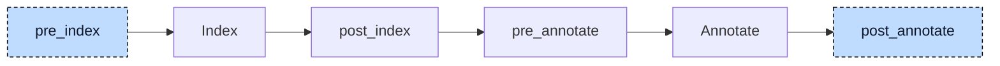

# Reference To Return

A function or method may declare `REFERENCE TO` as its return type. In

```iecst
FUNCTION referenceFunc : REFERENCE TO INT
    VAR_INPUT
        in : REFERENCE TO INT;
    END_VAR

    in := in + 1;
    referenceFunc REF= in;
END_FUNCTION
```

the caller writes `refVal REF= referenceFunc(refVal)` and expects `refVal` to refer to the result afterwards. Codegen returns function results by value, and the `REF=` statement accepts only a reference on its right side, never a call. The reference-to-return participant removes the return type, gives the callee a leading input parameter that refers to storage owned by the caller, and turns every call into a call statement plus a reference to that storage. The value the callee returns is copied into the caller's storage, so the reference the caller receives never points into the memory of a call that has already returned.



The participant uses two hooks. At `pre_index` it only reads the parsed tree and records every function and method whose return type is written as a `REFERENCE TO` definition, together with the referenced type. This has to happen before indexing: the index pre-processing replaces such an inline return type with a reference to a generated type named `__referenceFunc_return`, and the definition is no longer recognizable afterwards. At `post_annotate` it needs the annotations, which give the qualified name of every call operator and of every assignment target, and the index, which tells whether an assignment target is the return variable of its POU. It first counts, per implementation and per callee, how many calls to a recorded POU exist, then rewrites declarations and bodies in one pass over all units, and finally sends the project back through index and annotate. Each hook runs once.


## Transformation

**The callee** loses its return type and gets a by-value `VAR_INPUT` variable named `__<pou>_return_val` at the front of its by-value input block. The variable's type is a generated named pointer type, `__referenceFunc__referenceFunc_return_val` here, that is a `REFERENCE TO` the original referenced type and is appended to the unit's type list. The `REF=` that assigns the return variable becomes a plain assignment, so the callee writes the value through the reference into the caller's storage:

```diff
-FUNCTION referenceFunc : REFERENCE TO INT
+FUNCTION referenceFunc
     VAR_INPUT
+        __referenceFunc_return_val : REFERENCE TO INT;
         in : REFERENCE TO INT;
     END_VAR

     in := in + 1;
-    referenceFunc REF= in;
+    __referenceFunc_return_val := in;
 END_FUNCTION
```

The name is the POU name with every `.` replaced by `_`, prefixed with `__` unless the name already starts with `__`: a method `fb.get` gets `__fb_get_return_val`, a function `__pick` gets `__pick_return_val`. When the callee has no by-value `VAR_INPUT` block, one is appended after its existing blocks. The caller always passes the reference as the first argument, so the rewrite assumes that the by-value input block is the first block of the POU. Only a `REF=` to the return variable is rewritten; a plain assignment to it is replaced by an empty statement. The type `__referenceFunc_return` that pre-processing generated for the original return type stays in the unit, unused.

**The caller** gets two `VAR_TEMP` variables per call site: a reference `__<callee>_return_val_N` of a generated pointer type `__<caller>__<callee>_return_val_N`, and a store `__<callee>_return_val_store_N` of the referenced type. `N` counts the calls of that callee inside one implementation in walk order, starting at `1`, so two calls of `referenceFunc` in `main` use `_1` and `_2`. A `VAR_TEMP` block is added when the POU has none. The statement that contains the call becomes an expression list of three parts: the reference is pointed at the store, the callee is called with the reference as first argument, and the original statement runs with the call replaced by the reference:

```diff
 FUNCTION main
     VAR
         refVal : REFERENCE TO INT;
         tmpVal : INT;
     END_VAR
+    VAR_TEMP
+        __referenceFunc_return_val_1 : REFERENCE TO INT;
+        __referenceFunc_return_val_store_1 : INT;
+    END_VAR

     refVal REF= tmpVal;
-    refVal REF= referenceFunc(refVal);
+    __referenceFunc_return_val_1 REF= __referenceFunc_return_val_store_1;
+    referenceFunc(__referenceFunc_return_val_1, refVal);
+    refVal REF= __referenceFunc_return_val_1;
 END_FUNCTION
```

After this, `refVal` refers to `__referenceFunc_return_val_store_1`, which holds a copy of the value, and not to `tmpVal`; a write through `refVal` no longer reaches `tmpVal`. The same rewrite applies wherever the call stands: as an operand (`r := inst.get() + __pick(v)`), as the argument of another call (`r := twice(inst.get())`), or as the base of a member access after property lowering (`y := __fb___get_myStructuredVar_return_val_1.x`). A call used as a statement on its own keeps its third part as a bare reference expression, for which codegen emits a load whose result is not used. The generated statements are placed in front of the statement that is being visited when the call is met.

**Nested calls** are set up from the outside in and called from the inside out, because the outer call walks its arguments after it has queued its own setup and before it queues itself:

```diff
-refVal REF= doubleIt(addOne(refVal));
+__doubleIt_return_val_1 REF= __doubleIt_return_val_store_1;
+__addOne_return_val_1 REF= __addOne_return_val_store_1;
+addOne(__addOne_return_val_1, refVal);
+doubleIt(__doubleIt_return_val_1, __addOne_return_val_1);
+refVal REF= __doubleIt_return_val_1;
```

**Property getters** reach this participant as methods. The property lowerer has given `PROPERTY_GET value : REFERENCE TO INT` a local variable `value`, kept the body `value REF= _value`, and appended `__get_value := value`. The participant recognizes the local named like the property as the return of the getter, rewrites its `REF=` into the assignment through `__fb___get_value_return_val`, and the appended return assignment becomes an empty statement like every plain assignment to a return variable:

```diff
-METHOD __get_value : REFERENCE TO INT
+METHOD __get_value
     VAR
         value : REFERENCE TO INT;
     END_VAR
+    VAR_INPUT
+        __fb___get_value_return_val : REFERENCE TO INT;
+    END_VAR

-    value REF= _value;
-    __get_value := value;
+    __fb___get_value_return_val := _value;
+    ;
 END_METHOD
```

A read `x := inst.value`, which the property lowerer has turned into `x := inst.__get_value()`, is then lowered like any other call. A setter has no return type and is not touched.

The generated variables and types take the location of the callee's return type; the generated statements and references take the location of the call they replace, and the wrapping expression list gets a fresh node id.


## Interactions

The participant is the sixth in registration order. It relies on the property lowerer, which has already turned accessors into `__get_` and `__set_` methods at `pre_index`; the getter handling above depends on that naming. It relies on the resolver for the qualified name of every call operator, which is how a call to a method is matched against the recorded `fb.get`, and on the index to identify the return variable of a function or method. Because the callee's return is recognized only when it is written as an inline `REFERENCE TO` definition, a function whose return type is a named alias of a `REFERENCE TO` type is not lowered at all; the [validator](../pipeline/04-validation.md) then rejects `r REF= f(x)` on such a function with `Invalid assignment, expected a reference` (E098), the same check that a lowered call passes because the call has become a reference.

The [init participant](06-init.md) is registered directly after this one and runs at `post_annotate` for this reason: it generates the constructors for the generated pointer types, `__main__referenceFunc_return_val_1__ctor`, and a constructor call for every store whose type is a struct, such as `structuredTypeOrFb__ctor(__fb___get_myStructuredVar_return_val_store_1)`. The [aggregate-return lowerer](09-aggregate-return.md) never sees a `REFERENCE TO` a string or struct as a return type, because the callee is void by then; the aggregate lives in the caller's store variable instead. Codegen and the validator see an ordinary void function with a pointer parameter and ordinary temporaries; no later stage knows the generated names.
