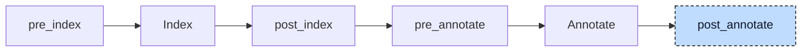

# Init

A variable declaration can carry an initial value, and codegen writes constant values straight into the static data of the global instance. Many initial values are not constants, though. In

```iecst
PROGRAM main
    VAR
        i : DINT := 1;
        counterInstance : Counter;
    END_VAR
END_PROGRAM
```

the `1` is static data, but `counterInstance` needs work at run time: its method table pointer is the address of a global, its own members may have initializers, a `REFERENCE TO` member needs the address of another variable, and a user-defined `FB_INIT` method must run once. The init participant turns every initializer into ordinary statements inside generated constructor functions, one per type and one per source file, so that codegen only has to compile plain assignments and calls.



The participant uses one hook, `post_annotate`, and runs once. It needs the index, not the annotations: the index tells it whether a type is a struct, an alias, or a reference, whether a POU is stateful, whether an `FB_INIT` method exists, and it holds the constant-evaluated array bounds and array literals. It processes one unit at a time. It first registers every POU and type of the unit, so that a member can be constructed before its type declaration is visited, then walks the unit in the order types, global variable blocks, `VAR_CONFIG` entries, POUs. The walk fills three collections: one constructor body per stateful POU and per type, one list of stack statements per POU, and one list of unit statements. At the end the participant appends the constructors to the unit as new POUs, prepends the stack statements to the existing bodies, strips array initializers that are not constant from the declarations, and sends the project back through index and annotate.


## Transformation

**Stateful POUs.** A program, function block, or class gets a constructor named `<Name>__ctor` that takes the instance as `self`. The members are visited in declaration order; a member whose type has a constructor gets a call to it, and a member with an initializer gets an assignment, in that order, so that the instance defaults are applied before the declaration overrides them. A function block or class then sets its method table pointer, and a POU that declares a method `FB_INIT` calls it last. The constructor of the intro example holds `self.i := 1;` and `Counter__ctor(self.counterInstance);`; the constructor of its `Counter` function block, with a member `limit : INT := 10` and an `FB_INIT` method, is:

```diff
+FUNCTION Counter__ctor
+    VAR_IN_OUT
+        self : Counter;
+    END_VAR
+
+    __Counter___vtable__ctor(self.__vtable);
+    self.limit := 10;
+    self.__vtable := ADR(__vtable_Counter_instance);
+    self.FB_INIT();
+END_FUNCTION
```

The generated POU has an internal kind, `Init`, that the index registers like a function; `FUNCTION` is only the closest spelling. A derived function block starts its constructor with a call to the base constructor on the injected base member, `Base__ctor(self.__Base)`, and skips that member during the walk, so the base and its `FB_INIT` run exactly once.

**Unit constructor.** Every source file whose walk produced at least one unit statement gets a constructor (included files never get one) named `__unit_<file>_<hash>__ctor`, where `<file>` is the file name with every non-identifier character replaced by `_` and `<hash>` is eight hex digits derived from the full path. The body holds, in this order, the initializers of the global variables in declaration order, one assignment per `VAR_CONFIG` entry, and one constructor call per program instance:

```diff
+FUNCTION __unit_main_st_<hash>__ctor
+    __vtable_Counter__ctor(__vtable_Counter_instance);
+    gVal := 3;
+    main.child.hw := %IX1.0;
+    main__ctor(main);
+END_FUNCTION
```

The method table instances are global variables that the polymorphism lowerer added, so they are constructed here like any other global. `VAR_GLOBAL CONSTANT` blocks are skipped: their values are static data only. Globals from included files are skipped too, and globals in an `{external}` block are skipped unless `--generate-external-constructors` is set.

**Types.** Every user type gets a constructor as well. A struct constructs and initializes its fields exactly like a POU does its members, and an enum, a subrange, or a renamed scalar with a default assigns `self` directly. An alias type such as `TYPE MyPoint : Point; END_TYPE` calls the constructor of the type it renames. A struct literal is decomposed into one assignment per leaf; for a struct `Line` with the fields `start : Point;` and `stop : Point := (x := 5);` the constructor is:

```diff
+FUNCTION Line__ctor
+    VAR_IN_OUT
+        self : Line;
+    END_VAR
+
+    Point__ctor(self.start);
+    Point__ctor(self.stop);
+    self.stop.x := 5;
+END_FUNCTION
```

Built-in types, generic types, and variable-length arrays get no constructor. The types the pre-processor created for inline declarations, such as `__Refs_r` for the member `r` below, are user types too and get constructors like every other type; most of them are empty.

**References and pointers.** A `REFERENCE TO` variable, an `AT` alias, and a hardware-mapped variable are initialized with `REF=`, because their initial value is an address, not a value; a `REF(...)` call in the initializer is unwrapped. A pointer keeps its `:=` with the `ADR` or `REF` call. Inside a stateful POU, a bare name in the initializer that is a member of that POU is qualified with `self.`:

```diff
 FUNCTION_BLOCK Refs
     VAR
         x : DINT;
         r : REFERENCE TO DINT REF= x;
         p : POINTER TO DINT := ADR(x);
     END_VAR
 END_FUNCTION_BLOCK
+FUNCTION Refs__ctor
+    VAR_IN_OUT
+        self : Refs;
+    END_VAR
+
+    __Refs___vtable__ctor(self.__vtable);
+    __Refs_r__ctor(self.r);
+    self.r REF= self.x;
+    __Refs_p__ctor(self.p);
+    self.p := ADR(self.x);
+    self.__vtable := ADR(__vtable_Refs_instance);
+END_FUNCTION
```

An alias `px AT x : DINT` gets `self.px REF= self.x` in the same way. For a variable declared `AT %IX1.2` the pre-processor has already injected the initializer `__PI_1_2`, the backing global of that address, so it gets `REF= __PI_1_2` here. A template address such as `%I*` gets no assignment in the POU constructor; the `VAR_CONFIG` entry that binds it becomes the assignment in the unit constructor shown above.

**Arrays.** An array whose element type has a constructor gets a loop that constructs every element, one loop per dimension, so that defaults, method table pointers, and `FB_INIT` reach every element. The bounds are taken from the index as constants, because the declaration may name a constant of the declaring POU that does not resolve inside the constructor. The loop is written in the `WHILE TRUE` form that the loop desugarer would have produced, since that participant has already run:

```diff
 PROGRAM main
     VAR
         motors : ARRAY[0..3] OF Motor;
     END_VAR
 END_PROGRAM
+FUNCTION __main_motors__ctor
+    VAR_IN_OUT
+        self : __main_motors;
+    END_VAR
+
+    alloca __main_motors__idx0 : DINT;
+    __main_motors__idx0 := 0;
+    WHILE TRUE DO
+        IF __main_motors__idx0 > 3 THEN
+            EXIT;
+        END_IF
+        Motor__ctor(self[__main_motors__idx0]);
+        __main_motors__idx0 := __main_motors__idx0 + 1;
+    END_WHILE
+END_FUNCTION
```

An array of a built-in type gets an empty constructor. An array literal that is not constant, such as `[five(), 2]`, cannot be static data: the participant assigns it in the constructor and removes it from the declaration, so codegen emits zeros for the global. A constant array literal stays in the declaration and is additionally assigned in the constructor, from the version the constant evaluator folded.

**Stack variables.** Functions and methods have no instance, and `VAR_TEMP` blocks live on the stack in every POU. Their initialization statements go to the start of the POU's own body instead of to a constructor, without a `self.` prefix. A function whose return type has a constructor also constructs its return value, addressed by the function's name: `FUNCTION useLine : Point` with a local `localLine : Line` starts with `Line__ctor(localLine);` and `Point__ctor(useLine);`. `VAR_IN_OUT` variables get no constructor call: they refer to storage the caller owns.

**Linkage.** For a type or POU marked `{external}`, and for everything that comes from an included file, the constructor is only declared: the generated POU has external linkage, and codegen emits a declaration that the linker resolves against the library that defines the type. Calls to such constructors are still emitted wherever the type is used. `--generate-external-constructors` (also implied by `--constructors-only`) flips this for `{external}` items, so that a library can be compiled from its own `{external}` declarations.


## Interactions

The participant depends on three earlier participants. The polymorphism lowerer (`post_index`) added the `__vtable` member, the `__vtable_<Name>` struct types, and the `__vtable_<Name>_instance` globals that the constructors assign and construct. The inheritance lowerer (`pre_index`) injected the `__<Base>` member that the base constructor call addresses. The reference-to-return participant is registered directly before it: it generates new types and variables in `post_annotate`, and the init participant runs after it so that those get constructors too. From the earlier stages it uses the pre-processor's names for inline types and the constant evaluator's results for array bounds and folded array literals.

Every later participant sees the constructors as ordinary POUs and processes their bodies. The inheritance lowerer rewrites the `self.__vtable` assignment of a derived block into `self.__Base.__vtable`, and the array lowerer turns the assignment of an array literal with non-constant elements in a constructor into one assignment per element.

Codegen consumes the result as described in the Initialization section of the [Codegen](../pipeline/05-codegen.md) chapter. Three details exist only for constructors: inside an `Init` or `ProjectInit` body, an assignment whose left side is an alias or a `REFERENCE TO` stores the address instead of the value, which is what makes the `VAR_CONFIG` assignment in the unit constructor bind the hardware address; constructors get no debug information, and an error while generating one carries a note that names the type it belongs to; and the POU-level checks of the validator skip `Init` and `ProjectInit` POUs. Across files, a unit that uses a type from another unit only calls that unit's constructor; the definition is linked in, and when units are merged into one module LLVM combines their `llvm.global_ctors` entries into one list.
