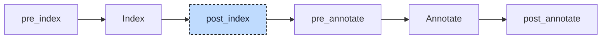

# Retain

A `RETAIN` variable keeps its value across a power cycle. The compiler cannot make memory persistent by itself; it places the variable in a linker section named `.retain`, and the runtime maps that section to non-volatile memory. A section is a property of a global symbol, so a `VAR_GLOBAL RETAIN` block is easy: codegen emits its variables with the section attribute. In

```iecst
PROGRAM Main
    VAR RETAIN
        counter : INT := 5;
    END_VAR

    counter := counter + 1;
END_PROGRAM
```

`counter` is not a global. It is a field of the program's instance struct, and one field of a struct cannot be placed in a section of its own. The retain participant moves such variables out of the program into a global of their own and leaves a pointer behind, so that after lowering, "retained" is always a property of a global variable and codegen has one rule to apply.



The participant uses one hook, `post_index`, and runs once. It needs the index because retention is transitive: a variable retains when its own block has the `RETAIN` modifier, or when its type contains a retained member at any depth (struct members, array elements, and aliases are followed; a cycle is cut). The index entry of each variable answers that question, so the participant does not walk types itself. It visits every unit once, the global blocks first and then the POUs, and collects the variables it moves or creates. At the end of the unit it appends them to the unit's first `VAR_GLOBAL RETAIN` block, or creates one when the unit has none. Then it indexes the project again, so that the new globals and the new pointer types are in the symbol table before the `pre_annotate` hooks and the annotator run. No annotations exist at this point, so nothing else has to be rebuilt.


## Transformation

**Program variables.** A program has exactly one instance, so a retained member can become a global of its own without a change in meaning. The variable's type and initializer move to a new global named `__<program>_<variable>__retain`. The variable itself stays in its block with the same name, but its type becomes an alias pointer to the global, and its initializer the global itself. The block loses its `RETAIN` modifier:

```diff
+VAR_GLOBAL RETAIN
+    __Main_counter__retain : INT := 5;
+END_VAR
+
 PROGRAM Main
-    VAR RETAIN
-        counter : INT := 5;
+    VAR
+        counter : __Main_counter__retain_ptr := __Main_counter__retain;
     END_VAR

     counter := counter + 1;
 END_PROGRAM
```

`__Main_counter__retain_ptr` is a named pointer type with automatic dereferencing, the same kind of node the parser produces for an `AT` alias such as `x AT y : INT`. It is registered as a user type scoped to the program. Its name is derived from the global rather than from the variable, because the pre-processor has already extracted inline types under `__Main_<variable>`, and an inline array or struct in the retain block would otherwise clash with its own pointer type. The body is not changed: the resolver treats an alias variable as automatically dereferenced, so `counter := counter + 1` reads and writes through the pointer. The rewrite applies to every block of the program that carries `RETAIN`, including `VAR_INPUT` and `VAR_TEMP`; a retained temporary becomes a local pointer that is set to the global at the start of every call.

**Function block instances.** Retained members of a function block are not extracted. A function block can have many instances, and each instance lives inside whatever declares it, so the participant keeps the `VAR RETAIN` block of the function block as it is and retains the container instead. A program variable whose type transitively retains is moved like a plain retained variable:

```diff
 FUNCTION_BLOCK Fb
     VAR RETAIN
         a : INT := 5;
     END_VAR
 END_FUNCTION_BLOCK

+VAR_GLOBAL RETAIN
+    __Main_x__retain : Fb;
+END_VAR
+
 PROGRAM Main
     VAR
-        x : Fb;
+        x : __Main_x__retain_ptr := __Main_x__retain;
     END_VAR
 END_PROGRAM
```

The whole instance lands in `.retain`, its non-retained members and its method table pointer included. The same happens for a struct with a member of type `Fb`, for an array of `Fb`, and for an instance nested several function blocks deep.

**Globals.** A global in a plain `VAR_GLOBAL` block whose type transitively retains is moved into the retain block; globals declared in `VAR_GLOBAL RETAIN` stay where they are:

```diff
 VAR_GLOBAL RETAIN
     explicit : Fb;
+    implicit : Fb;
 END_VAR

 VAR_GLOBAL
-    implicit : Fb;
     x : INT;
 END_VAR
```

Codegen would place `implicit` in `.retain` even without the move, because it asks the same transitive question for every global it emits. The move makes the answer visible in the lowered tree. A block created by the participant has an internal source location, internal linkage, and public access.

Function blocks, functions, and methods are otherwise left alone. Their `VAR RETAIN` blocks keep the modifier, and a `VAR RETAIN` in a function or method has no effect: the variable stays on the stack and no diagnostic is reported.


## Interactions

The polymorphism lowerer runs before this participant, so the `__vtable` member it adds to every function block ends up in the retained instance. The retain flags come from the parser, which accepts `RETAIN` on every block kind and parses `NON_RETAIN` without recording it, through the indexer, which copies the flag of a block to each of its members. Struct members declared in a `TYPE` block and return variables are never flagged themselves.

Three later stages consume the rewrite. The [resolver](../pipeline/03-resolver.md) annotates the replaced variable as an alias with automatic dereferencing, and codegen loads the pointer before every access. The init participant, which runs in `post_annotate`, sees an alias-typed variable with a reference initializer and makes the program constructor store the address of the global into the field (`store ptr @__Main_counter__retain` into the `counter` slot of the instance); the retained global itself is initialized in the unit constructor like every other global, so the declared initial value is written into `.retain` at every start. Codegen's variable generator asks each global whether it retains, either by flag or transitively, and sets the section attribute on the LLVM global: `@__Main_counter__retain = global i16 5, section ".retain"`. The program's instance struct holds only a pointer, `%Main = type { ptr }`, and stays outside the section.

The [validator](../pipeline/04-validation.md) checks the generated pointer types with the same rule as `REFERENCE TO` and `AT` declarations written by the user (E099), which rejects an alias whose target type name is also the name of a variable in the same scope.
