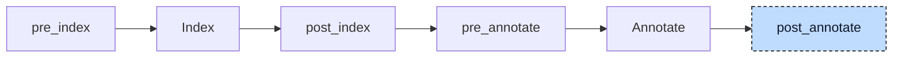

# Generic Lowerer

A generic function is declared once with type parameters and implemented once per type. In

```iecst
FUNCTION times_two<T: ANY_NUM> : T
    VAR_INPUT
        val : T;
    END_VAR
END_FUNCTION
```

the declaration has no body. The implementations are ordinary functions named after the template and the type, `times_two__INT` and `times_two__REAL`, written in Structured Text or provided by a library. The pre-processing step at the start of the index stage turns `T` into a type `__times_two__T` that carries the nature `ANY_NUM`, and the resolver annotates a call such as `times_two(INT#100)` with the template `times_two` and the generic return type. Codegen cannot call a template. The generic lowerer works out the concrete type of every type parameter from the arguments, rewrites the call to the implementation name, and, when no implementation of that name exists, declares one as an external function so that the linker decides whether it exists.



The participant uses one hook, `post_annotate`, and needs both the index and the annotations: the index holds the type parameters and the parameter list of the callee, the annotation map holds the callee of every call and the type of every argument. One pass walks every unit and visits the arguments of a call before the call itself, so nested calls are rewritten from the inside out; the bodies of generic templates are skipped. Declarations for missing implementations are collected during the walk and appended after it. After every pass the participant sends the units through index and annotate again, so that the rewritten calls and the new declarations are resolved, and repeats until a pass changes nothing. A program without a single generic call still costs one pass and one index and annotate round.


## Transformation

**A call to an existing implementation** only changes its operator. The concrete type of `T` comes from the arguments: every argument that is bound to a parameter of type `T` (also `POINTER TO T`, `ARRAY OF T`, or a variadic `T...`) votes with its type, and the biggest type wins. Named arguments vote for the parameter they name. The nature sets a floor, `USINT` for `ANY_INT` and `ANY_NUM`, `REAL` for `ANY_REAL`, so an integer argument to an `ANY_REAL` parameter resolves to a real type (`REAL` for a `DINT`, `LREAL` for a `LINT`), and every string type votes as `STRING` or `WSTRING` without its length. The implementation name is the template name followed by `__` and the derived type of each type parameter in declaration order, `mix__INT__REAL` for `mix<T: ANY_INT, U: ANY_REAL>`:

```diff
-a := times_two(INT#100);
-b := times_two(2.5);
+a := times_two__INT(INT#100);
+b := times_two__REAL(2.5);
```

**A call without an implementation** gets one declared. The participant copies the template's variable blocks and return type, substitutes every type parameter, and appends the copy to the unit that holds the template, as a declaration with `{external}` linkage and an empty body, once per name for the whole run:

```diff
-c := times_two(DINT#7);
+c := times_two__DINT(DINT#7);
+
+{external}
+FUNCTION times_two__DINT : DINT
+    VAR_INPUT
+        val : DINT;
+    END_VAR
+END_FUNCTION
```

The declaration is real code from here on: it survives every later index run, codegen emits `declare i32 @times_two__DINT(i32)`, and the linker either finds the symbol in a library or reports it as undefined. This is how library generics work. The standard library header declares `{external} FUNCTION LEN<T: ANY_STRING> : DINT` and nothing else; a call `LEN('abc')` becomes `LEN__STRING`, the participant declares it, and the linker resolves it against the library. A template marked `{external}` itself changes nothing: its implementations are external whether they are declared by hand or by the participant. Where the header provides a Structured Text implementation, such as `LEFT__STRING`, that one is used and nothing is declared.

> **Note**
>
> The rewritten operator keeps the location of the original call, so diagnostics and debug information still point at `times_two(DINT#7)` in the source. The declared implementation takes the location of the template.

**Nested calls** need more than one pass. In `times_two(times_two(a))` the inner call is rewritten first, but the annotation of the outer call's argument still says `__times_two__T`, so the outer call would vote with a generic type and is left for the next pass. After the re-annotation the argument is an `INT`:

```diff
-a := times_two(times_two(a));
+a := times_two(times_two__INT(a));
```

```diff
-a := times_two(times_two__INT(a));
+a := times_two__INT(times_two__INT(a));
```

The third pass changes nothing and ends the loop. A call whose type parameter gets no vote at all, because no argument is bound to a parameter of that type, is skipped in the same way in every pass and stays a generic call.

Two kinds of call are never touched. Built-in generics such as `MUX`, `SEL`, `ADD`, or `SHL` are resolved by the resolver and generated inline by codegen; they have no implementation to pick. Calls inside the body of a generic template operate on `T` itself, and the template is never generated; a generic call in such a body stays as written, and the validator reports it as an unresolved generic type (E064).


## Interactions

The participant relies on the pre-processing at the start of the index stage, which replaces each type parameter by a scoped type that carries the nature, on the index, which records the type parameters on the function entry and marks the template's implementation as generic, and on the resolver. The resolver's own generic handling is now limited to the built-ins: for a user or library generic it annotates the call with the template and its generic return type and leaves the argument types as they are. Both share the same derivation of the concrete types and of the implementation name, so a built-in and a user generic resolve by the same rules. The CFC participant, which runs first, also uses this derivation to infer the types of temporaries wired to generic blocks.

The aggregate-return lowerer, registered directly after it, is its main consumer: it expects every call to name a concrete function and skips generic templates. A declared implementation with an aggregate return, `MID__STRING : STRING`, is rewritten by it like any user function, so the external symbol takes the return buffer as its first pointer parameter, `declare void @MID__STRING(ptr, ptr, i32)`. Codegen defines no function for a generic or external implementation and emits a declaration for every external one that is called. The validator's uniqueness check skips generic functions, so several templates may share a name and differ only in their type parameters.

Every pass reruns index and annotate, so the participant adds at least one round to every compilation, and the pre-processor, which runs inside the index stage, appends its generic parameter types again on every round.


## Validation

Before it rewrites a call, the participant checks every argument against the nature of its type parameter and reports a violation such as a `REAL` for `ANY_INT` as E062, once per call, even though the call is visited again in every pass. An integer for `ANY_REAL` is allowed because it resolves to a real type. A call with a violation is left unresolved, so no implementation is declared for it and no follow-up diagnostics appear. The check cannot live in the validator: after the rewrite the call targets a concrete function and the natures are gone, and the resolver attaches natures to arguments only for built-in generics, so the validator's own E062 path sees them only there; see [Validation](../pipeline/04-validation.md).
