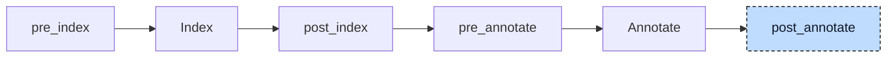

# Aggregate Return

A function or method may return a `STRING`, an array, or a struct. Codegen returns function results by value, which suits a number but not a value that can be hundreds of bytes long. In

```iecst
FUNCTION greet : STRING
    VAR_INPUT
        who : STRING;
    END_VAR

    greet := who;
END_FUNCTION
```

the caller writes `s := greet('world')` and expects the 81 bytes of the result to arrive in `s`. The aggregate-return lowerer gives the callee a `VAR_IN_OUT` parameter that refers to storage owned by the caller, and rewrites every call so that the caller allocates that storage, passes it as the first argument, and reads the result from it afterwards. This is also the calling convention of C, so an `{external}` function returning a string can be implemented in C with a pointer parameter.



The participant uses one hook, `post_annotate`, and runs once. It needs the index to decide whether a return type is an aggregate, whether a callee is a built-in, a function, or a method, and which declared parameter an argument belongs to; it needs the annotations for the callee of every call, with its qualified name and return type, and for the type of every argument. It works unit by unit: first the declarations of all POUs, then the bodies of all implementations, then the method declarations of all interfaces. The index and the annotations are not refreshed in between, so the bodies are rewritten against the signatures as they were before the change. Afterwards the participant sends the project back through index and annotate.


## Transformation

**The callee** gets a `VAR_IN_OUT` block with one variable, named like the POU, at the front of its variable blocks. The return type stays in the tree but is marked as aggregate: the POU still reads as a function that returns `STRING`, but the index no longer creates a return variable for it, and codegen ends the body with a plain return. Nothing in the body changes; the assignment to `greet` now writes through the reference into the caller's storage:

```diff
-FUNCTION greet : STRING
+FUNCTION greet
+    VAR_IN_OUT
+        greet : STRING;
+    END_VAR
     VAR_INPUT
         who : STRING;
     END_VAR

     greet := who;
 END_FUNCTION
```

Methods and interface methods are rewritten the same way, so a method `Named.getName : STRING` gets an in-out variable `getName`. Generic functions are skipped; only their concrete instances, which the generic lowerer created before, are rewritten. An inline return type such as `ARRAY[0..1] OF DINT` has already been replaced by the index pre-processing with a reference to a generated type, `__pair_return`, and that is the type the in-out variable gets.

**The caller** gets one temporary per call. The statement that contains the call becomes an expression list of three parts: an allocation statement (`alloca`, a node kind without a spelling in Structured Text, described in the [loop desugarer](01-loop-desugar.md)) for a temporary of the return type, the call with the temporary as first argument, and the original statement with the call replaced by the temporary:

```diff
-s := greet('world');
+alloca __greet0 : STRING;
+greet(__greet0, 'world');
+s := __greet0;
```

The temporary is named `__<callee><N>` from the last part of the callee's name, so `inst.getName()` gives `__getName3`, and `N` is one counter for the whole compiler run, shared by all temporaries this participant creates. The same rewrite applies wherever the call stands: as an operand of a comparison, as the condition of an `IF` (the allocation and the call land in front of the `IF`), in a `CASE` body, or as the argument of another call. A call used as a statement on its own keeps the third part as a bare reference to the temporary, for which codegen emits a load whose result is not used. Calls to built-in functions such as `SEL` or `MUX` are not touched; codegen handles their results itself.

**Nested calls** are moved out from the inside out, because a call walks its arguments before it queues its own allocation and call:

```diff
-s := shout(greet('x'));
+alloca __greet1 : STRING;
+greet(__greet1, 'x');
+alloca __shout2 : STRING;
+shout(__shout2, __greet1);
+s := __shout2;
```

**Named arguments.** Mixing named and positional arguments in one call is diagnosed by the validator (E132), so when the call uses `:=` for its arguments, the temporary is passed by name too. The name is the return name of the callee, the in-out variable the callee just received:

```diff
-greet(who := 'formal');
+alloca __greet3 : STRING;
+greet(greet := __greet3, who := 'formal');
+__greet3;
```

For a call through a function pointer, `fp^(inst)`, the temporary comes second, after the instance argument, and is named `__4` because the operator has no plain name.

**Pinned temporaries.** An allocation statement carries a flag that says whether the temporary is dead once its statement completes. Codegen uses it: for a statement-scoped temporary it reserves the stack slot at the start of the function but marks it live only from the allocation to the end of the expression list, so slots of consecutive statements can share memory. When the address of the result escapes the statement, inside an argument of `ADR` or `REF` or on the right side of `REF=`, the temporary is pinned instead: it gets no such markers and lives for the whole function call:

```diff
-ptr := ADR(greet('pin'));
+alloca __greet5 : STRING;
+greet(__greet5, 'pin');
+ptr := ADR(__greet5);
```

**Output assignments** are the participant's second job, on calls to functions and methods only. An output `result => i1` is normally a pointer to `i1` that the callee writes directly. That is wrong when the value needs a conversion (a `REAL` output stored into an `INT` variable), when the target is a bit access such as `b.%X0`, or when the output is a sized string whose size differs from the target's (one side sized and the other not, or the callee's buffer larger than the target's). In these cases the argument is replaced by a temporary of the parameter's type, and a copy-back assignment after the call lets codegen do the usual conversion, bit store, or length-capped copy:

```diff
-libFunction(inVar1 := 0, result => i1);
+alloca __libFunction_result6 : REAL;
+libFunction(inVar1 := 0, result => __libFunction_result6);
+i1 := __libFunction_result6;
```

The temporary is named `__<callee>_<parameter><N>` and is always statement-scoped. Positional outputs are rewritten the same way. Outputs of aggregate type other than sized strings, literal arguments, and calls to function blocks or programs are left alone; codegen copies those outputs itself.

The allocation and the references to a temporary take the location of the call; the wrapping expression list takes the location of the statement it replaces and a fresh node id. The in-out variable takes the location of the POU name.


## Interactions

The participant depends on most of the participants before it. The [loop desugarer](01-loop-desugar.md) has moved every loop condition into a guard `IF` inside a `WHILE TRUE` body, so a call in a loop condition is moved out inside the loop and runs on every iteration, where codegen marks the temporary live and dead once per iteration. The [control statement participant](04-control-statements.md) has split every `ELSIF` into a nested `IF`, so each condition has a statement list of its own for the calls moved out of it. The polymorphism lowerer wraps interface instance captures in `ADR(...)`, which is one reason `ADR` pins a temporary. The [reference-to-return participant](05-reference-to-return.md) has already made every `REFERENCE TO` return void, so such a function is never treated as returning an aggregate. The [init participant](06-init.md) has added a constructor call for the return variable of every function that returns a struct, `Point__ctor(origin)`; after this rewrite that call runs through the in-out reference and fills the caller's storage with the struct's default member values, while the temporary itself is only zero-filled by codegen. The generic lowerer has replaced generic calls by calls to concrete instances, so `LEFT(s, 2)` reaches this participant as `LEFT__STRING`, whose return type `STRING[__STRING_LENGTH]` gives a 2049-byte temporary `__LEFT__STRING7 : __LEFT__STRING_return`; the copy into `s` is then cut to the length of `s` like any string assignment.

Later stages see an ordinary void function with a pointer parameter. The index registers no return variable for a POU whose return type is marked as aggregate, and the in-out variable is its first declared parameter. Codegen passes `VAR_IN_OUT` parameters as pointers (see [Codegen](../pipeline/05-codegen.md), Functions), so a method `Named.getName` compiles to `void @Named__getName(ptr instance, ptr getName)` and the callee writes its result through the pointer like any in-out variable. An `{external}` function is declared with the same signature, `void @ext(ptr, i32)`, and a C implementation must take the result buffer as its first parameter. The assignment `s := __greet0` is the usual aggregate copy, so a result longer than the target is cut and never overflows. The [validator](../pipeline/04-validation.md) skips the first parameter when it compares a method against the interface or parent method it implements, because both sides have been rewritten and the generated parameter must not appear in a signature diagnostic. The inheritance lowerer, registered after this participant, descends into the expression lists it created; the array lowerer inspects only the top-level statements of a body and leaves these lists alone.

Because the rewrite happens after annotation and the index is not refreshed during the pass, the participant identifies a callee's return type from the annotation of the call, which still names the original type. Variable initializers are not rewritten: the declarations of a POU are visited only for their signature, so a call to `greet` in an initializer keeps its old form; such an initializer is not a constant and is rejected by the validator in any case.
