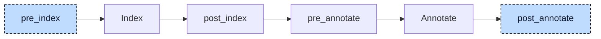

# Inheritance Lowerer

A function block or class can extend another one and use the members of its base as if they were its own. In

```iecst
FUNCTION_BLOCK Base
    VAR
        counter : DINT;
    END_VAR
END_FUNCTION_BLOCK

FUNCTION_BLOCK Child EXTENDS Base
    counter := counter + 1;
END_FUNCTION_BLOCK
```

the index and the resolver understand `EXTENDS`: the resolver finds `counter` by walking up the chain of bases and annotates it with its home, `Base.counter`. Codegen does not: it lays out a function block as a struct with exactly the fields of its variable blocks, and `Child` declares no field `counter`. The inheritance lowerer embeds the base as a member named `__Base` at the start of the derived block and rewrites every access to an inherited member, including `SUPER^`, into an access through that member, so the statement above becomes `__Base.counter := __Base.counter + 1`.



The participant uses two hooks. At `pre_index` it needs only the parsed tree: for every `FUNCTION_BLOCK` or `CLASS` with an `EXTENDS` clause it inserts the `__<Base>` variable, so the index registers it like a member the user wrote and the resolver can type accesses to it. At `post_annotate` it needs the index for the `EXTENDS` chain between two blocks, and the annotations for the type of every base expression and the home block of every member. It processes one unit at a time in two passes: the first replaces every `SUPER` keyword by a reference to the injected member, the second inserts the `__<Base>` steps in front of inherited members. A reference is rewritten after its base and its member have been visited, so a chain like `outer.inner.x` is completed from the inside out. Afterwards the participant sends the project through annotate again; the index is not rebuilt, because this hook changes no declaration. The participant reports no diagnostics.


## Transformation

**Embedded base.** The derived block gets a new local variable block with one variable, named after the base with a `__` prefix and typed with the base:

```diff
 FUNCTION_BLOCK Child EXTENDS Base
+    VAR
+        __Base : Base;
+    END_VAR
     VAR
         offset : DINT;
     END_VAR
```

The block is inserted in front of all other variable blocks, so the base is always the first field of the struct (`%Child = type { %Base, i32 }`), and the address of a `Child` is also the address of its `Base` part. A chain of three, `C EXTENDS B EXTENDS A`, embeds `__B : B` in `C` and `__A : A` in `B`. The `EXTENDS` clause stays on the block, so the index still records the base as the block's super class. The variable and its block carry internal source locations.

**Inherited members.** Inside the derived block, its methods, its actions, and the initializers of its variables, a member declared in a base is reached through the embedded base:

```diff
 FUNCTION_BLOCK Child EXTENDS Base
     VAR
-        offset : DINT := limit;
+        offset : DINT := __Base.limit;
     END_VAR

     METHOD reset
-        counter := 0;
+        __Base.counter := 0;
     END_METHOD

-    counter := counter + 1;
+    __Base.counter := __Base.counter + 1;
 END_FUNCTION_BLOCK
```

For every member reference the lowerer takes the block on which the member is looked up: the type the resolver gave the base expression, or, for a plain name, the block whose body is walked (the parent block for a method or an action). The annotation of the member names its home block as the first segment of the qualified name, `Base.counter`. When home and lookup block differ, the index returns the `EXTENDS` chain from the home up to the lookup block, and the lowerer inserts one `__<Name>` step per link, outermost first: with `a` declared in `A`, the statement `a := 1` in `C` becomes `__B.__A.a := 1`. A member of the block itself (`offset`), a global, and a local variable are left alone. The inserted identifiers carry internal locations; the member keeps its own, so a debugger still stops on `counter`.

**Access from outside.** The same rule applies to an instance, a pointer, or an array element of the derived type, wherever it is used. The base expression has the type `Child`, the member's home is `Base`:

```diff
-child.counter := 3;
-child.step();
-pc^.x := 1;
+child.__Base.counter := 3;
+child.__Base.step();
+pc^.__Base.x := 1;
```

`child.step()` stays a direct call; it now names the method on the embedded part, `Base.step`. `THIS^.counter` inside `Child` is handled the same way and becomes `THIS^.__Base.counter`, because `THIS^` has the type `Child`.

**Method table pointer.** Every function block or class carries a pointer, `__vtable`, to its method table, the struct of method addresses that the polymorphism lowerer builds for it. That lowerer adds the pointer only to blocks without a base, so in a derived block `__vtable` is an inherited member with home `Base`. The dispatch the polymorphism lowerer generated and the constructor the init participant generated are rewritten like user code:

```diff
-__vtable_Child#(THIS^.__vtable^).step^(Base#(THIS^));
+__vtable_Child#(THIS^.__Base.__vtable^).step^(Base#(THIS^));
```

```diff
 FUNCTION Child__ctor
     VAR_IN_OUT
         self : Child;
     END_VAR

     Base__ctor(self.__Base);
-    self.__vtable := ADR(__vtable_Child_instance);
+    self.__Base.__vtable := ADR(__vtable_Child_instance);
 END_FUNCTION
```

The call `Base__ctor(self.__Base)` already addressed the injected member when the init participant wrote it. After the rewrite, the one pointer in the root part of a `Child` instance points at the table of `Child`, which is what makes a call through a `REF_TO Base` reach the overriding method.

**`SUPER`.** `SUPER^` denotes the base part of the current instance and becomes a reference to the embedded member; `SUPER` without `^` is a pointer to it and becomes `REF(__Base)`:

```diff
     METHOD describe : DINT
-        describe := SUPER^.describe() + 10;
+        describe := __Base.describe() + 10;
     END_METHOD

-    p := SUPER;
+    p := REF(__Base);
```

The base is the super class of the block whose body is walked, the parent block inside a method. The replacement takes the location of the keyword and keeps the original `SUPER` node as metadata, so later checks can tell it apart from a user-written `__Base`. The new node is resolved on the spot with a resolver limited to that statement, so the second pass knows its type: `SUPER^.counter` needs no further step, while `SUPER^.z` with `z` declared in the grandparent becomes `__Base.__Grandparent.z`. `SUPER` in a position where it is not valid, after a dot, as `.SUPER`, or as the target of a cast, is left as it is for the validator. A method called through `SUPER^` is a direct call of the base implementation, because the polymorphism lowerer does not route `SUPER` calls through the method table; this is how an overriding method calls the version it overrides.

**Call arguments.** The name on the left of an argument assignment, `child(setpoint := 3)`, is not rewritten even when `setpoint` is declared in `Base`; the lowerer skips the left side of assignments inside a call. The name identifies a parameter, not a place in the struct. The resolver records with each argument how many `EXTENDS` steps lie between the called block and the parameter's home, and codegen emits the path itself.


## Interactions

The participant does no analysis of its own. The index resolves members and methods along the `EXTENDS` chain and answers the chain query; the resolver annotates every member with its qualified name and every base expression with its type. Before this participant runs, `SUPER^` has no type, and the resolver resolves a member behind it, `SUPER^.text`, like a plain name in the current block, so the earlier participants see it annotated and rewrite it: the property lowerer turns `SUPER^.scaled` into `SUPER^.__get_scaled()`, and the aggregate-return lowerer moves `SUPER^.text()` into a temporary. Both results reach this participant as ordinary references and get their `__Base` steps here; an inherited property read from outside ends as `child.__Base.__get_scaled()`.

The polymorphism lowerer and the init participant depend on the injected member and on the rewrite. The method table of a derived block lists the inherited methods with their base addresses (`self.step := ADR(Base.step)` in `__vtable_Child__ctor`), so dispatch on a derived instance finds them without help; only the path to the pointer, `THIS^.__Base.__vtable`, comes from here. The polymorphism lowerer casts the instance argument to the method's declaring block, `Base#(THIS^)`, which is valid because the base is the first field. The init participant writes `Base__ctor(self.__Base)` and skips the member during its walk, so the base is constructed exactly once; every other statement of a constructor, such as `self.offset := self.__Base.limit`, is rewritten like user code.

Codegen sees only struct member accesses and compiles the derived block as a struct whose first field is the base. For call arguments it walks the depth the resolver recorded as leading zero indices of the field path. In debug information the injected member is shown under the name `SUPER`, so a debugger presents the base part under the keyword the user knows. The [validator](../pipeline/04-validation.md) runs after all participants: it checks that the base of an `EXTENDS` clause exists, skips identifiers with internal locations in its private-member check, so the inserted steps never trigger it, and uses the metadata on the replaced `SUPER` nodes for its checks of misplaced `SUPER`.

The participant runs after every participant that generates code with member accesses, constructors, dispatch through method tables, moved-out calls, and accessor calls, and rewrites their output as well; this is why it comes so late. Only the array lowerer follows.
