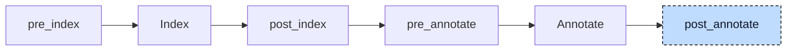

# Array

An array literal such as `[1, 2, 3]` is static data: codegen builds the whole array as one constant and copies it into the target with a single `memcpy`. That only works when every element has a value at compile time. In

```iecst
PROGRAM main
    VAR
        readings : ARRAY[0..2] OF DINT := [sample(), 0, sample()];
    END_VAR
END_PROGRAM
```

two of the three elements are calls, and the init participant has already turned the declaration into the statement `self.readings := [sample(), 0, sample()];` inside the constructor `main__ctor`. There is no constant to copy from. The array lowerer rewrites such an assignment into one assignment per element, or into a counted loop, so that codegen only has to store single values.



The participant uses one hook, `post_annotate`, and runs once, as the last of the twelve participants. It needs the index, not the annotations: the index tells it the type of the assigned variable, the constant-evaluated bounds of every dimension, and whether a name is a constant. It works unit by unit in three steps. First it walks the initializers of all declarations and the assignments of all bodies to rewrite the `(N)(value)` spelling described below. Then it walks the top-level statements of every body and replaces each assignment of an array literal that contains a runtime value by the lowered statements. Last it adds a `VAR_TEMP` block with the loop counters to every POU that received a generated loop. When all units are done it sends the project back through index and annotate; because no participant follows, this is the index and the annotation map that validation and codegen use.


## Transformation

**Element lists.** An assignment whose right side is an array literal is lowered only when an element is not constant: a variable, a call, or a struct literal such as `(x := 1)`, which codegen cannot evaluate inside an array. Each element becomes an assignment to the element's position, counted from the lower bound of the array. The left side is the original reference with an index appended; the element expression is the parser's node and keeps its location:

```diff
-self.readings := [sample(), 0, sample()];
+self.readings[0] := sample();
+self.readings[1] := 0;
+self.readings[2] := sample();
```

A literal with only constant elements is left alone and takes codegen's `memcpy` path. The lowerer decides without the index, so a reference to a constant counts as a runtime value here. A literal whose elements are all literals and constants never reaches it in a constructor, though: the init participant has already replaced it by the version the constant evaluator folded, in which every constant is a number.

**Repetition.** The spelling `n(value)` repeats one element `n` times. Fewer than 32 repetitions are unrolled into one assignment each, with the element expression copied into every one of them, so a call is called once per element. From 32 repetitions on, the participant emits a counted loop in the `WHILE TRUE` form that the [loop desugarer](01-loop-desugar.md) would have produced, since that participant will not run again. The counter is a `VAR_TEMP` variable of the POU named `__literal_idx`, one per POU and shared by all such loops in it:

```diff
+VAR_TEMP
+    __literal_idx : DINT;
+END_VAR
-self.big := [40(sample())];
+__literal_idx := 1;
+WHILE TRUE DO
+    IF __literal_idx > 40 THEN
+        EXIT;
+    END_IF
+    self.big[__literal_idx] := sample();
+    __literal_idx := __literal_idx + 1;
+END_WHILE
```

for `big : ARRAY[1..40] OF DINT`. A literal may mix segments, `[2(a), b, 2(c)]`; each segment is lowered on its own at the position it occupies, and the threshold applies per segment, so `[10(v), 10(v), 10(v), 10(v)]` is unrolled into 40 assignments.

**Several dimensions.** For `grid : ARRAY[0..1, 0..2] OF DINT`, the positions of the flat literal are converted into one index per dimension, the last dimension varying fastest and every index offset by its lower bound:

```diff
-self.grid := [sample(), 1, 2, 3, 4, sample()];
+self.grid[0, 0] := sample();
+self.grid[0, 1] := 1;
+self.grid[0, 2] := 2;
+self.grid[1, 0] := 3;
+self.grid[1, 1] := 4;
+self.grid[1, 2] := sample();
```

A single repetition of 32 or more that fills the whole array becomes one nested loop per dimension, with the counters `__literal_idx_0`, `__literal_idx_1`, and so on, so that `[40(sample())]` on an `ARRAY[0..7, 1..5]` loops `__literal_idx_0` from `0` to `7` and, inside it, `__literal_idx_1` from `1` to `5`, and assigns `self.big[__literal_idx_0, __literal_idx_1]` in the innermost body. A large repetition that fills only part of a multi-dimensional array is unrolled.

**Constant multipliers.** The standard also allows a constant as the repeat count, `[(N)(0.5)]`. The parser cannot tell this from a call of a parenthesized expression and produces a call node. With the index at hand, the first step of the participant resolves the name, as a member of the enclosing POU or as a global, and when it is a constant with an integer value, replaces the node by the repetition form `N(0.5)`. This rewrite covers the initializers in declarations too, so a literal that is constant apart from its spelling stays static data and is not lowered afterwards.

The generated assignments, loops, indices, and counters carry internal source locations; the copied left side and the element expressions keep the locations they had. The lowering happens only when the left side resolves in the index to an array type with constant bounds, through `self.member`, a bare member or local name, or `self` itself in the constructor of an array type. Otherwise the literal stays in place.


## Interactions

The participant exists for the [init participant](06-init.md), which turned every array initializer with a runtime value into an assignment in a constructor or in the stack statements at the start of a function body, and removed the initializer from the declaration so that codegen emits zeros for the static data. Those assignments sit at the top level of a body, which is the only place this participant looks; an array literal the user assigns at the top level of a body is lowered in the same way. The [loop desugarer](01-loop-desugar.md) and the [control statement participant](04-control-statements.md) ran long before, so the generated `WHILE TRUE` loops and single-block `IF` guards are written directly in their final form. The [aggregate-return lowerer](09-aggregate-return.md) has already rewritten the calls in bodies; it does not descend into array literals, so a call returning a `STRING` or struct inside a literal reaches neither participant in a lowered form and is rejected by the validator.

Later stages see only ordinary statements. The resolver annotates the indexed references and the counters like user code, and the [validator](../pipeline/04-validation.md) applies its usual checks to them. Codegen compiles an element assignment as a `getelementptr` into the array followed by a store; for a struct literal element it copies from a constant global with `memcpy`, and for a multi-dimensional index it flattens the indices into one offset (see [Codegen](../pipeline/05-codegen.md), Expressions). The `VAR_TEMP` counters become stack slots of the constructor, zero-initialized by codegen; the constant-multiplied literals that the first step rewrote are generated as constant initial values like any other repetition.
