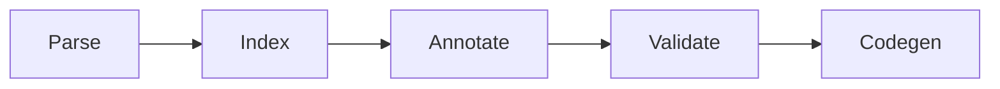
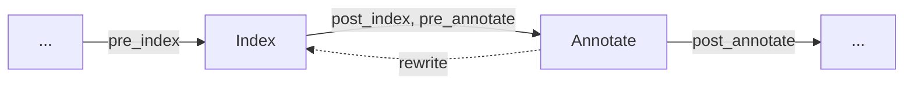

# Driver

The driver is the entry point of the compiler. It resolves the command line into a project, runs the pipeline stages in order, and hands the generated objects to the linker. It lives in the `plc_driver` crate and produces the `plc` binary. Every other chapter in this part describes one stage that the driver calls; this chapter describes the frame around them.

## Pipeline

Each stage takes the result of the previous stage by value and returns a new value:

| Stage | Result |
|---|---|
| Parse | One compilation unit (AST) per source file, include file, and library header |
| Index | The units plus the global symbol table |
| Annotate | The units, the symbol table, and the annotation map with the resolved type of every expression |
| Validate | No new data; aborts the run if any diagnostic reached error severity |
| Codegen | One LLVM module per unit, persisted as object files |
| Link | The final artifact: executable, shared object, relocatable object, LLVM IR, or bitcode |

The run has early exits. `--ast` stops after parsing and prints the raw AST. `--ast-lowered` stops after annotation and prints the AST after all lowering. `--check` stops after validation. Header generation and the hardware map also branch off after validation and skip codegen; see the [Outputs](../outputs/00-header-generator.md) chapters.

Before the pipeline runs, the driver loads every source file into memory once, so no stage reads from disk again, and selects the diagnostic renderer (`--error-format`) and the linker (`--linker`). Parsing, indexing, annotation, and codegen work on units in parallel with a rayon thread pool sized by `--threads`.

Codegen runs in one of two modes. By default each unit becomes its own LLVM module and object file, written under the build location with a path that mirrors the source path. With `--single-module`, and always for `-c`, all units are merged into one module. Linking then branches on the output format: IR and bitcode files are merged without a linker, a single object is copied, and everything else goes through the linker.

A project comes either from a build description (`plc.json`) or from the positional arguments. Its inputs fall into four groups. Sources are parsed with internal linkage and compiled. Includes (from `-i` or from library headers) are parsed with include linkage: their declarations are indexed, but no code is generated for them. Objects are not parsed and go straight to the linker. Libraries contribute headers as includes and names and paths as link options.

## Participants

The compiler has no dedicated intermediate representation. The AST produced by the parser is the only program representation until codegen. Everything that has to happen between the stages, mainly lowering language features into simpler constructs, is done by *participants*: plug-ins that receive the project at fixed hook points and either inspect it or rewrite it in place.

The labels on the solid edges are the hook points. Before the parsed units enter the index stage, every participant gets a chance to look at them or change them (`pre_index`). Once the symbol table exists, participants get a second chance with the table at hand (`post_index`), and a third one right before annotation (`pre_annotate`). After the annotator has resolved every expression, the fourth and most used hook runs (`post_annotate`). Two more hooks exist around code generation, but they are only used by the codegen participant itself.

The dashed edge is what makes participants different from a linear pass. When a participant rewrites the AST in one of these hooks, the symbol table and the annotation map no longer describe the program. The participant therefore sends the project back through index and annotate before it returns, and the next participant sees a consistent project again. A participant is not a step between two stages; it is a feature-specific transform that may attach to several hooks and that re-enters the pipeline after every rewrite. The inheritance lowerer, for example, rewrites declarations at `pre_index` and rewrites expressions at `post_annotate`.

There are two kinds. **Mutating participants** take the project by value and return a new one; they are the lowerers described above and use the four hooks around index and annotate. Diagnostics they collect while rewriting are gathered after the last `post_annotate` hook and reported together with the validation diagnostics. **Read-only participants** receive a shared reference and cannot change the project. They see all six hooks plus one call per generated module. The only default read-only participant is the codegen participant, which persists modules to disk and links them.

The driver registers twelve mutating participants in a fixed order. Later participants rely on the output of earlier ones, so the order is part of the contract. Each has its own chapter in the [Participants](../participants/README.md) part, listed in registration order.

> **Developer Note**
>
> Participants were introduced under deadline pressure as a low-cost alternative to a dedicated intermediate representation. At the time there were few lowering steps, and an IR would have been a large architectural change with little immediate benefit for the features that had to ship. The shortcut was never revisited: each new language feature added its own lowering step, and the participant list grew with it. Today the approach works, but it is known technical debt, for these reasons:
>
> - **Order hazards.** Participants rewrite the same AST. Each one assumes the rewrites of the participants before it and must not see the rewrites of the ones after it. The order is encoded only in the registration list, and moving a participant can silently change the meaning of a program.
> - **Synthetic AST.** Lowering produces nodes no user wrote: initializer functions, desugared loops, aggregate returns turned into in-out parameters. They are indistinguishable from user code by construction, so validation, diagnostics, and debug information have to detect and special-case them.
> - **Repeated analysis.** Every rewrite invalidates the symbol table and annotation map, so most participants rebuild both. For a three-file project the index and the annotator run nine times each.
> - **One representation, two contracts.** The AST has to represent both the source program and its lowered form. Later stages must handle constructs that exist only after lowering, and earlier stages must tolerate fields that are only meaningful later.
> - **No stable boundary.** There is no point where the program is in a fully defined, source-independent form. Codegen consumes an AST that mixes user constructs with generated ones, and a stage cannot be tested against a fixed input contract, only against "the AST after N participants".
>
> A dedicated IR would replace this with a fixed contract between front end and back end, one-directional lowering passes, and a single name resolution.
