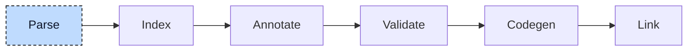

# Lexer and Parser

Parsing is the first pipeline step. It turns each source file into an abstract syntax tree (AST), because a compiler cannot work on text: a source file is a flat sequence of characters, and every later stage needs structure, which names are declared, which statements belong to which function, which operator binds tighter. It is the only stage that reads characters; everything after it works on the tree.



The stage has two halves. The lexer cuts the character stream into tokens. The parser consumes the tokens and builds the tree. The driver calls this pair once per source file, once per include file, and once for the built-in function declarations that ship with the compiler. Every call produces one compilation unit: the AST of one file, tagged with its linkage (internal for project sources, include for headers, built-in for the compiler's own declarations).


## Lexer

Working directly on characters is awkward for a parser: to see the assignment in `foo := 1` it would have to find the end of the name, skip whitespace and comments, and check that the colon is followed by `=`. The lexer takes this work out of the parser. It walks the source once and groups the characters into tokens: `foo` is one identifier token, `:=` is one assignment token, `1` is one integer literal token. A token has a kind, the exact text it covers, and the byte range it covers in the file. The parser then asks "is the current token an assignment?" instead of reading bytes.

The lexer works on a table of token kinds. Each kind is defined by the keyword or the character pattern that matches it: `FUNCTION` in any letter case is the function keyword, a letter followed by letters, digits, and underscores is an identifier, digits with optional underscores are an integer literal, and so on. At every position the lexer picks the kind that matches the longest stretch of text, so `:=` is one assignment token and not a colon followed by an equals sign. Whitespace, comments (`(* *)`, `/* */`, `//`), and unknown pragmas in braces are matched and dropped, so the parser never sees them. The few pragmas the compiler understands (`{external}`, `{ref}`, `{constant}`, `{sized}`) are token kinds of their own.

Some tokens carry a value the lexer already decoded. `%IX` becomes a hardware access token that knows it means input and bit. `INT#` becomes a type cast prefix. Literals such as `16#FF`, `T#1h30m`, or `'it$'s'` are single tokens, but their value is decoded by the parser, not by the lexer. The lexer only classifies text and cannot report a problem other than by rejecting the token. Decoding can fail in ways that need a precise diagnostic (an unknown `$` escape) or depend on neighboring tokens (`1.5` arrives as integer, dot, integer; `3(0)` is an integer followed by a repeat count), and both are the parser's business.

The lexer is also where the parser's cursor lives. The parser holds a session object that owns the lexer, the current token, the previous token, and a stack of "closing keywords" used for error recovery. Advancing the cursor pulls the next token from the lexer and checks a few lexical rules as it goes, for example that `END_IF` is written with an underscore.

For this file:

```iecst
FUNCTION compute : DINT
    compute := 1 + 2 * scale(bar, 3);
END_FUNCTION
```

the lexer emits:

| Token | Range | Text |
|---|---|---|
| KeywordFunction | 0..8 | `FUNCTION` |
| Identifier | 9..16 | `compute` |
| KeywordColon | 17..18 | `:` |
| Identifier | 19..23 | `DINT` |
| Identifier | 28..35 | `compute` |
| KeywordAssignment | 36..38 | `:=` |
| LiteralInteger | 39..40 | `1` |
| OperatorPlus | 41..42 | `+` |
| LiteralInteger | 43..44 | `2` |
| OperatorMultiplication | 45..46 | `*` |
| Identifier | 47..52 | `scale` |
| KeywordParensOpen | 52..53 | `(` |
| Identifier | 53..56 | `bar` |
| KeywordComma | 56..57 | `,` |
| LiteralInteger | 58..59 | `3` |
| KeywordParensClose | 59..60 | `)` |
| KeywordSemicolon | 60..61 | `;` |
| KeywordEndFunction | 62..74 | `END_FUNCTION` |
| End | 74..74 | |

Ranges are byte offsets into the file; the gap between `DINT` and the second `compute` is the newline and the indentation. `DINT` is an identifier, not a keyword, because type names are resolved later. Offsets become line and column positions only when a node's location is created, through a table of newline offsets that the session builds once per file.


## Parser

The parser turns the token stream into a compilation unit. It is a recursive descent parser, written by hand: there is one function per construct of the language, and a function that parses a construct calls the functions for the constructs it contains. For example parsing a function declaration calls the function that parses a variable block, which calls the one that parses a variable line, which calls the one that parses a data type. The call stack at any moment mirrors the nesting of the source at that point.

The top level is a loop over the current token. `PROGRAM`, `FUNCTION`, `FUNCTION_BLOCK`, and `CLASS` start a program organization unit (POU), `TYPE` starts user type declarations, `VAR_GLOBAL` a global variable block, `INTERFACE` an interface, `ACTIONS` a block of actions. Anything else is reported and skipped. A POU is parsed into two separate things: the declaration part (name, kind, return type, variable blocks, methods, properties) and the implementation part (the statement list of the body). Later stages treat these as different objects, so the parser separates them here. In pseudocode, the top level is:

```
loop {
    match token {
        Program | Function | FunctionBlock | Class => parse_pou(),
        Type                                       => parse_type(),
        VarGlobal                                  => parse_variable_block(),
        Interface                                  => parse_interface(),
        Actions                                    => parse_actions(),
        End                                        => return unit,

        other => {
            report("Unexpected token {other}, expected one of PROGRAM, FUNCTION, ...");
            advance();
        }
    }
}
```

Expressions, on the other hand, are parsed with one function per precedence level rather than one per construct. This is still recursive descent, but the rules are organized by how tightly an operator binds. The chain runs from the loosest binding to the tightest: expression list, range, `OR`, `XOR`, `AND`, equality, comparison, addition, multiplication, exponent, unary, and finally the leaf (a literal, a reference, a call, or a parenthesized expression). Each level parses its left operand by calling the next tighter level, then loops while it sees one of its own operators. This is why `1 + 2 * scale(bar, 3)` becomes an addition whose right side is a multiplication: the addition level hands control down to multiplication, which consumes `2 * scale(...)` as a whole before returning. A parenthesized leaf calls back to the top of the chain, which closes the recursion.

Every node the parser creates gets a source location and a unique id from a counter shared by all files of a run. The id is how later stages attach information to a node without modifying it; the annotation map in the resolver, for example, is keyed by node id. For `foo := bar + 5` the parser produces this tree, with the ids in the order they were handed out (children exist before their parent, so leaves come first):

```
Assignment {                                    // id: 7
    left: ReferenceExpr {                       // id: 2
        Member "foo"                            // id: 1
    },
    right: BinaryExpression {                   // id: 6
        operator: Plus,
        left: ReferenceExpr {                   // id: 4
            Member "bar"                        // id: 3
        },
        right: LiteralInteger 5,                // id: 5
    },
}
```

## Error handling

The parser does not stop at the first error. Diagnostics are collected in the session, and the parser recovers and continues so that one run reports as many problems as possible. Recovery is built on regions. When a function starts parsing a construct with a known end, such as a variable block that ends with `END_VAR` or a parenthesized expression that ends with `)`, it pushes the closing tokens on the session's stack. If parsing inside the region fails, the parser skips tokens until it reaches a token that closes the current region or any outer one, reports what it skipped, and continues after the region. A missing operand produces an empty statement node in the tree so the shape stays valid. For

```iecst
PROGRAM main
    VAR
        i : DINT
        text : STRING;
    END_VAR

    i := 1;
END_PROGRAM

FUNCTION scale : DINT
    scale := 2 *;
END_FUNCTION
```

the parser expects a semicolon after `i : DINT` and finds `text : STRING` instead. It reports the tokens it has to skip, continues with the body of `main`, and therefore also finds the missing operand in `scale`. One run reports both problems:

```
broken.st:4:9: error[E007]: Unexpected token: expected KeywordSemicolon but found 'text : STRING'
broken.st:12:17: error[E007]: Unexpected token: expected expression but found ;
error: Compilation aborted due to critical parse errors
```

After a file is parsed, the collected diagnostics go to the diagnostician. If any of them has error severity, the stage aborts the whole run with "Compilation aborted due to critical parse errors". Only files that parsed cleanly, or with warnings, reach the index stage.

## Output

For this function:

```iecst
FUNCTION compute : DINT
VAR_INPUT
    bar : DINT;
END_VAR
VAR
    foo : DINT;
END_VAR
    foo := 1 + 2 * scale(bar, 3);
    compute := foo;
END_FUNCTION
```

the parser functions are called in this order and nesting. Each line names the function and the token under the cursor when it is entered:

```
                                                       Parsing "FUNCTION compute : DINT"
parse_pou                                              at "FUNCTION"
  parse_return_type                                    at ":"
    parse_data_type_definition                         at "DINT"

                                                       Parsing "VAR_INPUT bar : DINT; END_VAR"
  parse_variable_block                                 at "VAR_INPUT"
    parse_variable_line                                at "bar"
      parse_data_type_definition                       at "DINT"

                                                       Parsing "VAR foo : DINT; END_VAR"
  parse_variable_block                                 at "VAR"
    parse_variable_line                                at "foo"
      parse_data_type_definition                       at "DINT"

                                                       Parsing "foo := 1 + 2 * scale(bar, 3);"
  parse_implementation                                 at "foo"
    parse_statement                                    at "foo"
      parse_expression                                 at "foo"
        parse_or_expression                            at "foo"
          ... one call per precedence level ...
            parse_multiplication_expression            at "foo"
              parse_unary_expression                   at "foo"
                parse_leaf_expression                  at "foo"    // consumes foo, sees ":=", parses the right side
                  parse_additive_expression            at "1"
                    parse_multiplication_expression    at "1"      // left operand of "+", returns after "1"
                    parse_multiplication_expression    at "2"      // right operand of "+", consumes "2 * scale(bar, 3)"
                      parse_unary_expression           at "2"
                      parse_unary_expression           at "scale"
                        parse_call_statement           at "scale"
                          parse_expression_list        at "bar"

                                                       Parsing "compute := foo;"
    parse_statement                                    at "compute"
      ...
```

and produces this compilation unit (locations and ids omitted):

```
CompilationUnit {
    pous: [
        POU {
            name: "compute",
            pou_type: Function,
            return_type: DataTypeReference "DINT",
            variable_blocks: [
                VariableBlock { kind: Input(ByVal), variables: [ bar : DINT ] },
                VariableBlock { kind: Local,        variables: [ foo : DINT ] },
            ],
        },
    ],
    implementations: [
        Implementation {
            name: "compute",
            statements: [
                Assignment {
                    left:  ReferenceExpr { Member "foo" },
                    right: BinaryExpression {
                        operator: Plus,
                        left:  LiteralInteger 1,
                        right: BinaryExpression {
                            operator: Multiplication,
                            left:  LiteralInteger 2,
                            right: CallStatement {
                                operator: ReferenceExpr { Member "scale" },
                                parameters: ExpressionList [ ReferenceExpr { Member "bar" }, LiteralInteger 3 ],
                            },
                        },
                    },
                },
                Assignment {
                    left:  ReferenceExpr { Member "compute" },
                    right: ReferenceExpr { Member "foo" },
                },
            ],
        },
    ],
    user_types: [],
    global_vars: [],
    linkage: Internal,
}
```

`plc --ast <file>` prints the full form of this tree, including locations, and stops before any later stage runs.

Graphical sources in XML (CFC, Continuous Function Chart) are not handled here. They are parsed by a separate crate that reads the XML and produces the same compilation unit type, so from the index stage on, both kinds of source look alike.

> **Note**
>
> The function `compute` appears twice in the compilation unit, once in `pous` as a POU that holds its declaration (name, kind, return type, variable blocks) and once in `implementations` as an implementation that holds its body (the statement list). The reason is actions: an action is an additional body of a program or function block, so one declaration can own several bodies. For
>
> ```iecst
> FUNCTION_BLOCK Counter
>     VAR
>         count : DINT;
>     END_VAR
>
>     count := count + 1;
> END_FUNCTION_BLOCK
>
> ACTIONS Counter
>     ACTION reset
>         count := 0;
>     END_ACTION
> END_ACTIONS
> ```
>
> the unit holds one POU, `Counter`, and two implementations, `Counter` and `Counter.reset`, that share its variables. Two lists model this one-to-many relation directly.


## Where it lives

| What | Where |
|---|---|
| Lexer | `compiler/plc_lexer` |
| Parser | `src/parser.rs`, `src/parser/`, `compiler/plc_parser` |
| AST | `compiler/plc_ast` |
| CFC | `compiler/plc_cfc` |


## What's next

The tree is purely syntactic. `scale` is a reference to a member named `scale`; the parser does not know that it is a function, and `bar` is not yet connected to its declaration. Types are names, not resolved types. Inline type definitions such as `STRING[80]` or `ARRAY[0..3] OF DINT` inside a variable declaration stay inline; the pre-processing step at the start of the index stage turns them into named user types. To turn names into meaning, the compiler first needs a table of everything that is declared anywhere in the project. Building that table is the job of the next stage, the [Index](02-index.md); connecting every expression in the bodies to an entry in that table is the job of the [Resolver](03-resolver.md) after it.
