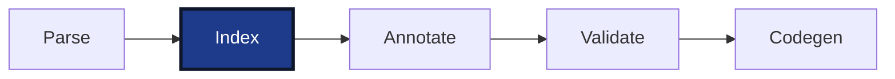

# Index

The index is the symbol table of the project. It records for every declared name what it is and what type it has. Only declarations are needed for that: a statement body can reference names, but it cannot introduce any, since every variable, type, and POU in Structured Text is declared in a declaration section. The index therefore reads the declarations and skips the bodies. For

```iecst
FUNCTION_BLOCK Buffer
    VAR_INPUT
        limit : INT;
    END_VAR
    VAR
        values : ARRAY[1..5] OF DINT;
    END_VAR
END_FUNCTION_BLOCK

PROGRAM main
    VAR
        bufferInstance : Buffer;
        i : DINT;
    END_VAR

    bufferInstance.values[i] := bufferInstance.limit;
END_PROGRAM
```

it records that `Buffer` is a function block, that `Buffer.limit` is an input of type `INT`, that `Buffer.values` is a local variable of an array type, and that `main.bufferInstance` is a local variable of type `Buffer`. This is needed because, after parsing, a source file is an isolated tree of names. The statement `bufferInstance.values[i] := bufferInstance.limit` means nothing until it is known that `bufferInstance` is a variable of type `Buffer`, that `Buffer` has a member `values`, and that `values` is an array of `DINT`. Those declarations may sit in another file. The index collects the declarations of all files into one table so that every later stage can look a name up.



The stage receives the parsed compilation units and returns them together with one global index. Each unit is pre-processed and indexed into a table of its own, the tables are merged together with the built-in declarations, and the constant expressions collected along the way are evaluated. The index is never updated in place: whenever a participant rewrites the tree, the stage runs again and replaces it.


## Pre-processing

The index is name based. An entry never points at another entry; it stores the name of its type as a string, and following it is another lookup. For `limit : INT` that is simple: the entry stores `"INT"`. For an anonymous type such as `ARRAY[1..5] OF DINT` or `STRING[80]` there is nothing to store, because the type has no name.

Pre-processing fixes this before indexing starts. It walks each unit, lifts every anonymous type into a named type declaration, and replaces the inline definition with a reference to the new name. The name is built from the container and the member; for a return type it is the function name and `return`. A function with an inline return type and an inline parameter type changes like this:

```diff
+TYPE
+    __describe_return : STRING[80];
+    __describe_values : ARRAY[1..5] OF DINT;
+END_TYPE
+
-FUNCTION describe : STRING[80]
+FUNCTION describe : __describe_return
     VAR_INPUT
-        values : ARRAY[1..5] OF DINT;
+        values : __describe_values;
     END_VAR
 END_FUNCTION
```

The same happens to pointers (`REF_TO INT`) and to the type parameters of generic functions (`__ADD__T` for parameter `T` of `ADD`).

While it walks the unit, pre-processing also normalizes two constructs so that later stages see one shape instead of several. Enum variants all get an explicit value expression: `TYPE Speed : (Slow, Normal, Fast := 10); END_TYPE` becomes `Slow := 0, Normal := Speed#Slow + 1, Fast := 10`. Hardware addresses such as `sensor AT %IX0.0 : BOOL` get a compiler-generated global that backs the address, named `__PI_0_0`, and the declared variable becomes an alias pointer to it, of a lifted type `__global_sensor`.

This is the first point in the pipeline where the AST is modified.


## The index

Before looking at how the index is filled, this is what it holds. Trimmed to its fields:

```rust
pub struct Index {
    /// Variables declared in VAR_GLOBAL blocks
    global_variables: SymbolMap<String, VariableIndexEntry>,

    /// Generated globals holding the default value of a struct, array, string, or POU instance
    global_initializers: SymbolMap<String, VariableIndexEntry>,

    /// Enum variants, keyed by the variant name alone
    enum_global_variables: SymbolMap<String, VariableIndexEntry>,

    /// Programs, functions, function blocks, classes, methods, and actions
    pous: SymbolMap<String, PouIndexEntry>,

    /// Interfaces
    interfaces: SymbolMap<String, InterfaceIndexEntry>,

    /// Properties, keyed by the POU that declares them
    properties: SymbolMap<String, Identifier>,

    /// Bodies, keyed by call name
    implementations: FxIndexMap<String, ImplementationIndexEntry>,

    /// Types: built-in, user-declared, lifted, and the instance struct of every POU
    type_index: TypeIndex,

    /// Initializers, array bounds, and string sizes, as expressions until evaluated
    constant_expressions: ConstExpressions,

    /// Size and alignment of the primitive types on the target
    data_layout: DataLayout,

    /// Jump labels, keyed by POU
    labels: FxIndexMap<String, SymbolMap<String, Label>>,

    /// VAR_CONFIG declarations
    config_variables: Vec<ConfigVariable>,
}
```

The maps are multi-maps with lowercase keys. Structured Text is case-insensitive, so keys are lowercased on insert and on lookup. A key can hold several entries, so that a name declared twice is not silently overwritten but kept for validation, which walks the duplicates under a key and reports them as ambiguous or duplicate symbols; regular lookups return the first entry. Insertion order is kept, which keeps generated code deterministic. On top of the raw maps the index offers lookup helpers for the common questions of the later stages, such as the effective type behind an alias chain, a member of a container including its super classes, or the parameters of a POU in call order.


## Indexing a unit

The indexer walks the declarations of a unit and puts an entry into the maps above for each one. For

```iecst
FUNCTION_BLOCK Counter
    VAR_INPUT
        step : DINT := 1;
    END_VAR
    VAR_OUTPUT
        count : DINT;
    END_VAR

    count := count + step;
END_FUNCTION_BLOCK
```

the walk reaches `FUNCTION_BLOCK Counter` and from here on knows that everything up to the end belongs to a function block named `Counter`. In `VAR_INPUT` it finds `step`. It creates a member entry for it: the variable `Counter.step`, an input of type `DINT`, at position 0. The initializer `1` is an expression, and the indexer does not evaluate expressions. It puts the expression into the constant arena, gets an id back, and stores that id in the entry. In `VAR_OUTPUT` it finds `count` and creates the second member entry, the output `Counter.count` of type `DINT` at position 1, with no initializer.

With the declaration part done, the indexer knows the full shape of a `Counter` and registers it in three maps. The type index gets the instance struct, a type named `Counter` whose members are the two entries in order; this struct is the memory layout of every instance. The POU map gets the entry that says `Counter` is a function block whose instances have that struct. And because a function block needs a default instance to copy from, the global initializers get a variable `__Counter__init` of type `Counter`.

Then the body. The indexer only records that an implementation exists for `Counter` and that it belongs to the type `Counter`. The statement `count := count + step` is not looked at; connecting it to the entries is the job of the resolver, explained in the next chapter.

Finally, visualized, the description of the example looks as follows. The keys are the lowercased names:

```
FUNCTION_BLOCK Counter
               ^^^^^^^    pous["counter"]                 { kind: FunctionBlock, name: "Counter", instance_struct_name: "Counter" }
                          type_index.pou_types["counter"] { name: "Counter", members: [Counter.step, Counter.count] }
                          global_initializers["__counter__init"] { name: "__Counter__init", data_type_name: "Counter" }
                          implementations["counter"]      { call_name: "Counter", type_name: "Counter", kind: FunctionBlock }
    VAR_INPUT
        step : DINT := 1;
        ^^^^                                              { name: "step",  qualified_name: "Counter.step",  data_type_name: "DINT", argument_type: Input,  location_in_parent: 0, initial_value: ConstId(0) }
                       ^  constant_expressions[0]         { expression: 1, target_type: "DINT", state: Unresolved }
    END_VAR
    VAR_OUTPUT
        count : DINT;
        ^^^^^                                             { name: "count", qualified_name: "Counter.count", data_type_name: "DINT", argument_type: Output, location_in_parent: 1, initial_value: None }
    END_VAR

    count := count + step;
END_FUNCTION_BLOCK
```

The other declaration kinds follow the same walk with fewer stops. Global variables become entries in `global_variables`. A struct becomes a type in `type_index` with its members as variable entries, plus a `global_initializers` entry. An enum becomes a type and, in addition, one constant global per variant in `enum_global_variables`, so that `Slow` resolves without the qualifier `Speed.Slow`. Array bounds and string sizes go to `constant_expressions` like initializers.

Two details are easy to miss. Functions get an instance struct too, with an extra member for the return value, so that `describe.describe` can be looked up like any other member even though no function instance exists at runtime. Parameters passed by reference (`VAR_IN_OUT`, `VAR_INPUT {ref}`, function outputs) do not keep their declared type; the indexer registers an auto-dereferencing pointer type for them, `__auto_pointer_to_DINT` for a `DINT`, and the member uses that.

Actions are the exception to "declaration first". An action has a body but no declaration of its own, so the indexer registers its POU entry when it reaches the implementation.


## Merging

Units are indexed concurrently, one table each, and the tables are merged in unit order into one global index. Merging appends: a name declared in two files ends up with two entries under one key, which validation later reports as a duplicate. Constant expressions are copied into the global arena and receive new ids, and the entries that hold an id are updated with it.

Two more tables are merged in after the user's units. The built-in types, `BOOL`, `INT`, `DINT`, `REAL`, `STRING`, `TIME`, and the rest, are constructed directly; there are 38 of them. The built-in functions, `ADR`, `SIZEOF`, `MUX`, `SEL`, the generic arithmetic and comparison functions, and the array bound functions, are Structured Text declarations embedded in the compiler; they are parsed, pre-processed, and indexed like any other unit and merged last. A user function named `add` therefore shares a key with the built-in `ADD` and is a duplicate symbol.


## Constant evaluation

Array bounds, string sizes, initial values, and enum variant values are expressions, and the later stages need them as values: codegen has to know how many elements an array has. Only now, with all declarations merged, is every name such an expression can reference known, so the constant arena is evaluated as the last step. In

```iecst
VAR_GLOBAL CONSTANT
    SCALE_FACTOR : DINT := MAX_ITEMS + 1;
    MAX_ITEMS : DINT := 3;
    TOO_BIG : SINT := 300;
END_VAR

VAR_GLOBAL
    sensor AT %IX0.0 : BOOL;
    NOT_CONST : DINT := 5;
END_VAR

VAR_GLOBAL CONSTANT
    C : DINT := NOT_CONST + 1;
END_VAR
```

the arena holds one expression per initializer, plus the address `__PI_0_0` that pre-processing gave `sensor`. The evaluator takes them in order and tries to fold each into a literal. `MAX_ITEMS + 1` comes first, but `MAX_ITEMS` is not resolved yet, so the expression goes to the back of the queue. `3` is already a literal and is marked resolved. `300` is a literal too, but the entry says it initializes a `SINT`, and `300` does not fit, so it is marked unresolvable with the reason "This will overflow for type SINT". The reference to `__PI_0_0` cannot be folded at all, because it is an address, and addresses exist only after codegen has allocated the globals; it is marked unresolvable with the reason "Try to re-resolve during codegen", which codegen understands as an instruction. `5` resolves. `NOT_CONST + 1` references a variable that is not declared constant, so it is unresolvable with the reason "NOT_CONST is no const reference". The queue now holds only `MAX_ITEMS + 1`; on the second attempt `MAX_ITEMS` is known to be `3`, and the expression resolves to `4`. The loop stops when a full pass makes no progress.

Finally, visualized, the arena reads as follows:

```
VAR_GLOBAL CONSTANT
    SCALE_FACTOR : DINT := MAX_ITEMS + 1;
                           ^^^^^^^^^^^^^   { target_type: "DINT", Resolved(4) }
    MAX_ITEMS : DINT := 3;
                        ^                  { target_type: "DINT", Resolved(3) }
    TOO_BIG : SINT := 300;
                      ^^^                  { target_type: "SINT", Unresolvable("This will overflow for type SINT") }
END_VAR

VAR_GLOBAL
    sensor AT %IX0.0 : BOOL;
              ^^^^^^                       { target_type: "__global_sensor", Unresolvable("Try to re-resolve during codegen") }
    NOT_CONST : DINT := 5;
                        ^                  { target_type: "DINT", Resolved(5) }
END_VAR

VAR_GLOBAL CONSTANT
    C : DINT := NOT_CONST + 1;
                ^^^^^^^^^^^^^              { target_type: "DINT", Unresolvable("NOT_CONST is no const reference") }
END_VAR
```

Validation turns the stored reasons into diagnostics: `TOO_BIG` becomes a warning, and `C` an error that aborts the compilation, since codegen could not emit a value for it. As a last step, enums without an explicit default get one: the variant that evaluates to zero, or the first variant if none does.


## Entries

The values in these maps are four kinds of records: variable entries, POU entries, implementation entries, and types. Their exact fields are best read in the source, in `src/index.rs` for the first three and `src/typesystem.rs` for types. The [Internals](../internals/README.md) chapters show what these records contain for each language construct, such as what the index holds for a function block or an array.


## What's next

The index knows every declaration, but the statement bodies are still untouched trees of names. `bufferInstance.values[i] := bufferInstance.limit` has not been connected to the entries for `main.bufferInstance`, `Buffer.values`, or `Buffer.limit`, and no expression has a type yet. Making those connections, one expression at a time, is the job of the next stage, the [Resolver](03-resolver.md).
