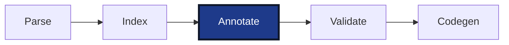

# Resolver

After indexing, every declaration is known, but the statement bodies are still trees of names. In

```iecst
PROGRAM main
    VAR
        i : DINT;
        small : SINT;
    END_VAR

    small := i + 1;
END_PROGRAM
```

the parser produced an assignment whose left side is a name `small` and whose right side is a name `i` plus a literal `1`. Nothing says that `small` is the local variable `main.small`, that `i + 1` is a `DINT` expression, or that storing it into a `SINT` needs a narrowing conversion. The resolver answers these questions for every expression in the project. The driver calls this stage "annotate", and the name is exact: the resolver does not change the tree. It writes its answers into a side table, the annotation map, keyed by the id the parser gave each node. Validation reads that table to report type errors and codegen reads it to pick instructions and insert conversions.



The stage receives the units and the global index. Each unit is annotated concurrently by its own visitor, which returns an annotation map, the set of names the unit depends on, and the string literals it contains. The maps are merged into one, and the few types the visitors had to create on the way are imported into the index. The result is the annotated project that validation and codegen work on. Like the index, the map is never updated in place: whenever a participant rewrites the tree, the stage runs again and replaces it.


## Annotations and hints

For every expression the resolver records two things. The *annotation* says what the expression is: which declaration it refers to, or which type its value has. The *type hint* says what the expression should become: the type the surrounding statement expects. For `small := i + 1` the literal `1` and the sum `i + 1` are annotated as `DINT`, since integer literals are `DINT` unless they need 64 bits, and the sum receives the hint `SINT`, because that is what the left side stores. Codegen sees the hint and emits a truncation; validation compares both and warns about the implicit downcast.

Annotations come in a few kinds. A reference to a variable records its qualified name, its type, whether it is an input, output, local, or global, and whether it is constant. A reference to a function records the function and its return type. A reference to a type, a program, or a function block records that name. An expression that is neither, such as `i + 1`, `values[i]`, or a literal, records only its resulting type. A call argument records, as a hint, the parameter it was matched to and its type.

Trimmed to its fields, the annotation map looks like this:

```rust
pub struct AnnotationMapImpl {
    /// What each expression is, keyed by node id
    type_map: FxIndexMap<AstId, StatementAnnotation>,

    /// What each expression should become, keyed by node id
    type_hint_map: FxIndexMap<AstId, StatementAnnotation>,

    /// Range-check calls that codegen emits in place of an assigned value
    hidden_function_calls: FxIndexMap<AstId, AstNode>,

    /// Types created while annotating, such as sized string literal types
    pub new_index: Index,
}
```

The map is the only output of the stage. An expression the resolver could not resolve simply has no entry; the resolver itself reports nothing, and validation turns the missing entry into an "unresolved reference" diagnostic.


## Walking a unit

The resolver walks each unit from top to bottom and visits every expression it finds: the initializers in variable blocks, the bounds in type declarations, and the statements of the bodies. Each expression is visited with the POU it sits in as its context. For

```iecst
FUNCTION_BLOCK Buffer
    VAR_INPUT
        limit : INT;
    END_VAR
END_FUNCTION_BLOCK

PROGRAM main
    VAR
        bufferInstance : Buffer;
        i : DINT := 1;
    END_VAR

    i := bufferInstance.limit;
END_PROGRAM
```

The walk starts at `Buffer` and visits its variable blocks. The only block is `VAR_INPUT` with the member `limit`. The declaration has no initializer, so there is no expression and nothing to annotate. The body of `Buffer` is empty, so the resolver is done with this POU without a single entry.

Next is `main`, again variable blocks first. `bufferInstance` has no initializer, nothing to do. `i` has the initializer `1`. An integer literal is always a `DINT` value, so the map gets an entry: `1` is a value of type `DINT`. Because the literal initializes a `DINT` variable, it also gets the hint `DINT`, the type it has to be stored as.

Finally the body of `main`. The single statement is an assignment. The resolver visits the value first, then the target, and hints the value last. The value is the qualified reference `bufferInstance.limit`, which is resolved from left to right. For `bufferInstance` the resolver knows it is inside `main`, so it asks the index whether `main` has a member of that name. It does, and `bufferInstance` is annotated as the variable `main.bufferInstance` of type `Buffer`. That type becomes the qualifier for the next part: `limit` is looked up as a member of `Buffer` and annotated as the variable `Buffer.limit` of type `INT`. The reference as a whole carries the same entry as its last part, `Buffer.limit`. Then the target: `i` is looked up as a member of `main` and annotated as `main.i` of type `DINT`. Targets get no hint. Last, the value is hinted with the target's type: `bufferInstance.limit` is an `INT`, and it must become a `DINT`, so it gets the hint `DINT`, which codegen later turns into a widening conversion.

Finally, visualized, the description of the example looks as follows:

```
PROGRAM main
    VAR
        bufferInstance : Buffer;
        i : DINT := 1;
                    ^          { kind: Value, resulting_type: "DINT", hint: "DINT" }
    END_VAR

    i := bufferInstance.limit;
    ^                          { kind: Variable, qualified_name: "main.i",              resulting_type: "DINT",   hint: None }
         ^^^^^^^^^^^^^^        { kind: Variable, qualified_name: "main.bufferInstance", resulting_type: "Buffer", hint: None }
                        ^^^^^  { kind: Variable, qualified_name: "Buffer.limit",        resulting_type: "INT",    hint: None }
         ^^^^^^^^^^^^^^^^^^^^  { kind: Variable, qualified_name: "Buffer.limit",        resulting_type: "INT",    hint: "DINT" }
END_PROGRAM
```

Looking up a plain name tries a few strategies in order until one succeeds: a variable (a member of the current POU, then a global variable or an enum variant), a POU (a program, function, or function block by that name), and a type. The operator of a call tries functions first, so that inside a function `scale`, the name `scale` is the return variable but `scale(...)` is the function.


## Promotion

Arithmetic and comparisons combine operands of different types. The resolver decides which type the operation runs in and marks the operands that have to be converted. In

```iecst
PROGRAM main
    VAR
        small : SINT;
        big : DINT;
        ok : BOOL;
    END_VAR

    small := big + 1;
    ok := small < big;
END_PROGRAM
```

the first statement is an assignment, so its value `big + 1` is visited first. The sum visits both operands: `big` is a member of `main` and annotated as `main.big` of type `DINT`, and the literal `1` is a `DINT` value. The type of the sum is the bigger of the two operand types, and never smaller than `DINT`. Both operands already are `DINT`, so nothing has to be converted and `big + 1` is annotated as a `DINT` value. Then the target: `small` is annotated as `main.small` of type `SINT`. Last, the value is hinted with the target's type: `big + 1` gets the hint `SINT`. The hint sits on the sum as a whole, not on its operands; the addition runs in `DINT` and only the result is narrowed.

The second statement compares `small`, a `SINT`, with `big`, a `DINT`. The bigger type is `DINT`, so `small` gets the hint `DINT`: it is widened before the comparison. A comparison always produces a `BOOL`, so `small < big` is annotated as a `BOOL` value. The target `ok` is `main.ok` of type `BOOL`, and the comparison gets the hint `BOOL`, which changes nothing here.

Visualized:

```
    small := big + 1;
    ^^^^^                { kind: Variable, qualified_name: "main.small", resulting_type: "SINT", hint: None }
             ^^^^^^^     { kind: Value,                                  resulting_type: "DINT", hint: "SINT" }
             ^^^         { kind: Variable, qualified_name: "main.big",   resulting_type: "DINT", hint: None }
                   ^     { kind: Value,                                  resulting_type: "DINT", hint: None }

    ok := small < big;
    ^^                   { kind: Variable, qualified_name: "main.ok",    resulting_type: "BOOL", hint: None }
          ^^^^^^^^^^^    { kind: Value,                                  resulting_type: "BOOL", hint: "BOOL" }
          ^^^^^          { kind: Variable, qualified_name: "main.small", resulting_type: "SINT", hint: "DINT" }
                  ^^^    { kind: Variable, qualified_name: "main.big",   resulting_type: "DINT", hint: None }
```


## Calls

In

```iecst
FUNCTION scale : DINT
    VAR_INPUT
        value : DINT;
        factor : INT;
    END_VAR
END_FUNCTION

PROGRAM main
    VAR
        i : DINT;
        small : SINT;
    END_VAR

    i := scale(i, factor := small);
END_PROGRAM
```

the statement is an assignment, so the call is visited first. A call has an operator and an argument list. The operator `scale` is looked up with functions first and annotated as the function `scale` returning `DINT`. The arguments are visited next, with `scale` remembered as the callee. `i` is a plain reference and resolves as usual to `main.i` of type `DINT`. `factor := small` is a named argument, itself an assignment: its value `small` resolves to `main.small` of type `SINT`, but its target `factor` is looked up as a member of the callee, not of `main`, and resolves to the input `scale.factor` of type `INT`; `small` gets the hint `INT`.

Then the arguments are matched to the parameters of `scale`. Positional arguments take the parameters in declaration order, named arguments take the parameter with their name. `i` is matched to parameter 0 and gets the hint `DINT`, `factor := small` is matched to parameter 1 and gets the hint `INT`. These hints also record the parameter position, which codegen uses to place the values. With the arguments done, the call as a whole is annotated with the return type of the function, a `DINT` value. The rest is the ordinary assignment: the target `i` is `main.i`, and the call gets the hint `DINT`.

Visualized:

```
    i := scale(i, factor := small);
    ^                              { kind: Variable, qualified_name: "main.i",       resulting_type: "DINT", hint: None }
         ^^^^^^^^^^^^^^^^^^^^^^^^^ { kind: Value,                                    resulting_type: "DINT", hint: "DINT" }
         ^^^^^                     { kind: Function, qualified_name: "scale",        return_type: "DINT",    hint: None }
               ^                   { kind: Variable, qualified_name: "main.i",       resulting_type: "DINT", hint: Argument { resulting_type: "DINT", position: 0 } }
                  ^^^^^^^^^^^^^^^  { kind: None,                                                             hint: Argument { resulting_type: "INT", position: 1 } }
                  ^^^^^^           { kind: Variable, qualified_name: "scale.factor", resulting_type: "INT",  hint: None }
                            ^^^^^  { kind: Variable, qualified_name: "main.small",   resulting_type: "SINT", hint: "INT" }
```

The named argument `factor := small` has no annotation of its own, only the hint that ties it to parameter 1; its two sides are annotated like any assignment.

A call on a function block instance follows the same path, except that the operator resolves to a variable whose type is the function block; the arguments are matched against that function block, and the call has no result type. Built-in functions such as `ADR`, `REF`, `SIZEOF`, and `MUX` carry their own annotation logic, since their result type depends on the argument.


## Literals and generated types

Literals are typed by their value: an integer is `DINT` if it fits 32 bits and `LINT` otherwise, a real is `REAL` if it fits 32 bits and `LREAL` otherwise, and a typed literal such as `INT#5` takes the type of its prefix. A string literal gets a string type sized to its length: in `text : STRING := 'hello'` the literal is annotated `__STRING_5` and hinted to `STRING`. The sized type does not exist in the index, so the resolver registers it in a small index of its own. After all units are annotated, these generated types, together with the on-demand pointer types, are imported into the global index so that codegen can look them up like any declared type. String literals found in bodies are also collected per unit, because codegen emits them as global constants.


## Dependencies

While it annotates, the visitor records every type, variable, and callable the unit refers to, following types into their members, arrays into their element type, and pointers into their target. Codegen uses this set to declare in a unit's module only what that module needs, instead of every declaration in the project.


## What's next

Every expression now has a type, every name its declaration, and every conversion its hint, but nothing has checked whether the program is correct: whether every name refers to a declaration, whether an `INT` fits into a `SINT`, or whether a private member is accessed from outside. Those checks are the job of the next stage, [Validation](04-validation.md).
