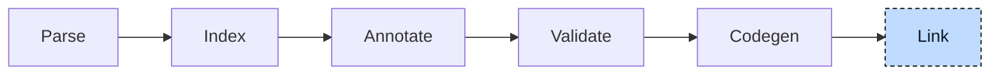

# Linker

Linking is the last pipeline step. Its job is to join the object files that codegen produced into one artifact. For

```iecst
(* scale.st *)
FUNCTION scale : DINT
    VAR_INPUT
        value : DINT;
    END_VAR

    scale := value * 2;
END_FUNCTION

(* main.st *)
PROGRAM main
    VAR
        i : DINT;
    END_VAR

    i := scale(i);
END_PROGRAM
```

the object of `main.st` contains a call to `scale` but no code for it; `scale` is only a declared symbol there. The object of `scale.st` has the code. Neither object can run. Linking joins the objects, replaces every reference to a symbol with the address of its definition, adds the libraries the project needs, and writes the final artifact: an executable, a shared object, or one combined object.



The compiler does not link by itself. It assembles a command line and runs a linker that is installed on the system, in the same way a C compiler driver does. The stage receives the objects that codegen persisted, together with the objects and libraries named by the project, and returns the path of the artifact.


## Inputs

Three kinds of input reach the linker: the objects generated in this run (one per source file, or exactly one with `--single-module` or `-c`), object files given as positional arguments (not parsed, passed straight through), and libraries from `-l` flags or the build description, searched in the `-L` paths and the library locations of the build description. The include files that made a library's declarations known during parsing are not inputs here; the linker resolves those symbols against the library binary.


## Output formats

The output format is chosen on the command line and decides whether a linker runs at all:

| Flag | Result | How |
|---|---|---|
| default | executable | linker, `-o <output>` |
| `--shared` | shared object | linker, `--shared -o <output>` |
| `--relocatable` | one object combining all inputs | linker, `-r -o <output>` |
| `-c` | one object, no linking | the single object is copied to the output path |
| `--ir`, `--bc` | one LLVM IR or bitcode file | the modules are merged in memory and written; no linker |

A shared object is linked with `--no-undefined`, so that a symbol nobody defines fails the build instead of surfacing when the library is loaded; `--allow-undefined-symbols` turns this off for libraries whose loader provides the missing symbols. `--fno-pic` on an executable adds `-no-pie`, so the linker accepts the fixed-address code that codegen emitted.


## Choosing the linker

Without a `--linker` flag the compiler looks for a linker in a fixed order: `cc`, then `clang`, then `ld.lld`, then `ld`. The first two are compiler drivers: they know the platform's startup files and default libraries and add them on their own, so an executable linked through them can start. The last two are direct linkers that take only what they are given. A driver is only accepted if it can build for the target; the compiler checks this by linking an empty C program with the same `--target` and `--sysroot` first. For the host target this always passes. For a cross target it passes only when a sysroot with the target's libraries is available, which is why `--sysroot` is needed for a cross-compiled executable. `--linker <command>` skips the search.

The distinction between driver and direct linker decides how flags are spelled: a raw `--linker-arg` goes to a direct linker unchanged and to a driver behind `-Xlinker`, and `--nocrt` and `--nolibc` tell a driver to leave out the startup files and default libraries for targets that bring their own.


## The command line

The arguments are assembled in a fixed order: the generated objects, the objects from the command line, the `-L` search paths, the `-l` libraries, the sysroot, the implicit search paths (current directory, build location, library location), the flags described above, and finally the mode and output. For the two-file example, linked with a library, the compiler runs:

```
cc -fuse-ld=lld build/main.st.o build/scale.st.o -L/opt/plc/lib -liec61131std -L. -o out
```

The command is written to the debug log before it runs. The linker's own output goes to the terminal unchanged, and a non-zero exit code becomes the diagnostic E077, "An error occurred during linking". When the project comes from a build description, the `build` subcommand finishes by copying every library marked as `Copy` next to the artifact, so that the result can be deployed as one directory.

> **Developer Note**
>
> The linker is an external process, found on the `PATH` at run time. A working installation needs at least one of `cc`, `clang`, `ld.lld`, or `ld`, and the exact behavior of a link depends on which one is found. The `--script` and `--no-linker-script` flags are left over from a built-in linker script that is no longer used; a script is only added to the command when the user passes one.


## Where it lives

| What | Where |
|---|---|
| Linker | `src/linker.rs`, `src/output.rs` |
| Link step | `compiler/plc_driver` |


## What's next

This chapter closes the pipeline: source text went in, and an executable or library came out. Several things along the way were never written by the user: the `__ctor` functions that codegen registered as global constructors, the `__vtable` member of every function block, the `WHILE TRUE` loops that every `FOR` had turned into before codegen saw it. All of them were inserted by participants, the plug-ins the [Driver](00-driver.md) chapter introduced. The [Participants](../participants/README.md) part describes each of them, in the order the driver runs them.
