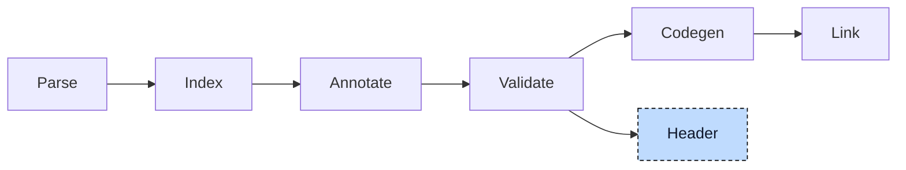

# Header Generator

C code and Structured Text code can call each other through linked functions. Both need compatible declarations. For

```iecst
FUNCTION scale: DINT
    VAR_INPUT
        value: DINT;
        factor: INT;
    END_VAR
    VAR_IN_OUT
        total: DINT;
    END_VAR
END_FUNCTION
```

the C declaration is `int32_t scale(int32_t value, int16_t factor, int32_t* total);`. The widths, pointer parameters, and symbol name must match. The header generator translates the validated project's declarations into a C header. The examples below show its mappings and current limits.



The generator runs after validation, in place of codegen: the run stops once the headers are written and no object file is produced. It reads the declarations of every unit and the global index; the bodies are never looked at.


## Invocation

These commands request headers and stop the pipeline after validation:

| Command | Headers | Name |
|---|---|---|
| `plc --generate-headers a.st b.st` | one per source file, next to it | `a.h`, `b.h` |
| `plc --generate-headers a.st b.st -o api` | one combined header | `api.h` |
| `plc generate plc.json headers` | one per file of the build description | source name |

`--header-prefix <name>` names the header after the prefix instead of after the source. Every unit then writes to the same file, so only the declarations of the last unit survive. `--header-output <dir>` moves the headers into a directory, which is created when it is missing.

A unit whose declarations are all external or included, such as an `-i` include file, produces an empty model and no file. The include guard is the header path in upper case with every other character turned into `_`, so `motor.h` gets `MOTOR_H_`.

Only C is implemented; `--header-language rust` is accepted by the command line and rejected by the generator. The `--include-stubs` flag is parsed and ignored.


## From declarations to a template

The generator first collects declarations in a template model, then renders that model as text:

```rust,noplayground
pub struct TemplateData {
    /// Aliases (typedefs), structs, and enums
    pub user_defined_types: UserDefinedTypes,

    /// extern declarations, including one instance per program
    pub global_variables: Vec<Variable>,

    /// Prototypes: functions, function block bodies, methods, actions
    pub functions: Vec<Function>,
}

pub struct Variable {
    /// Already a C type name, such as `int32_t` or `Point*`
    pub data_type: String,

    pub name: String,

    /// Default, Array(size), MultidimensionalArray(sizes), Declaration(value), Variadic, or Struct
    pub variable_type: VariableType,
}
```

The generator visits globals, user types, POUs, and implementations. It skips external and included declarations, generated constructors, and types with names that start with `__`. It keeps the anonymous helper array types needed to recover multi-dimensional array sizes.

Built-in types are translated from their index records. Integers use `intN_t` or `uintN_t`; `BOOL` uses `bool`; `REAL` and `LREAL` use `float_t` and `double_t`. Date and time types use `time_t`. Strings become arrays of `char` or `int16_t`, including a terminator slot. User type names stay unchanged.

Array bounds and string lengths that are constant expressions rather than literals are evaluated through the index, so `STRING[MESSAGE_LEN]` with `MESSAGE_LEN: DINT := 80` becomes `char[81]`. A bound that is not constant stops the run with an error.


## The example, rendered

The project below covers the main declaration forms. Each following subsection pairs a construct with trimmed C output.

```iecst
TYPE Speed: (Slow, Fast := 10, Turbo); END_TYPE

TYPE Point:
    STRUCT
        x: DINT;
        label: STRING[20];
    END_STRUCT
END_TYPE

TYPE Message: STRING[80]; END_TYPE
TYPE Grid: ARRAY[0..1, 0..2] OF DINT; END_TYPE
TYPE PointRef: REF_TO Point; END_TYPE
TYPE Percent: INT(0..100); END_TYPE

VAR_GLOBAL
    counter: DINT;
    origin: Point;
    callback: __FPOINTER scale;
END_VAR

FUNCTION scale: DINT
    VAR_INPUT
        value: DINT;
    END_VAR
    VAR_INPUT {ref}
        p: Point;
    END_VAR
    VAR_IN_OUT
        total: DINT;
    END_VAR
    VAR_OUTPUT
        overflow: BOOL;
    END_VAR
END_FUNCTION

FUNCTION sum: DINT
    VAR_INPUT
        args: {sized} DINT...;
    END_VAR
END_FUNCTION

FUNCTION_BLOCK Buffer
    VAR_INPUT
        limit: INT;
    END_VAR
    VAR
        count: DINT;
    END_VAR
    METHOD push: BOOL
        VAR_INPUT
            value: DINT;
        END_VAR
    END_METHOD
END_FUNCTION_BLOCK

ACTIONS Buffer
    ACTION reset
    END_ACTION
END_ACTIONS

FUNCTION_BLOCK RingBuffer EXTENDS Buffer
    VAR
        head: DINT;
    END_VAR
END_FUNCTION_BLOCK

PROGRAM main
    VAR
        i: DINT;
    END_VAR
END_PROGRAM
```

### Named types

Named types become typedefs. An enum is a typedef of its numeric type plus one `#define` per variant, named `Type_Variant` so that variants of different enums cannot clash. A variant without a value gets the previous value plus one, which is the same rule the index pre-processor applies:

```c
typedef char Message[81];
typedef int16_t Percent;
typedef Point* PointRef;
typedef int32_t Grid[2][3];

typedef int32_t Speed;
#define Speed_Slow ((Speed)0)
#define Speed_Fast ((Speed)10)
#define Speed_Turbo ((Speed)11)

typedef struct {
    int32_t x;
    char label[21];
} Point;
```

### Stateful POUs

Stateful POUs follow the split the [Codegen](../pipeline/05-codegen.md) chapter describes. A function block or program is a struct with the `_type` suffix that holds inputs, outputs, in-outs, and locals in declaration order, and its body is a function that takes a pointer to that struct. The `__vtable` member the polymorphism lowerer added is rendered as `uint64_t*`, and an extended block embeds its parent as a member named after the base type, again with the `_type` suffix.

A program also gets an `extern` for its instance. Methods and actions take the instance pointer first and are named `Parent__member`, the C spelling of the qualified name:

```c
typedef struct {
    uint64_t* __vtable;
    int16_t limit;
    int32_t count;
} Buffer_type;

typedef struct {
    Buffer_type __Buffer;
    int32_t head;
} RingBuffer_type;

typedef struct {
    int32_t i;
} main_type;

extern main_type main_instance;

void Buffer(Buffer_type* self);
bool Buffer__push(Buffer_type* self, int32_t value);
void RingBuffer(RingBuffer_type* self);
void main(main_type* self);
void Buffer__reset(Buffer_type* self);
```

### Functions

Functions become prototypes with parameters in declaration order. Scalar inputs are values; `{ref}` inputs, in-outs, and outputs are pointers. Struct, array, and string parameters are also pointers. Array and string parameters include capacity comments. Sized variadics become a count and a pointer; unsized variadics become `...`:

```c
int32_t scale(int32_t value, Point* p, int32_t* total, bool* overflow);

int32_t sum(int32_t args_count, int32_t* args);
```

### Globals

Globals are `extern` declarations with their C type. A variable declared as `__FPOINTER f` refers to a function, so the generator adds a function pointer typedef named `f_ptr` with the signature of `f`, once per header, and declares the variable with it:

```c
typedef int32_t (*scale_ptr)(int32_t, Point*, int32_t*, bool*);

extern int32_t counter;
extern Point origin;
extern scale_ptr callback;
```

The generator sorts aliases by dependency and drops unused generated aliases. The template writes the include guard and standard headers, then aliases, enums, structs, globals, and functions. It uses an `extern "C"` block.


## Combining headers

With `-o`, the generator combines the per-unit models in unit order and renders one header. It writes to `--header-output` or the directory of the first unit with declarations. Lists are joined without deduplication.


## Where it lives

| What | Where |
|---|---|
| Header generator | `compiler/plc_header_generator` |
| Generate step, command line | `compiler/plc_driver` |
