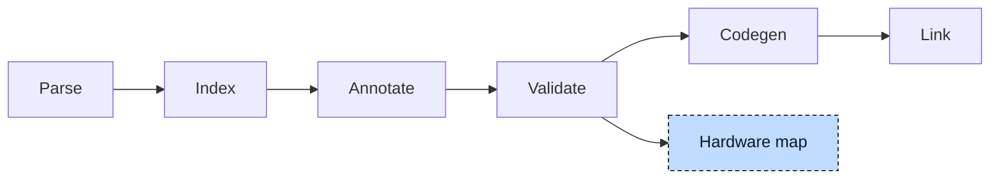

# Hardware Map

A variable bound to a hardware address does not own its storage. For

```iecst
VAR_GLOBAL
    start AT %IX0.0 : BOOL;
END_VAR
```

pre-processing creates the global `__PI_0_0` and turns `start` into an alias pointer to it. The constructor binds the pointer. Thus the binary contains both the source variable and its generated storage, as described in [Index](../pipeline/02-index.md#pre-processing).

A monitoring tool needs this connection to display the source name with the correct hardware value. The hardware map lists each bound variable's source name, generated global, and address.



When requested, the map is written after validation and before codegen. It uses only the index. `plc --check --hwmap-file=map.json` writes it without generating an object file; a normal build can produce both the map and the binary.


## The map

The chapter follows one project with every kind of binding:

```iecst
FUNCTION_BLOCK Sensor
    VAR
        raw AT %I* : INT;
        alarm AT %QX3.1 : BOOL;
    END_VAR
END_FUNCTION_BLOCK

VAR_GLOBAL
    start AT %IX0.0 : BOOL;
    speed, speedCopy AT %QW2.5 : WORD;
    counter AT %MD1 : DWORD;
    sensors : ARRAY[0..1] OF Sensor;
END_VAR

VAR_CONFIG
    sensors[0].raw AT %IW5.0 : INT;
    sensors[1].raw AT %IW5.1 : INT;
END_VAR

PROGRAM main
    VAR
        stop AT %IX0.1 : BOOL;
    END_VAR
END_PROGRAM
```

Each entry has five fields: the source path (`name`), generated global (`mangled_name`), source address (`address`), direction, and access width. For this project:

```json
{
  "VariableMap": [
    { "name": "start",            "mangled_name": "__PI_0_0", "address": "%IX0.0", "direction": "Input",  "access_type": "Bit"   },
    { "name": "speed",            "mangled_name": "__PI_2_5", "address": "%QW2.5", "direction": "Output", "access_type": "Word"  },
    { "name": "speedCopy",        "mangled_name": "__PI_2_5", "address": "%QW2.5", "direction": "Output", "access_type": "Word"  },
    { "name": "counter",          "mangled_name": "__M_1",    "address": "%MD1",   "direction": "Memory", "access_type": "DWord" },
    { "name": "sensors[0].alarm", "mangled_name": "__PI_3_1", "address": "%QX3.1", "direction": "Output", "access_type": "Bit"   },
    { "name": "sensors[1].alarm", "mangled_name": "__PI_3_1", "address": "%QX3.1", "direction": "Output", "access_type": "Bit"   },
    { "name": "main.stop",        "mangled_name": "__PI_0_1", "address": "%IX0.1", "direction": "Input",  "access_type": "Bit"   },
    { "name": "sensors[0].raw",   "mangled_name": "__PI_5_0", "address": "%IW5.0", "direction": "Input",  "access_type": "Word"  },
    { "name": "sensors[1].raw",   "mangled_name": "__PI_5_1", "address": "%IW5.1", "direction": "Input",  "access_type": "Word"  }
  ]
}
```

`speed` and `speedCopy` share an address and the global `__PI_2_5`. Both names appear in the map. The two `alarm` members also share one global, `__PI_3_1`, because their address belongs to the function block declaration rather than to an individual instance.

Generated names combine a direction prefix with address segments separated by underscores. Inputs and outputs use `__PI_` for the process image; memory uses `__M_`; `%G` uses `__G_`. The width is absent, so `%QW2.5` and `%QX2.5` would collide. Pre-processing and map generation use the same naming function.


## Collecting the entries

The map uses the index's variable-instance iterator in two passes. This iterator visits program instances, global function block instances, and their members.

The first pass takes every instance whose declaration carries a direct address, and skips the templates (`AT %I*`), because a template has no address until a `VAR_CONFIG` block gives it one. The address segments are constant expressions in the index: they went through the constant evaluator, so `AT %IX0.0` is stored as two evaluated integers.

The instance path is expanded over every array dimension. The one declaration `alarm` in `Sensor` therefore gives `sensors[0].alarm` and `sensors[1].alarm`, because `sensors` has two elements, and a three-dimensional array of blocks gives one name per element, in `[i,j,k]` form.

The second pass reads `VAR_CONFIG` entries, which supply concrete addresses for template variables. It uses each configured instance path and the global created during pre-processing. The passes cover different declarations, but the map still removes duplicate pairs of source name and generated global.


## Files and formats

`--hwmap-file=<path>` selects JSON or TOML by the extension; any other extension is E134. Without a value, the map is written next to the output as `<output>.hwmap.json`, so `plc main.st -o main.so --hwmap-file` gives `main.so.hwmap.json`. The `=` is required: `--hwmap-file map.json` makes `map.json` a source file. The TOML form is the same list as an array of tables:

```toml
[[VariableMap]]
name = "start"
mangled_name = "__PI_0_0"
address = "%IX0.0"
direction = "Input"
access_type = "Bit"
```

> [!NOTE]
> **Developer note.** `--hardware-conf=<path>` is the older form of the same idea and is deprecated. It writes a `HardwareConfiguration` list without the generated names and with the address as a list of segment strings, and it lists templates with an empty address, which the new map leaves out because a template maps to nothing. It prints a deprecation warning and will be removed.


## Where it lives

| What | Where |
|---|---|
| Hardware map, deprecated hardware configuration, instance path expansion | `src/hw_map.rs`, `src/hardware_binding.rs`, `src/expression_path.rs` |
| Name mangling and pre-processing of addresses | `compiler/plc_ast` |
| Command line and write step | `compiler/plc_driver` |
