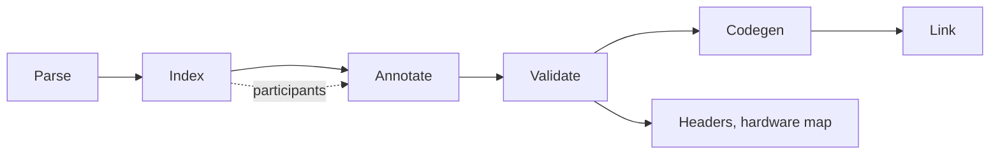

# Overview

RuSTy compiles IEC 61131-3 Structured Text into machine code, with LLVM as its back end. This book explains how the compiler works, from source text to linked binary.

The compiler is a pipeline of stages. Each stage takes the result of the previous one and adds to it.

The book has four parts:

1. **[Pipeline](pipeline/README.md)** describes each stage, in execution order. The driver runs the stages. The parser builds one syntax tree per file, the index collects all declarations, the resolver annotates every expression with its type, validation checks the language rules, codegen writes LLVM IR, and the linker joins the object files. Start here if you are new to the compiler.
2. **[Participants](participants/README.md)** describes the rewrites that run between stages. A participant hooks in before or after a stage and simplifies the syntax tree, so later stages see simpler code. Examples are loops, properties, inheritance, generics, and initializers. Each chapter shows the tree before and after the rewrite.
3. **[Outputs](outputs/README.md)** describes the results other than machine code. The header generator writes the declarations of a project as C headers. The hardware map lists the variables bound to hardware addresses as a JSON or TOML file.
4. **[Internals](internals/README.md)** follows one language construct at a time (POUs, structs, arrays, strings, enums, references, initializers) from declaration to LLVM IR. The last chapter is a reference of every annotation the resolver can attach to a node.

Four flags stop the compiler after a stage and print what it has, which is how most of the examples in these chapters were checked. `--ast` prints the tree after parsing, `--ast-lowered` the tree after the last participant, `--ir` the generated LLVM IR, and `--check` stops after validation and prints the diagnostics alone.

The IR in these chapters comes from the target `aarch64-unknown-linux-gnu`, and the blocks are trimmed: the complete module starts with a `target datalayout` and a `target triple` line. Two details follow the target. On x86_64, a parameter or a return value narrower than 32 bits carries a `signext` or a `zeroext` attribute at the declaration and at each call, and the stack slot of such a value gets its natural alignment instead of `align 4`. The layout of each type, the order of the instructions, and every index are the same on both targets.
