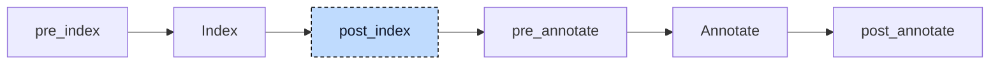

# CFC

A Continuous Function Chart (CFC) stores a POU body as a diagram. Its XML file contains a Structured Text declaration and a network of elements, numbered pins, and wires. The network

```
          myAdd (0)
        +--------------------+
in1 --> | in1          myAdd | --> function_call (1)
in2 --> | in2   myAddDoubled | --> doubledOut (2)
        +--------------------+
```

calls `myAdd` with the function's two inputs and routes its return value to the function's result and its output `myAddDoubled` to the output `doubledOut`. The numbers in parentheses are the evaluation priorities the user assigned. Trimmed to what matters, the document reads:

```xml
<ppx:Function name="function_call">
    <ppx:AddData>
        <ppx:Data>
            <bmx:TextDeclaration>FUNCTION function_call: INT
VAR_INPUT
    in1, in2: DINT;
END_VAR
VAR_OUTPUT
    doubledOut: DINT;
END_VAR</bmx:TextDeclaration>
        </ppx:Data>
    </ppx:AddData>
    <ppx:MainBody><ppx:BodyContent><ppx:Network>
        <ppx:FbdObject xsi:type="ppx:Block" typeName="myAdd" globalId="1">
            <ppx:InputVariables>
                <ppx:InputVariable parameterName="in1">
                    <ppx:ConnectionPointIn><ppx:Connection refConnectionPointOutId="2"/></ppx:ConnectionPointIn>
                </ppx:InputVariable>
                ...
            </ppx:InputVariables>
            <ppx:OutputVariables>
                <ppx:OutputVariable parameterName="">
                    <ppx:ConnectionPointOut connectionPointOutId="4"/>
                </ppx:OutputVariable>
                <ppx:OutputVariable parameterName="myAddDoubled">
                    <ppx:ConnectionPointOut connectionPointOutId="5"/>
                </ppx:OutputVariable>
            </ppx:OutputVariables>
        </ppx:FbdObject>
        <ppx:FbdObject xsi:type="ppx:DataSource" identifier="in1" globalId="6">
            <ppx:ConnectionPointOut connectionPointOutId="2"/>
        </ppx:FbdObject>
        <ppx:FbdObject xsi:type="ppx:DataSink" identifier="doubledOut" globalId="9">
            <ppx:ConnectionPointIn><ppx:Connection refConnectionPointOutId="5"/></ppx:ConnectionPointIn>
        </ppx:FbdObject>
        ...
    </ppx:Network></ppx:BodyContent></ppx:MainBody>
</ppx:Function>
```

Each element has a `globalId`; each output pin has a `connectionPointOutId`. An input pin names the output pin it reads. The POU declaration is Structured Text without its closing keyword. A block's unnamed output pin carries its return value. The CFC participant converts the network into an AST statement list:

```iecst
FUNCTION function_call: INT
VAR_INPUT
    in1, in2: DINT;
END_VAR
VAR_OUTPUT
    doubledOut: DINT;
END_VAR
VAR
    __out_myAdd_1: DINT;
    __out_myAddDoubled_1: DINT;
END_VAR
    __out_myAdd_1 := myAdd(in1 := in1, in2 := in2, myAddDoubled => __out_myAddDoubled_1);
    function_call := __out_myAdd_1;
    doubledOut := __out_myAddDoubled_1;
END_FUNCTION
```



The participant acts during parsing and at `post_index`. Parsing routes `.cfc`, `.fbd`, and `.xml` files to the CFC parser. It reads the XML and parses the text declaration, then returns a compilation unit with an empty body. This lets the index register the POU and its parameters before the network is converted.

To build the body, the participant needs the index. A block's callee kind and output parameters determine which call and temporary variables it requires.

At `post_index` the participant transpiles every CFC document against the index, replaces the unit of the parse step with the full one, and indexes the project again, so that the bodies and their temporaries are known. Then it runs the inference rounds for generic temporaries described below. Its diagnostics are collected after annotation, like those of the other participants. A project without CFC sources passes through the hook unchanged.


## Transformation

The CFC resolver converts the document into assignments, returns, jumps, labels, and calls, each with an evaluation priority. It also records temporary variables. The transpiler converts this intermediate list into AST nodes. The following sections describe the resolver's decisions, then the rendering step.


## Elements and wires

Each element is classified by its `xsi:type`:

| Element | Role | Result |
|---|---|---|
| `DataSource` | a value: a variable or literal, read by others | nothing on its own |
| `DataSink` | a variable that receives a value | one assignment |
| `Block` | a call of a function, function block, program, or action | one call |
| `Connector`, `Continuation` | a named wire break: the connector receives, continuations of the same label re-emit | nothing; wires pass through |
| `Return` | a conditional return | one `RETURN` with a condition |
| `CfcJump`, `CfcLabel` | a conditional jump and its target | one jump, one label |
| `Unconnected` | an element the user placed but never wired | a warning |

The resolver first surveys the network. It maps every output pin ID to the element that owns it and every connector label to its connector, and it collects the label names and the jump targets, so each can check the other. To read an input, it follows the referenced output pin until it reaches a value producer.

Two kinds of element are stepped over. A continuation is replaced by whatever feeds the connector of the same label, so a connector pair behaves like a wire. An `ENO` pin of a block is replaced by whatever feeds the `EN` pin of that block, because `ENO` mirrors the guard (see below). Both hops are cycle-guarded. A continuation without a connector, a connector without an input, or a block whose `ENO` leads back to itself is a dead end, reported once per element however many consumers reach it.

A trace ends at a block output pin, which is read as described under blocks, or at a plain element, whose `identifier` text goes through the compiler's expression parser. The trace also collects the negation bubbles on the way. A bubble on the producer and one on the consumer each wrap the value in one more `NOT`. The bubble of a hopped `ENO` pin and the one of the `EN` pin behind it invert the same value, so a pair of them cancels.

The rest of this section takes one element kind at a time. Each example shows the network the user drew, then the statements the transpiler renders from it. A number in parentheses is the evaluation priority of the element, a bubble `o-->` is a negation, and `[name |S]` is a sink with a storage mode.

### Data source

A data source supplies a variable or literal through its output pin. It produces no statement by itself. Each consumer follows the wire independently, so a source connected to two sinks produces two assignments:

```
foo --+--> bar (0)
      '--> baz (1)
```

```iecst
bar := foo;
baz := foo;
```

A literal source works in the same way. The identifier goes through the compiler's expression parser, so `5` becomes a literal node and `foo` becomes a reference node:

```
5 --> foo (0)
```

```iecst
foo := 5;
```

The parser accepts more than the element may hold. A source or a sink is limited to a literal or a reference, and an expression such as `in1 + 1` is rejected (E083), because a diagram models arithmetic as blocks. The condition of a return or a jump is the exception and accepts any expression.

A negation bubble on the pin wraps the value in a `NOT`:

```
foo o--> bar (0)
```

```iecst
bar := NOT foo;
```

### Data sink

A data sink is a write. It traces its input back to a producer and assigns the value to its own identifier. A source wired to a sink is therefore one assignment:

```
foo --> bar (0)
```

```iecst
bar := foo;
```

The result of a CFC function is written in the same way, by a sink whose identifier is the name of the function. A sink that the user left unwired renders nothing and is not reported.

A storage mode turns the sink from an assignment into a latch. In `Set` mode the traced value is no longer the value stored: it is the guard, and the value stored is `TRUE`. Nothing is written while the guard is false, so a variable that was set once keeps its value:

```
a --> [b |S] (0)
```

```iecst
IF a THEN b := TRUE; END_IF
```

`Reset` mode is the counterpart and stores `FALSE` under the same guard. `Reference` mode stores no value at all; it stores the address, so later reads of the sink see whatever the source holds at that time:

```
a --> [b |REF] (0)
```

```iecst
b REF= a;
```

A negation bubble has no meaning on a reference assignment and is rejected (E154).

### Block

A block is a call. Its `typeName` names the callee, its input pins are the parameters, and its output pins are the outputs of the callee. A callee with state keeps its outputs in its own instance, so the network needs nothing more than the call and a read of the member:

```
localIn --> in [inst : counter] out (0) --> localOut (1)
```

```iecst
inst(in := localIn);
localOut := inst.out;
```

Blocks carry more rules than the other elements, because the shape of the call depends on what the index says the callee is. The [Blocks](#blocks) section below covers them.

### Connector and continuation

A connector ends a wire and names it. Each continuation with that name resumes the wire. Neither produces a statement; the resolver follows the connection to its source. One connector can feed several continuations:

```
foo --> x>
>x --> bar (0)
>x --> baz (1)
```

```iecst
bar := foo;
baz := foo;
```

A pair can feed another pair. The trace follows the chain, with a cycle guard, until it reaches a producer:

```
foo --> a>
>a --> b>
>b --> c>
>c --> bar (0)
```

```iecst
bar := foo;
```

A pair that nothing reads renders nothing, and a connector without an input is only reported when something reads it (E086). The user can leave a routing aid unfinished without a diagnostic:

```
x>       (no source)
>x       (nobody reads it)
```

A label that two connectors claim is E081, and a continuation whose label no connector defines is E082.

### Return

A return leaves the POU early. It is always conditional: the traced value becomes the guard. The return carries no value, because the result of a function is written by the sink named after the function.

```
myCondition --> RETURN (0)
```

```iecst
IF myCondition THEN RETURN; END_IF
```

A return without a wired condition could never fire. It is dropped and reported (E085).

### Jump and label

A jump is a conditional `GOTO`, and a label is its target. The two are separate elements with no wire between them; the jump names its target as text, and the survey matches the names. Both render directly, in priority order like every other element, so the priorities of the user decide whether a jump goes forward or backward:

```
myCondition --> JMP skipAssignment (0)
x --> y (1)
LABEL skipAssignment (2)
```

```iecst
IF myCondition THEN GOTO skipAssignment;
y := x;
LABEL: skipAssignment
```

A jump without a wired condition is kept instead of dropped, with a `FALSE` guard, so the label it targets stays the target of a valid statement. A warning says that the jump can never be taken (E145):

```
(unwired) --> JMP skipAssignment (0)
x --> y (1)
LABEL skipAssignment (2)
```

```iecst
IF FALSE THEN GOTO skipAssignment;
y := x;
LABEL: skipAssignment
```

A jump to a name that no label defines is E142, a label that no jump targets is kept and reported with E143, and the same label defined twice is E144.

### Unconnected

An unconnected element is a box that the user placed and never wired. It renders nothing, and the warning it produces (E084) is its only result, once per box. The rest of the network is unaffected:

```
foo          (unconnected)
bar          (unconnected)
foo --> bar (0)
```

```iecst
bar := foo;
```


## Blocks

The index decides how a block is rendered. A callee that is a function and has no instance name is stateless: its outputs exist only during the call. Every output that a consumer reads is therefore captured into a temporary named `__out_<pin>_<globalId>`, declared in a `VAR` block of the POU with the type the callee declares for that output. The return pin carries no parameter name, so it contributes the name of the callee (`__out_myAdd_1` below); it is captured by an assignment of the call, every other output with `=>`. A fan-out then calls once and reads twice:

```
        myAdd (0)
      +--------------------+
a --> | in1          myAdd | --+--> x (1)
b --> | in2   myAddDoubled |   |
      +--------------------+   '--> y (2)
      (myAddDoubled unread)
```

```iecst
__out_myAdd_1 := myAdd(in1 := a, in2 := b, myAddDoubled => );
x := __out_myAdd_1;
y := __out_myAdd_1;
```

An unwired function input is passed as an empty argument, `in2 := `, to use the callee's default. An unread output uses an empty `=>`, as with `myAddDoubled` above. Variadic calls such as `ADD` receive positional values in pin order and omit unwired pins. Feedback from the block's own output reads the previous temporary value because capture follows the call.

A callee with state, a function block instance or a program, keeps its outputs in the instance, so no temporaries are necessary: the call passes the wired inputs only, and a consumer of an output reads the member. The [Block](#block) example above shows the plain case. An action is called through its owner, and its outputs are the members of the owner, not of the action:

```
localIn --> in [inst : counter.increment] out (0) --> localOut (1)
```

```iecst
inst.increment(in := localIn);
localOut := inst.out;
```

A program is read in the same way through the name of its one instance, `counter.out`. Two programs wired in a cycle are legal for the same reason: each one reads the member of the other from the previous evaluation, and the priorities decide which one runs first.

Execution control adds `EN` and `ENO` pins. `EN` becomes an `IF` around the call and its output capture; a skipped call leaves temporaries unchanged. `ENO` refers to the `EN` source rather than a result of the callee. Thus `done := trigger` reads the same source as the guard. A chain of these pins produces a sequence of `IF trigger` guards:

```
                  myAdd (0)
            +--------------------+
trigger --> | EN             ENO | --> done (2)
      a --> | in1          myAdd | --> sum (1)
      b --> | in2   myAddDoubled |
            +--------------------+
            (myAddDoubled unread)
```

```iecst
IF trigger THEN
    __out_myAdd_7 := myAdd(in1 := a, in2 := b, myAddDoubled => );
END_IF
sum := __out_myAdd_7;
done := trigger;
```

The flag decides whether a pin named `EN` is the control pin; without the flag, `EN` and `ENO` are ordinary parameters.

> [!NOTE]
> **Developer note.** The export format does not say how to tell the control pin from a parameter of the same name that the callee declares itself. Two pins named `EN` on one block therefore stop the compiler with a panic instead of a guess.


## Order

Each element renders on its own. A whole network is a set of them, and the wires do not say which of them runs first. The user's priorities do: statements and temporaries are sorted by evaluation priority, and elements without a priority come last, in document order.


## Rendering

With the list in order, the transpiler turns each statement into an AST node with the constructors the parser uses, so the result is indistinguishable from parsed text. Every statement carries a location of a kind that only this participant creates: the `globalId` of the element instead of a line and column. A diagnostic on such a node is printed as `file.cfc: Block 6` without a source snippet. The temporaries go into one additional `VAR` block, and the statement list replaces the empty body the parse step left.


## Generic temporaries

The rendered body is complete, except where a callee is generic. A temporary takes its output parameter's declared type, and for a generic function such as `myGenAdd<T: ANY_NUM>: T` that type is `__myGenAdd__T`. Codegen needs a concrete type. The compiler's expression resolver can derive it from the call arguments after transpilation.

After indexing the new units, the participant runs type inference rounds. Each round annotates the unit and checks generic temporaries whose inputs already have concrete types. It updates their declarations and index entries with the inferred types. A chain of generic calls resolves one step per round:

```iecst
__out_myGenAdd_1 := myGenAdd(a := a, b := b);                  (* a, b : INT   -> round 1: INT  *)
__out_myGenAdd_5 := myGenAdd(a := __out_myGenAdd_1, b := c);   (* c : DINT     -> round 2: DINT *)
```

The rounds stop when a round patches nothing. A temporary that is still generic then, because nothing but its own generic outputs feeds the call, is reported in terms of the block the user placed (E149).


## Interactions

The participant is registered first and runs at `post_index`, so the `pre_index` participants have already processed the interface-only unit the parse step produced. The transpiled unit that replaces it is a fresh parse of the declaration plus the rendered body; from the re-index on, every later participant sees the CFC POU as ordinary declarations and statements. Calls of CFC POUs from Structured Text resolve against the parse step's unit already, because the declaration is complete before the body exists.

The generic lowerer, at `post_annotate`, replaces the generic calls in the rendered body by calls of concrete implementations. It relies on the inference rounds having replaced every generic temporary type first; the concrete declarations are what let the annotator type those calls.

The transpiler does not generate loops. Its `IF` guards are the shape parsed text produces, so the later participants treat them like any other. Its jumps, its labels, and its conditional `RETURN` have no Structured Text syntax at all; they exist for this participant, and codegen has a branch for each.


## Validation

The participant checks the diagram before pins and wires disappear from the AST. This lets diagnostics name the user's elements instead of generated temporaries:

| Code | Reported for |
|---|---|
| E081 | a connector label claimed twice |
| E082 | a continuation with no connector |
| E083 | an expression where only a name or a literal is allowed |
| E084 | an element that is placed but not wired |
| E085 | a return without a condition |
| E086 | a connector without an input |
| E142 | a jump to a label nobody defines |
| E143 | a label no jump targets |
| E144 | a label defined twice |
| E145 | a jump without a condition |
| E146 | a block whose type the index does not know |
| E147 | a wired output the callee does not declare |
| E149 | a generic output no round could type |
| E152 | an execution-controlled block whose `EN` is unwired |
| E153 | an `ENO` chain that loops |
| E154 | a negation bubble on a reference assignment |
| E155 | a block with two unnamed return pins |

Everything about the rendered statements themselves (unknown variables, type mismatches, wrong argument counts) is left to the validation stage, which reports it at the block location of the element too.
