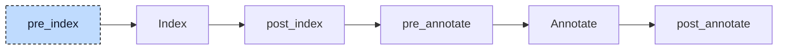

# Loop Desugar

Structured Text has three loops: `WHILE`, `REPEAT`, and `FOR`. They differ in when they test the condition and how they update the counter. Codegen uses one form, `WHILE TRUE`, with explicit `EXIT` statements. In

```iecst
FOR i := 10 TO 1 BY -3 DO
    sum := sum + i;
END_FOR
```

the counter starts at `10` and decreases by `3` each iteration. The loop ends when `i` is below `1`. The loop desugarer makes these steps explicit inside a `WHILE TRUE` body.



The participant runs once at `pre_index`. It needs only the parsed tree, so no index or annotations need to be rebuilt.

It makes three passes over every unit, one per loop kind, in the order `WHILE`, `REPEAT`, `FOR`. Each pass visits the body of a loop before the loop itself, so nested loops are rewritten from the inside out.


## Transformation

### `WHILE`

`WHILE` checks its condition before every iteration. The condition moves into the body as a guard that leaves the loop when it is false:

```diff
-WHILE count < limit DO
+WHILE TRUE DO
+    IF NOT count < limit THEN
+        EXIT;
+    END_IF
     count := count + 1;
 END_WHILE
```

### `REPEAT`

`REPEAT` checks its condition after the body. Placing the check at the end of the generated body would let `CONTINUE` skip it. Instead, the lowerer puts the check at the start and skips it on the first iteration:

```diff
+alloca __ran_once_0 : BOOL;
-REPEAT
+WHILE TRUE DO
+    IF __ran_once_0 THEN
+        IF n >= 4 THEN
+            EXIT;
+        END_IF
+    END_IF
+    __ran_once_0 := TRUE;
     n := n + 1;
-UNTIL n >= 4
-END_REPEAT
+END_WHILE
```

### `FOR`

`FOR` uses two flags. `__ran_once_N` skips the counter update on the first iteration. Later iterations update the counter at the start, so `CONTINUE` cannot skip the update. `__is_incrementing_N` records the initial step direction and selects the exit comparison:

```diff
+alloca __ran_once_0 : BOOL;
+alloca __is_incrementing_0 : BOOL;
-FOR i := 10 TO 1 BY -3 DO
+i := 10;
+__is_incrementing_0 := -3 > 0;
+WHILE TRUE DO
+    IF __ran_once_0 THEN
+        i := i + -3;
+    END_IF
+    __ran_once_0 := TRUE;
+    IF __is_incrementing_0 THEN
+        IF i > 1 THEN
+            EXIT;
+        END_IF
+    ELSE
+        IF i < 1 THEN
+            EXIT;
+        END_IF
+    END_IF
     sum := sum + i;
-END_FOR
+END_WHILE
```

Without `BY`, the step is the literal `1` and the direction flag is set to `TRUE` directly. The step and the end value stay expressions in the tree, so a variable step or end is read again on every iteration, as in the source. A step of `0` counts as not incrementing: the loop exits as soon as the counter is below the end value, so `FOR i := 1 TO 3 BY 0` runs zero times instead of forever. An `EXIT` or `CONTINUE` written by the user stays where it was and now refers to the generated `WHILE`.

The `alloca` lines are allocation statements, a node kind that has no spelling in Structured Text. They declare a variable in the middle of a body instead of in a `VAR` block. The resolver treats one like a local variable of the POU, named `main.__ran_once_0`, and codegen gives it a stack slot at the start of the function that starts at `FALSE` and lives for the whole call. The numbering is one counter shared by all `REPEAT` and `FOR` loops of the run, so every temporary has a unique name.

Most generated nodes have internal source locations. Reused source nodes keep theirs: conditions still point to the original conditions, and counter setup and comparisons point to the `FOR` header. A debugger can therefore stop on the source loop lines while skipping generated flags and loop-back jumps.


## Interactions

Codegen accepts only `WHILE` loops with the literal condition `TRUE`. A `FOR` or `REPEAT` reaching it indicates a pipeline error. The [init participant](06-init.md) runs later and generates this final loop form directly. The [control statement participant](04-control-statements.md) also sees the rewritten loops.
