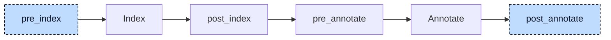

# Property

A property gives a function block a member that reads like a variable but runs code. In

```iecst
FUNCTION_BLOCK fb
    VAR
        raw: DINT;
    END_VAR

    PROPERTY_GET scaled: DINT
        scaled := raw * 10;
    END_PROPERTY

    PROPERTY_SET scaled: DINT
        raw := scaled / 10;
    END_PROPERTY
END_FUNCTION_BLOCK

FUNCTION main
    VAR
        inst: fb;
        x: DINT;
    END_VAR

    inst.scaled := 50;
    x := inst.scaled;
END_FUNCTION
```

the assignment `inst.scaled := 50` calls the setter, while `x := inst.scaled` calls the getter. The property lowerer generates the methods `fb.__get_scaled` and `fb.__set_scaled`, then replaces property accesses with calls. Later stages can process those methods and calls using their usual rules.



At `pre_index`, the participant converts accessor blocks into method declarations and bodies. The index registers these methods, and the resolver can find them.

At `post_annotate`, it reads property annotations. Each annotation names the getter or setter required by the access. The lowerer inserts the call and reruns annotation. It keeps the index because the declarations have not changed.

The order inside a statement is fixed. In an assignment the participant lowers the index expressions of the target first, then the right side, then the assignment itself; in a reference it lowers the base and the index before the reference. `inst.foo[inst.bar]` therefore becomes `inst.__get_foo()[inst.__get_bar()]`, and `inst.scaled := inst.scaled + 1` becomes `inst.__set_scaled(inst.__get_scaled() + 1)`. The driver collects the participant's diagnostics after the last `post_annotate` hook.


## Transformation

### Getter to method

The getter uses the property name as a local result variable. The generated method keeps that variable and the original body, then copies the result to the method's return variable:

```diff
-PROPERTY_GET scaled: DINT
+METHOD __get_scaled: DINT
+    VAR
+        scaled: DINT;
+    END_VAR
+
     scaled := raw * 10;
-END_PROPERTY
+    __get_scaled := scaled;
+END_METHOD
```

### Setter to method

In the setter body the property name stands for the incoming value, so it becomes a by-value input parameter, and the method has no return type:

```diff
-PROPERTY_SET scaled: DINT
+METHOD __set_scaled
+    VAR_INPUT
+        scaled: DINT;
+    END_VAR
+
     raw := scaled / 10;
-END_PROPERTY
+END_METHOD
```

The generated methods are named `<parent>.__get_<property>` and `<parent>.__set_<property>` and are appended to the unit's POU and implementation lists. Their kind is `Method`, and the kind also records the property name and whether this is the getter or the setter; the validator uses that to name an accessor as a property instead of a method in its messages. The property block itself stays on the function block, so that the validator can still check the definition.

Properties are accepted in a `FUNCTION_BLOCK`, a `CLASS`, a `PROGRAM`, and an `INTERFACE`. For an interface only the method declarations are generated and added to the interface's method list, because an interface property has no body; the parser rejects statements there.

### Read to getter call

Every reference with a getter annotation is replaced by a call without arguments, wherever it stands: as an operand, as a call argument, as an array index, or as the base of an index access:

```diff
-x := inst.scaled;
+x := inst.__get_scaled();
```

The call takes the location of the reference it replaces. Inside the body of the function block or one of its actions, the unqualified `scaled` becomes `__get_scaled()` without a base; the resolver looks the property up in the parent POU of a method or action.

### Assignment to setter call

When the target of an assignment carries a setter annotation, the whole assignment is replaced by a call statement whose only argument is the right-hand side; the call takes the location of the assignment:

```diff
-inst.scaled := 50;
+inst.__set_scaled(50);
```

Inside its own accessors the property name is not lowered. `scaled := raw * 10` in the getter stays an assignment to the added local variable, because the resolver tries variables before properties. A different property named in an accessor body is lowered like everywhere else.

If an accessor is missing, the resolver still records its expected name. The lowerer generates the call, and validation reports a property-specific error: `PROPERTY_GET for property scaled is not defined` (E048). Generated locals and return assignments have internal locations; methods use the property name's location.


## Interactions

The resolver selects a getter for a read and a setter for an assignment target. It searches the base type, enclosing POU, base types, and interfaces as needed. The lowerer reads that result from the annotation; it does not repeat the lookup.

Later participants process accessor methods and calls. The [polymorphism lowerer](03-polymorphism.md) adds accessors to method and interface tables. Thus `iface.value := 3` can become an indirect setter call, and an unqualified `scaled := 2` can dispatch through the current instance's table.

When a getter returns an array or a struct, the aggregate-return lowerer turns its return into a by-reference parameter named `__get_data`.


## Validation

Before rewriting an assignment, the participant checks the target's base chain. A property in that chain, as in `inst.data[1] := 5` or `inst.point.x := 4`, produces E128: `Properties can only be assigned as a whole, not through member or index access`. The statement is left unchanged. A setter accepts a complete value, not an individual member or element.

This check needs the original assignment and its property annotations. After lowering, [Validation](../pipeline/04-validation.md) sees a call instead.
