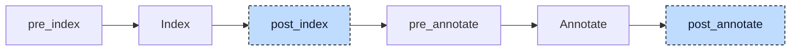

# Polymorphism

Polymorphism is part of object-oriented programming in Structured Text. There are two kinds:

1. Pointer variables to a class or function block, for example `refMyFb : POINTER TO MyFb;` or `refMyFb : REF_TO MyFb;`
2. Interface-typed variables, for example `refMyInterface : MyInterface;`

In case (1), any instance of a type derived from the base type can be assigned to the reference. In case (2), any instance of a class or function block that implements the interface can be assigned. In both cases, calling a method executes the implementation defined by the **actual (run-time) type** of the assigned instance, not the statically declared type of the variable. Consider

```iecst
VAR
    instanceA : FbA; // Has methods foo and bar
    instanceB : FbB; // Extends FbA; inherits foo, overrides bar, adds baz
    instanceC : FbC; // Has method foo

    refInstance : POINTER TO FbA;
    refInterface : InterfaceAC; // Defines method foo; both FbA and FbC implement it
END_VAR

// Base type
refInstance := ADR(instanceA);
refInstance^.foo(); // Calls FbA.foo
refInstance^.bar(); // Calls FbA.bar

// Derived type. Valid because FbB derives from FbA. Only the methods of FbA are accessible.
refInstance := ADR(instanceB);
refInstance^.foo(); // Calls FbA.foo (inherited)
refInstance^.bar(); // Calls FbB.bar (overridden)

// FbA implements InterfaceAC, so this assignment is valid
refInterface := instanceA;
refInterface.foo(); // Calls FbA.foo

// FbC also implements InterfaceAC, so this assignment is valid too
refInterface := instanceC;
refInterface.foo(); // Calls FbC.foo
```

To call the correct method at run time (dynamic dispatch), the compiler must generate supporting data structures and lookup logic. The core data structure is the virtual table, from now on called vtable.

A vtable is a struct of function pointers, where each field points to a method implementation. Each class or function block type has exactly one vtable, generated at compile time. Every instance embeds a pointer to the vtable of its type as a hidden first field, which is used at run time to resolve method calls. For example

```
┌─VTable FbA─┐     ┌────────────┐     ┌─VTable FbB─┐
├────────────┤  ┌─▶│  FbA.foo   │◀─┐  ├────────────┤
│    foo     │──┘  ├────────────┤  └──│    foo     │
├────────────┤  ┌─▶│  FbA.bar   │     ├────────────┤
│    bar     │──┘  ├────────────┤  ┌──│    bar     │
└────────────┘     │  FbB.bar   │◀─┘  ├────────────┤
                   ├────────────┤  ┌──│    baz     │
                   │  FbB.baz   │◀─┘  └────────────┘
                   ├────────────┤
                   │    ...     │
                   └────────────┘
```

Here the vtable fields of `FbA` point to `FbA.foo` and `FbA.bar`. `FbB` points to its own implementations `FbB.bar` (overridden) and `FbB.baz` (unique to `FbB`), but because it inherits `foo`, that field points to the implementation of the parent, `FbA.foo`. At run time, the call `refInstance^.bar()` reads the vtable pointer of the instance and fetches the function pointer for the correct method. The key takeaway is: **dynamic dispatch is just an indirect function call through a function pointer.**

The polymorphism lowerer generates these tables and rewrites the calls. It runs at two hooks:



At `post_index`, the table generators run: first the vtable generator for classes and function blocks, then the interface table generator. They append the table struct types and the global table instances to the compilation units. Table types land in the unit that declares the interface or POU, instances in the unit that declares the implementing POU, so each artifact is local to its unit and multi-file builds work. The project is then indexed again so that the new types and globals are visible.

At `post_annotate`, the dispatch lowerers run: first the interface dispatch lowerer, which replaces interface type declarations with `__FATPOINTER` and lowers assignments, method calls, and call arguments; then the POU dispatch lowerer, which patches class and function block calls to go through the vtable. The project is then indexed and annotated again, so that the injected types and calls are resolved for code generation. The Validation section covers the checks that must happen before this rewrite.

The two Transformation sections below describe the two kinds of polymorphism in detail.


## Transformation

### Class and function block polymorphism

As mentioned in the introduction, any derived POU instance can be assigned to a reference of its base type. For example, assume a hierarchy where `FbA` is the parent of `FbB`, which in turn is the parent of `FbC`. This allows

```iecst
VAR
    instanceA : FbA; // Has method foo
    instanceB : FbB; // Has methods bar, baz
    instanceC : FbC; // Has method qux

    refInstanceA : POINTER TO FbA;
END_VAR

// All of these assignments are valid, because inheritance guarantees that A, B and C
// all share at least the methods of A.
refInstanceA := ADR(instanceA);
refInstanceA^.foo(); // Calls FbA.foo
refInstanceA := ADR(instanceB);
refInstanceA^.foo(); // Calls FbB.foo (or FbA.foo if not overridden)
refInstanceA := ADR(instanceC);
refInstanceA^.foo(); // Calls FbC.foo (or the closest ancestor that overrides foo)
```

To achieve dynamic dispatch, the compiler must perform a vtable lookup to execute the correct method. It does so by patching every such method call:

```diff
-refInstanceA^.foo();
+__vtable_FbA#(refInstanceA^.__vtable^).foo^(FbA#(refInstanceA^) /*, other arguments */);
```

Two casts are needed to reinterpret the void pointers as the correct types. The vtable cast, `__vtable_FbA#(...)`, names the declared type of the pointer. The instance cast, `FbA#(...)`, names the POU that declares the method; for an inherited method that is a base type, not the pointer's type. A call of a function block body through a pointer, `refInstanceA^()`, uses the `__body` slot described below and passes the instance without a cast.

That in turn requires that classes and function blocks have a `__vtable` member field, which the compiler injects as a new first variable block of the POU:

```diff
 FUNCTION_BLOCK FbA
+    VAR
+        __vtable : POINTER TO __VOID;
+    END_VAR
     VAR
         // ...other member fields
     END_VAR
 END_FUNCTION_BLOCK
```

The `__vtable` field is initialized at construction time by the init participant, which assigns it to `ADR(__vtable_FbA_instance)`. That in turn requires a `__vtable_FbA` struct definition whose members carry default initializers, each pointing to the corresponding method implementation. Function blocks also include a `__body` entry for their callable body (classes do not, since they cannot be called directly). For clarity, the ASCII diagrams in this chapter omit `__body` and show only named methods:

```diff
+TYPE __vtable_FbA :
+    STRUCT
+        __body : __FPOINTER FbA := ADR(FbA);
+        foo : __FPOINTER FbA.foo := ADR(FbA.foo);
+        bar : __FPOINTER FbA.bar := ADR(FbA.bar);
+    END_STRUCT
+END_TYPE
```

And finally a global instance of that struct, one per POU:

```diff
 VAR_GLOBAL
+    __vtable_FbA_instance : __vtable_FbA;
 END_VAR
```

The global itself has no initializer. The member initializers of the struct become a constructor, which fills the instance before the program starts (see Interactions). A POU from an include file or with `{external}` linkage gets its instance declared in an `{external}` global block instead, because the library defines it.

For derived POUs the process is the same, except that they do not get their own `__vtable` member field. They access the `__vtable` of the root parent and override it. This is also why the vtable pointer is a void pointer: different vtables, and therefore different types, are assigned to the `__vtable` field of the root. For the `A <- B <- C` inheritance chain we get

```diff
 FUNCTION_BLOCK FbA
     VAR
+        __vtable : POINTER TO __VOID; // Initialized to ADR(__vtable_FbA_instance)
     END_VAR
 END_FUNCTION_BLOCK

 FUNCTION_BLOCK FbB
     VAR
+        __FbA : FbA; // Parent, with __vtable overridden to ADR(__vtable_FbB_instance)
     END_VAR
 END_FUNCTION_BLOCK

 FUNCTION_BLOCK FbC
     VAR
+        __FbB : FbB; // Parent, with __FbA.__vtable overridden to ADR(__vtable_FbC_instance)
     END_VAR
 END_FUNCTION_BLOCK
```

The parent member fields (for example `__FbA`) are created by the inheritance lowerer, and the vtable pointer assignments are handled by the init participant. The inheritance lowerer also spells out the path to the member: a call through a `POINTER TO FbB` first becomes `refInstanceB^.__vtable^` here and then `refInstanceB^.__FbA.__vtable^` when the inheritance lowerer runs.

One more note: methods called from within other methods, or from a function block body, also need to go through the vtable, because an inherited method may call an overridden method. The missing base becomes `THIS^`:

```diff
 METHOD foo
     // This call must be evaluated at run time, because a child POU might have overridden bar
-    bar();
+    __vtable_FbA#(THIS^.__vtable^).bar^(FbA#(THIS^));
 END_METHOD
```

Calls written as `THIS^.bar()` or `SUPER^.bar()` are left untouched, and so is a call on a plain instance variable, `instanceA.bar()`. In all three cases the type of the instance is exact, so the call is statically dispatched.

Now that we know how vtables are stored and accessed, we should answer why `__vtable_FbA#(refInstanceA^.__vtable^).foo^(FbA#(refInstanceA^))` works in the first place. That is, why can we simply cast one vtable to another? Let's take a look at the vtable layouts:

```
┌─VTable FbA─┐   ┌─VTable FbB─┐   ┌─VTable FbC─┐
├────────────┤   ├────────────┤   ├────────────┤
│    foo     │   │    foo     │   │    foo     │
└────────────┘   ├────────────┤   ├────────────┤
                 │    bar     │   │    bar     │
                 ├────────────┤   ├────────────┤
                 │    baz     │   │    baz     │
                 └────────────┘   ├────────────┤
                                  │    qux     │
                                  └────────────┘
```

Notice how the order of function pointers is stable? At the top we have the function pointers of the parent class(es), followed by our own. This works because the generated vtable structs have a guaranteed sequential layout with no field reordering; each derived vtable is a strict prefix extension of the vtable of its parent. This is the reason why casting one vtable to another works in linear inheritance: we simply reinterpret the vtable as the parent type, cutting off trailing fields but keeping the content of the existing ones. In other words, upcasting from a derived class to a parent requires no run-time conversion. Note that this property only holds for single, linear inheritance chains; interfaces require a different dispatch mechanism (see the next section).

**Putting it all together**, the compiler does the following to achieve dynamic dispatch for classes and function blocks:

1. Generate a vtable struct for every class and function block, populated with function pointers for every method these POUs define or inherit
2. Generate a global variable instance for each vtable, filled with the correct addresses at construction time
3. Generate and inject a `__vtable` member field of type `POINTER TO __VOID` into every non-extended class or function block, initialized by the init participant to the address of the global instance
4. Transform **method** calls to use the lookup table, where the
    1. method is called from within another method or a function block body, or
    2. method is called through a variable of type `POINTER TO <CLASS|FUNCTION_BLOCK>`, `REF_TO`, or `REFERENCE TO`,
    3. but leave `THIS^`, `SUPER^`, and instance variable calls untouched, since those are statically dispatched


### Interface polymorphism

Again, as mentioned in the introduction, an interface can be used as a variable type, and any concrete instance can be assigned to it, provided that its POU implements the interface. For example

```iecst
VAR
    instanceFbA : FbA; // Implements interface IA (method foo)
    instanceFbB : FbB; // Implements interfaces IA (method foo) and IB (method bar)

    refInterface : IA;
END_VAR

refInterface := instanceFbA;
refInterface.foo(); // Calls FbA.foo

// Here we assign an instance of FbB to interface IA, which works because FbB implements IA
refInterface := instanceFbB;
refInterface.foo(); // Calls FbB.foo
```

#### The problem: why vtables do not work for interfaces

Let's try to apply our findings from the previous section to interfaces. Assume the following interface definitions

```
//   IA
//  /  \
// IB   IC
//  \  /
//   ID
//
// IA: foo
// IB EXTENDS IA: foo, bar
// IC EXTENDS IA: foo, baz
// ID EXTENDS IB, IC: foo, bar, baz, qux
```

and some function blocks that implement them, plus code that makes use of polymorphism

```iecst
VAR
    instanceD : FbD; // Implements interface ID (foo, bar, baz, qux)

    refInterfaceB : IB;
    refInterfaceC : IC;
END_VAR

refInterfaceB := instanceD;
refInterfaceB.foo();
refInterfaceB.bar();

refInterfaceC := instanceD;
refInterfaceC.foo();
refInterfaceC.baz();
```

Two problems arise:

1. What types do `refInterfaceB` and `refInterfaceC` have?
2. How do we upcast the vtable of `instanceD` to the vtable of `IB` or `IC`, given that their layouts are incompatible?

First, let's tackle the vtable issue. Assume that for each interface there is a function block that implements it. If we were to naively build vtables with the methods of each POU in declaration order, we would get

```
┌─VTable FbA─┐   ┌─VTable FbB─┐   ┌─VTable FbC─┐   ┌─VTable FbD─┐
├────────────┤   ├────────────┤   ├────────────┤   ├────────────┤
│    foo     │   │    foo     │   │    foo     │   │    foo     │
└────────────┘   ├────────────┤   ├────────────┤   ├────────────┤
                 │    bar     │   │    baz     │   │    bar     │
                 └────────────┘   └────────────┘   ├────────────┤
                                                   │    baz     │
                                                   ├────────────┤
                                                   │    qux     │
                                                   └────────────┘
```

Upcasting from vtable `FbD` to `FbB` works (both have `foo` in slot 0 and `bar` in slot 1), but `FbD` to `FbC` does not, because `bar` in `FbD` would be interpreted as `baz`. That is

```iecst
refInterfaceC := instanceD;
refInterfaceC.baz(); // This would call FbD.bar rather than FbD.baz!
```

If we were to swap the order of `bar` and `baz` in `FbD`, then upcasting from `FbD` to `FbC` would work, but from `FbD` to `FbB` would break. There is no single layout that satisfies both. We need a different approach.

#### Interface tables (itables)

The solution is a separate data structure: interface tables, or short itables. The idea is to have **one itable struct per interface** and **one global itable instance per (interface, POU) pair** where the POU implements the interface, directly or indirectly. Each itable struct contains function pointer fields that match the method signatures of the interface, and each instance fills those pointers with the concrete implementations of the POU.

For our diamond hierarchy, the compiler generates the following itable struct definitions:

```diff
+TYPE __itable_IA :
+    STRUCT
+        foo : __FPOINTER IA.foo;
+    END_STRUCT
+END_TYPE
+
+TYPE __itable_IB :
+    STRUCT
+        __upcast_IA : POINTER TO __VOID;
+        foo : __FPOINTER IA.foo;
+        bar : __FPOINTER IB.bar;
+    END_STRUCT
+END_TYPE
+
+TYPE __itable_IC :
+    STRUCT
+        __upcast_IA : POINTER TO __VOID;
+        foo : __FPOINTER IA.foo;
+        baz : __FPOINTER IC.baz;
+    END_STRUCT
+END_TYPE
+
+TYPE __itable_ID :
+    STRUCT
+        __upcast_IA : POINTER TO __VOID;
+        __upcast_IB : POINTER TO __VOID;
+        __upcast_IC : POINTER TO __VOID;
+        foo : __FPOINTER IA.foo;
+        bar : __FPOINTER IB.bar;
+        baz : __FPOINTER IC.baz;
+        qux : __FPOINTER ID.qux;
+    END_STRUCT
+END_TYPE
```

Each itable struct includes `__upcast_<Ancestor>` pointer fields for every proper ancestor interface in its hierarchy, sorted alphabetically. Root interfaces like `IA` have none. These fields enable interface upcasting at run time with a single field read (see Interface upcasting below).

Note how the function pointer types reference the original interface method (for example `IA.foo`), which already exists in the index as a registered implementation without a body. This avoids separate forward declarations. Also note that inherited methods are included: `__itable_IB` contains both `foo` (from `IA`) and `bar` (from `IB`), with inherited methods first. In the diamond above, the methods of the ancestors (`IA.foo`, `IB.bar`, `IC.baz`) come before the own methods of `ID` (`ID.qux`).

Then, the compiler generates global instances for every (interface, POU) combination. Each `__upcast` field is initialized to the ancestor instance for the same POU:

```diff
+VAR_GLOBAL
+    // FbA implements IA directly
+    __itable_IA_FbA_instance : __itable_IA := (foo := ADR(FbA.foo));
+
+    // FbB implements IB, which extends IA, so two instances are needed
+    __itable_IA_FbB_instance : __itable_IA := (foo := ADR(FbB.foo));
+    __itable_IB_FbB_instance : __itable_IB := (__upcast_IA := ADR(__itable_IA_FbB_instance), foo := ADR(FbB.foo), bar := ADR(FbB.bar));
+
+    // Similarly for FbC: implements IC, which extends IA
+    __itable_IA_FbC_instance : __itable_IA := (foo := ADR(FbC.foo));
+    __itable_IC_FbC_instance : __itable_IC := (__upcast_IA := ADR(__itable_IA_FbC_instance), foo := ADR(FbC.foo), baz := ADR(FbC.baz));
+
+    // FbD implements ID, which extends IB and IC, both of which extend IA.
+    // Four instances are needed, one per unique interface in the hierarchy.
+    __itable_IA_FbD_instance : __itable_IA := (foo := ADR(FbD.foo));
+    __itable_IB_FbD_instance : __itable_IB := (__upcast_IA := ADR(__itable_IA_FbD_instance), foo := ADR(FbD.foo), bar := ADR(FbD.bar));
+    __itable_IC_FbD_instance : __itable_IC := (__upcast_IA := ADR(__itable_IA_FbD_instance), foo := ADR(FbD.foo), baz := ADR(FbD.baz));
+    __itable_ID_FbD_instance : __itable_ID := (__upcast_IA := ADR(__itable_IA_FbD_instance), __upcast_IB := ADR(__itable_IB_FbD_instance), __upcast_IC := ADR(__itable_IC_FbD_instance), foo := ADR(FbD.foo), bar := ADR(FbD.bar), baz := ADR(FbD.baz), qux := ADR(FbD.qux));
+END_VAR
```

While verbose, this solves the layout incompatibility problem entirely. There is no need to upcast one itable to another. Instead we swap the address of the itable pointer to the correct global instance. Each interface has its own consistent layout, and each POU gets its own instance with the correct function pointers. Like the vtable instances, itable instances of external POUs are declared in an `{external}` global block.

Two additional cases are worth calling out:

**POU inheritance**: When a POU extends another POU that implements an interface, the child POU inherits the interface obligation. For example, if `FbB EXTENDS FbA` and `FbA IMPLEMENTS IA`, then `FbB` also gets an `__itable_IA_FbB_instance`. If `FbB` overrides a method, its itable instance points to the override; otherwise it points to the inherited implementation.

**Method resolution**: When filling an itable instance, the compiler walks the inheritance chain of the POU to find the most derived implementation of each method. For example, if `FbA` defines `foo`, `FbB EXTENDS FbA` overrides `foo`, and `FbC EXTENDS FbB` does not, then the itable of `FbC` points `foo` to `FbB.foo`.

#### The fat pointer

With itables solving the function pointer lookup problem, we still need to answer: what type does an interface variable have? Interfaces are shallow constructs with no state. They serve purely as a contract that certain methods exist. However, for dispatch we need two things:

1. A way to find the correct itable (to call the right method)
2. A way to pass the data of the concrete instance to that method (so it can access state)

This leads to the fat pointer struct:

```diff
+TYPE __FATPOINTER :
+    STRUCT
+        data : POINTER TO __VOID;
+        table : POINTER TO __VOID;
+    END_STRUCT
+END_TYPE
```

The `data` field holds a pointer to the concrete POU instance, and the `table` field holds a pointer to the correct itable. Both are void pointers because different concrete types and different itable types may be assigned over the lifetime of the variable.

The compiler replaces every interface type reference with `__FATPOINTER`. This happens uniformly across all declarations, including struct members and function return types:

```diff
 VAR
-    reference : IA;
+    reference : __FATPOINTER;
 END_VAR

 VAR_INPUT
-    param : IA;
+    param : __FATPOINTER;
 END_VAR

 // Also works for arrays
 VAR
-    refs : ARRAY[1..3] OF IA;
+    refs : ARRAY[1..3] OF __FATPOINTER;
 END_VAR

 // And function return types
-FUNCTION producer : IA
+FUNCTION producer : __FATPOINTER
```

The `__FATPOINTER` struct is generated on demand: it is added to the first compilation unit of the project only when at least one interface is used as a type. If no code uses interface types, no fat pointer struct is emitted. A function that returns `__FATPOINTER` returns an aggregate, so the aggregate-return lowerer later turns its return into a `VAR_IN_OUT` parameter like for any struct.

#### Dispatch transformations

With itables and fat pointers in place, the compiler can transform all interface-related operations. There are four kinds of transformations.

**Assignments**: When a concrete POU instance is assigned to an interface variable, the compiler expands the single assignment into two: one for the data pointer and one for the itable pointer.

```diff
-reference := instanceFbA;
+reference.data := ADR(instanceFbA);
+reference.table := ADR(__itable_IA_FbA_instance);
```

This also works with array elements:

```diff
-refs[1] := instanceFbA;
+refs[1].data := ADR(instanceFbA);
+refs[1].table := ADR(__itable_IA_FbA_instance);
```

The compiler determines the itable instance name from the type annotations: the type of the right-hand side gives the POU name, and the type hint (the expected type on the left) gives the interface name.

**Method calls**: When a method is called on an interface variable, the compiler transforms it into an indirect call through the itable. The transformation has four steps:

Step 1: Prepend the data pointer as the implicit first argument (this is the instance the method expects):

```diff
-reference.foo(args);
+reference.foo(reference.data^, args);
```

Step 2: Replace the base of the operator with a dereferenced `.table` access:

```diff
-reference.foo(reference.data^, args);
+reference.table^.foo(reference.data^, args);
```

Step 3: Cast the itable access to the concrete itable type so the compiler knows the struct layout:

```diff
-reference.table^.foo(reference.data^, args);
+__itable_IA#(reference.table^).foo(reference.data^, args);
```

Step 4: Dereference the function pointer to perform the indirect call:

```diff
-__itable_IA#(reference.table^).foo(reference.data^, args);
+__itable_IA#(reference.table^).foo^(reference.data^, args);
```

Putting those steps together:

```diff
-reference.foo(1, 2);
+__itable_IA#(reference.table^).foo^(reference.data^, 1, 2);
```

This also works with named arguments:

```diff
-reference.foo(a := 10, b := 20);
+__itable_IA#(reference.table^).foo^(reference.data^, a := 10, b := 20);
```

And with nested interface calls, which are lowered bottom up:

```diff
-reference.baz(reference.foo(reference.bar()), 42);
+__itable_IA#(reference.table^).baz^(reference.data^, __itable_IA#(reference.table^).foo^(reference.data^, __itable_IA#(reference.table^).bar^(reference.data^)), 42);
```

**Call arguments**: When a concrete POU instance is passed as an argument to a function that expects an interface type, the compiler allocates a temporary fat pointer, fills it, and passes it in place of the original argument. The temporary is an allocation statement scoped to the enclosing statement, not a declared variable:

```diff
-consumer(instanceFbA);
+alloca __fatpointer_0 : __FATPOINTER;
+__fatpointer_0.data := ADR(instanceFbA);
+__fatpointer_0.table := ADR(__itable_IA_FbA_instance);
+consumer(__fatpointer_0);
```

This works with named arguments too:

```diff
-consumer(in := instanceFbA);
+alloca __fatpointer_0 : __FATPOINTER;
+__fatpointer_0.data := ADR(instanceFbA);
+__fatpointer_0.table := ADR(__itable_IA_FbA_instance);
+consumer(in := __fatpointer_0);
```

Multiple interface arguments in a single call each get their own temporary; the counter is shared by the whole compilation and never reset:

```diff
-consumer(instanceA, instanceB, instanceC);
+alloca __fatpointer_0 : __FATPOINTER;
+__fatpointer_0.data := ADR(instanceA);
+__fatpointer_0.table := ADR(__itable_IA_FbA_instance);
+alloca __fatpointer_1 : __FATPOINTER;
+__fatpointer_1.data := ADR(instanceB);
+__fatpointer_1.table := ADR(__itable_IA_FbB_instance);
+alloca __fatpointer_2 : __FATPOINTER;
+__fatpointer_2.data := ADR(instanceC);
+__fatpointer_2.table := ADR(__itable_IA_FbC_instance);
+consumer(__fatpointer_0, __fatpointer_1, __fatpointer_2);
```

The preamble (allocations and assignments) is hoisted before the call. When the call is nested inside another statement, for example `result := consumer(instance)` or the condition of an `IF`, the preamble is hoisted above that whole statement, so that the fat pointer is fully constructed before the call executes.

**Interface upcasting**: When a child interface variable is assigned to a parent interface variable (for example `refIA := refIB` where `IB EXTENDS IA`), both sides are already fat pointers. The `.data` field can be copied directly; it still points to the same concrete POU instance. However, the `.table` field points to an `__itable_IB_*` instance but must point to the corresponding `__itable_IA_*` instance for the same POU. Since the concrete POU is only known at run time, we cannot statically determine which itable instance to use.

The solution uses the `__upcast_<Ancestor>` fields embedded in each itable struct. Each itable instance initializes these fields to point directly to the ancestor itable instance for the same POU, so one field read resolves the upcast regardless of hierarchy depth:

```diff
-refIA := refIB;
+refIA.data := refIB.data;
+refIA.table := __itable_IB#(refIB.table^).__upcast_IA;
```

The same transformation applies when a child interface is passed as a call argument where a parent interface is expected:

```diff
-consumer(refIB);
+alloca __fatpointer_0 : __FATPOINTER;
+__fatpointer_0.data := refIB.data;
+__fatpointer_0.table := __itable_IB#(refIB.table^).__upcast_IA;
+consumer(__fatpointer_0);
```

Same-interface assignments (for example `refIA1 := refIA2`) remain plain struct copies, since the itable layout is identical.


### Complete example

To tie everything together, let's trace a complete example from user code to lowered form.

**User code** (across multiple files):

```iecst
// ia.st
INTERFACE IA
    METHOD describe : DINT
    END_METHOD
END_INTERFACE

// fb_a.st
FUNCTION_BLOCK FbA IMPLEMENTS IA
    METHOD describe : DINT
        printf('FbA$N');
        describe := 1;
    END_METHOD
END_FUNCTION_BLOCK

// fb_b.st
FUNCTION_BLOCK FbB IMPLEMENTS IA
    METHOD describe : DINT
        printf('FbB$N');
        describe := 2;
    END_METHOD
END_FUNCTION_BLOCK

// main.st
FUNCTION main
    VAR
        instA : FbA;
        instB : FbB;
        refs : ARRAY[1..2] OF IA;
        i : DINT;
    END_VAR

    refs[1] := instA;
    refs[2] := instB;

    FOR i := 1 TO 2 DO
        printf('id=%d$N', refs[i].describe());
    END_FOR;
END_FUNCTION
```

**After table generation** (`post_index`), the following artifacts are added. In the compilation unit of `ia.st`:

```iecst
TYPE __itable_IA :
    STRUCT
        describe : __FPOINTER IA.describe;
    END_STRUCT
END_TYPE
```

In the compilation unit of `fb_a.st`:

```iecst
VAR_GLOBAL
    __itable_IA_FbA_instance : __itable_IA := (describe := ADR(FbA.describe));
END_VAR
```

In the compilation unit of `fb_b.st`:

```iecst
VAR_GLOBAL
    __itable_IA_FbB_instance : __itable_IA := (describe := ADR(FbB.describe));
END_VAR
```

`FbA` and `FbB` also get their `__vtable` members, vtable structs, and vtable instances, which are omitted here.

**After dispatch lowering** (`post_annotate`), the main function becomes (the loop is shown in its source form; the loop desugarer has already rewritten it by then):

```iecst
FUNCTION main
    VAR
        instA : FbA;
        instB : FbB;
        refs : ARRAY[1..2] OF __FATPOINTER;
        i : DINT;
    END_VAR

    // refs[1] := instA becomes two field assignments
    refs[1].data := ADR(instA);
    refs[1].table := ADR(__itable_IA_FbA_instance);

    // refs[2] := instB becomes two field assignments
    refs[2].data := ADR(instB);
    refs[2].table := ADR(__itable_IA_FbB_instance);

    FOR i := 1 TO 2 DO
        // refs[i].describe() becomes an indirect call through the itable
        printf('id=%d$N', __itable_IA#(refs[i].table^).describe^(refs[i].data^));
    END_FOR;
END_FUNCTION
```

At run time, when `i = 1`, `refs[1].table` points to `__itable_IA_FbA_instance`, so `describe` resolves to `FbA.describe`. When `i = 2`, `refs[2].table` points to `__itable_IA_FbB_instance`, so `describe` resolves to `FbB.describe`. The output is:

```
FbA
id=1
FbB
id=2
```


## Interactions

At `pre_index`, the [property lowerer](02-property.md) creates `__get_x` and `__set_x` methods. By the time the tables are generated they are ordinary methods, so they receive vtable and itable slots, and property accesses through pointers and interfaces dispatch dynamically.

The [init participant](06-init.md), registered later in the same hook, does the storing. The constructor of every class and function block ends with `self.__vtable := ADR(__vtable_FbA_instance)`. For a derived type the constructor of the base runs first and stores the table of the base, then the derived constructor overwrites the same member through the embedded base: `self.__FbA.__vtable := ADR(__vtable_FbB_instance)`. The member initializers of the vtable structs and the initializers of the itable instances become constructors too, and `__FATPOINTER` gets one like any struct. All of them run from the global constructors before the program starts.

The [inheritance lowerer](10-inheritance.md), also later, resolves the members the rewrite introduced. An access follows the declared type, so a pointer declared as `POINTER TO FbB` gives `refInstanceB^.__vtable`, and because `FbB` has no member of that name it becomes `refInstanceB^.__FbA.__vtable`. The re-annotation at the end of this participant finds the inherited member; the inheritance lowerer spells out the path.

The [aggregate-return lowerer](09-aggregate-return.md) runs after this participant and sees the indirect calls like any other call. This matters when both transformations apply to the same call, for example an interface method that returns a `STRING` and takes an interface argument. The interface dispatch pass produces the fat pointer preamble followed by the call; the aggregate lowerer then processes each statement individually, so the order is preserved:

```diff
 // User code:
-result := reference.foo(instance);

 // After interface dispatch lowering:
+alloca __fatpointer_0 : __FATPOINTER;
+__fatpointer_0.data := ADR(instance);
+__fatpointer_0.table := ADR(__itable_IA_FbA_instance);
+result := __itable_IA#(reference.table^).foo^(reference.data^, __fatpointer_0);

 // After aggregate return lowering:
+alloca __fatpointer_0 : __FATPOINTER;
+__fatpointer_0.data := ADR(instance);
+__fatpointer_0.table := ADR(__itable_IA_FbA_instance);
+alloca __foo0 : STRING;
+__itable_IA#(reference.table^).foo^(reference.data^, __foo0, __fatpointer_0);
+result := __foo0;
```


## Validation

The participant reports E126 when an instance is assigned or passed to an interface its type does not implement, and when an interface variable is assigned or passed to an unrelated or a child interface. It reports E129 when an interface variable is called directly, `refInterface()`.

These checks run before interface types become `__FATPOINTER`, while the original interface names are still available. On failure, the lowerer drops the statement or leaves an unfilled argument temporary to avoid diagnostics about generated code. It passes its diagnostics to the driver.
