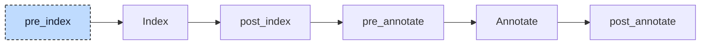

# Control Statements

The parser stores an `IF` and its `ELSIF` branches in one node. Later, the aggregate-return lowerer moves calls that return strings, arrays, or structs into separate statements. Each call must still run only when its condition is reached. For

```iecst
IF foo(counter) = 'Hello' THEN
    // ...
ELSIF foo(counter) = 'Goodbye' THEN
    // ...
END_IF
```

moving both calls before the `IF` would run `foo` twice even when the first condition is true. This participant gives each `ELSIF` a nested `IF` inside the preceding `ELSE`. The later lowerer can then place each call beside its own condition.



The participant runs once at `pre_index`. It moves parsed nodes and needs no index or annotations.

The participant visits each unit once. It first restructures a multi-condition `IF`, then visits its bodies, including the new nested `IF` statements. The rewrite therefore proceeds from the outside in. It also visits `CASE` and loop bodies without changing those nodes.

The participant exists only for the [aggregate-return lowerer](09-aggregate-return.md). Codegen compiles an `IF` with several condition blocks directly, and no other stage needs the split.


## Transformation

An `IF` with `n` condition blocks becomes `n` nested `IF` statements. The first condition stays in place. Each `ELSIF` becomes an `IF` in the previous level's `ELSE`. The original `ELSE` body moves to the innermost level:

```diff
 IF val = 1 THEN
     c := 'a';
-ELSIF val = 2 THEN
-    c := 'b';
-ELSIF val = 3 THEN
-    c := 'c';
 ELSE
-    c := 'x';
+    IF val = 2 THEN
+        c := 'b';
+    ELSE
+        IF val = 3 THEN
+            c := 'c';
+        ELSE
+            c := 'x';
+        END_IF
+    END_IF
 END_IF
```

Without an `ELSE`, the innermost `IF` has no `ELSE` body. The conditions and the bodies are the parser's nodes; only the wrapping `IF` nodes are new. Each one takes the location of the original `END_IF` as its own location and as its end location, and gets a fresh node ID. Because the conditions keep their locations, a debugger still stops on every `ELSIF` line, and the jump at the end of each nested `IF` points to the one `END_IF` the user wrote.

The [aggregate-return lowerer](09-aggregate-return.md) inserts extracted calls immediately before their containing statement. In the example, the second call now belongs inside the `ELSE`:

```diff
+alloca __foo0: __foo_return;
+foo(__foo0, counter);
-IF foo(counter) = 'Hello' THEN
+IF __foo0 = 'Hello' THEN
     ;
-ELSIF foo(counter) = 'Goodbye' THEN
-    ;
+ELSE
+    alloca __foo1: __foo_return;
+    foo(__foo1, counter);
+    IF __foo1 = 'Goodbye' THEN
+        ;
+    END_IF
 END_IF
```

Of these lines, only the `ELSE` and the nested `IF` are the work of this participant; the `alloca` lines and the rewritten calls come from the [aggregate-return lowerer](09-aggregate-return.md). In the generated code the second call sits in the `else` branch and runs only when the first condition is false.


## Interactions

The participant sees loops already in the `WHILE TRUE` form of the loop desugarer; their guard `IF`s have one condition block each and pass through unchanged. The CFC transpiler, which runs later, creates only single-block `IF` statements as well.

The aggregate-return lowerer is the one consumer that depends on the rewrite. It walks all conditions of an `IF` in the scope of the statement that contains the `IF`, so only a single-block `IF` gives every condition its own place for the calls moved out of it.

Participants that run later, such as the array lowerer, generate single-condition `IF` statements directly.
