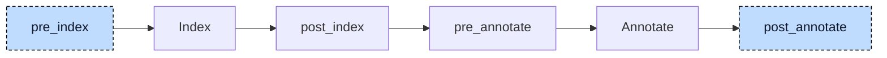

# Reference To Return

A function or method may declare `REFERENCE TO` as its return type. In

```iecst
FUNCTION referenceFunc : REFERENCE TO INT
    VAR_INPUT
        in : REFERENCE TO INT;
    END_VAR

    in := in + 1;
    referenceFunc REF= in;
END_FUNCTION
```

the caller can write `refVal REF= referenceFunc(refVal)`. Codegen cannot use a call directly on the right of `REF=`. The lowerer adds a result parameter that points to caller-owned storage. It replaces the call expression with setup statements, a call, and a reference to that storage. The callee copies the result value there; the caller receives a reference to the copy.



The participant uses two hooks. At `pre_index`, it records functions and methods with an inline `REFERENCE TO` return type. This must happen before pre-processing replaces that definition with a generated type name such as `__referenceFunc_return`.

At `post_annotate`, annotations identify callees and assignment targets. The index identifies return variables. The participant counts call sites per implementation and callee, rewrites declarations and bodies, then rebuilds the index and annotations.


## Transformation

### The callee

The callee loses its return type and gets a by-value `VAR_INPUT` variable named `__<pou>_return_val` at the front of its by-value input block. The variable's type is a generated named pointer type, `__referenceFunc__referenceFunc_return_val` here, that is a `REFERENCE TO` the original referenced type and is appended to the unit's type list. The `REF=` that assigns the return variable becomes a plain assignment, so the callee writes the value through the reference into the caller's storage:

```diff
-FUNCTION referenceFunc : REFERENCE TO INT
+FUNCTION referenceFunc
     VAR_INPUT
+        __referenceFunc_return_val : REFERENCE TO INT;
         in : REFERENCE TO INT;
     END_VAR

     in := in + 1;
-    referenceFunc REF= in;
+    __referenceFunc_return_val := in;
 END_FUNCTION
```

The name is the POU name with every `.` replaced by `_`, prefixed with `__` unless the name already starts with `__`: a method `fb.get` gets `__fb_get_return_val`, a function `__pick` gets `__pick_return_val`. When the callee has no by-value `VAR_INPUT` block, one is appended after its existing blocks. The caller always passes the reference as the first argument, so the rewrite expects the by-value input block to be the first block of the POU.

Only a `REF=` to the return variable is rewritten; a plain assignment to it becomes an empty statement. The type `__referenceFunc_return` that pre-processing generated for the original return type stays in the unit, unused.

### The caller

The caller gets two `VAR_TEMP` variables per call site: a reference and storage for the copied value. Their names are `__<callee>_return_val_N` and `__<callee>_return_val_store_N`; the reference uses the generated type `__<caller>__<callee>_return_val_N`. The counter starts at 1 for each callee in an implementation. A `VAR_TEMP` block is added if needed. The containing statement becomes an expression list: point the reference at storage, call the callee, then use the reference:

```diff
 FUNCTION main
     VAR
         refVal : REFERENCE TO INT;
         tmpVal : INT;
     END_VAR
+    VAR_TEMP
+        __referenceFunc_return_val_1 : REFERENCE TO INT;
+        __referenceFunc_return_val_store_1 : INT;
+    END_VAR

     refVal REF= tmpVal;
-    refVal REF= referenceFunc(refVal);
+    __referenceFunc_return_val_1 REF= __referenceFunc_return_val_store_1;
+    referenceFunc(__referenceFunc_return_val_1, refVal);
+    refVal REF= __referenceFunc_return_val_1;
 END_FUNCTION
```

After the call, `refVal` points to the generated storage. That storage holds a copy of the result. A write through `refVal` no longer changes `tmpVal`.

The same rewrite applies wherever the call stands: as an operand (`r := inst.get() + __pick(v)`), as the argument of another call (`r := twice(inst.get())`), or as the base of a member access after property lowering (`y := __fb___get_myStructuredVar_return_val_1.x`). A call used as a statement on its own keeps its third part as a bare reference expression, for which codegen emits a load whose result is not used. The generated statements go in front of the statement that is visited when the call is met.

### Nested calls

Nested calls are set up from the outside in and called from the inside out, because the outer call walks its arguments after it has queued its own setup and before it queues itself:

```diff
-refVal REF= doubleIt(addOne(refVal));
+__doubleIt_return_val_1 REF= __doubleIt_return_val_store_1;
+__addOne_return_val_1 REF= __addOne_return_val_store_1;
+addOne(__addOne_return_val_1, refVal);
+doubleIt(__doubleIt_return_val_1, __addOne_return_val_1);
+refVal REF= __doubleIt_return_val_1;
```

### Property getters

Property getters already exist as methods. For `PROPERTY_GET value : REFERENCE TO INT`, property lowering keeps `value REF= _value` and appends `__get_value := value`. This participant recognizes `value` as the getter's result. It changes the reference binding into a value copy through the result parameter and removes the appended return assignment:

```diff
-METHOD __get_value : REFERENCE TO INT
+METHOD __get_value
     VAR
         value : REFERENCE TO INT;
     END_VAR
+    VAR_INPUT
+        __fb___get_value_return_val : REFERENCE TO INT;
+    END_VAR

-    value REF= _value;
-    __get_value := value;
+    __fb___get_value_return_val := _value;
+    ;
 END_METHOD
```

A read `x := inst.value`, which the property lowerer has turned into `x := inst.__get_value()`, is then lowered like any other call. A setter has no return type and is not touched.

The generated variables and types take the location of the callee's return type; the generated statements and references take the location of the call they replace, and the wrapping expression list gets a fresh node ID.


## Interactions

The [property lowerer](02-property.md) creates the accessor methods and names used by getter handling. The resolver identifies qualified callees such as `fb.get`; the index identifies each POU's return variable.

The [init participant](06-init.md) runs next at `post_annotate`. It creates constructors for the generated pointer types and constructs result storage when its type requires it, such as a struct.

The [aggregate-return lowerer](09-aggregate-return.md) sees no reference return to rewrite: the function now returns `VOID`. Any string or struct result is in the caller's storage. Validation and codegen process the generated pointer parameter and temporaries using their usual rules.
