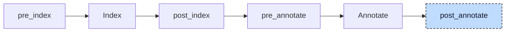

# Init

Codegen can place constant initial values in a global instance's static data. Other initialization needs executable code. In

```iecst
PROGRAM main
    VAR
        i: DINT := 1;
        counterInstance: Counter;
    END_VAR
END_PROGRAM
```

the `1` can be static data, but `counterInstance` can need member initialization, a method table address, reference bindings, and an `FB_INIT` call. The init participant generates constructor functions that perform this work through assignments and calls.



The participant runs once at `post_annotate`. It uses the index to identify types, stateful POUs, and `FB_INIT` methods, and to read evaluated array bounds and literals. It does not need the annotation map.

For each unit, the participant first registers its POUs and types. It then visits types, globals, `VAR_CONFIG` entries, and POUs. It collects three kinds of statements: type and POU constructor bodies, initialization at the start of a POU body, and unit initialization.

The participant appends constructor POUs and inserts stack initialization at the start of existing bodies. It removes non-constant array initializers from declarations, then rebuilds the index and annotations.


## Transformation

### Stateful POUs

Stateful POUs A program, function block, or class gets a `<Name>__ctor` function with an instance parameter named `self`. It visits members in declaration order. For each member, it calls the type constructor before applying the member's initializer. A function block or class then sets its method table pointer. An `FB_INIT` method declared by the POU runs last.

The constructor of the intro example holds `self.i := 1;` and `Counter__ctor(self.counterInstance);`. The constructor of its `Counter` function block, with a member `limit: INT := 10` and an `FB_INIT` method, is:

```diff
+FUNCTION Counter__ctor
+    VAR_IN_OUT
+        self: Counter;
+    END_VAR
+
+    __Counter___vtable__ctor(self.__vtable);
+    self.limit := 10;
+    self.__vtable := ADR(__vtable_Counter_instance);
+    self.FB_INIT();
+END_FUNCTION
```

The generated POU has an internal kind, `Init`, that the index registers like a function; `FUNCTION` is only the closest spelling. A derived function block starts its constructor with a call to the base constructor on the injected base member, `Base__ctor(self.__Base)`, and skips that member during the walk, so that the base and its `FB_INIT` run exactly once.

### Unit constructor

A source unit with initialization statements gets a constructor named `__unit_<file>_<hash>__ctor`. Included files do not. The file name is normalized to identifier characters; the hash uses eight hex digits from the full path. The body initializes globals, applies `VAR_CONFIG` entries, then constructs program instances:

```diff
+FUNCTION __unit_main_st_<hash>__ctor
+    gVal := 3;
+    __vtable_Counter__ctor(__vtable_Counter_instance);
+    main.child.hw := %IX1.0;
+    main__ctor(main);
+END_FUNCTION
```

The method table instances are global variables that the polymorphism lowerer added in a block behind the user's own, so they are constructed here like any other global, after them. `VAR_GLOBAL CONSTANT` blocks are skipped, because their values are static data only. Globals from included files are skipped too, and globals in an `{external}` block are skipped unless `--generate-external-constructors` is set.

### Types

Every user type gets a constructor as well. A struct constructs and initializes its fields exactly like a POU does its members, and an enum, a subrange, or a renamed scalar with a default assigns `self` directly. An alias type such as `TYPE MyPoint: Point; END_TYPE` calls the constructor of the type it renames. A struct literal is decomposed into one assignment per leaf; for a struct `Line` with the fields `start: Point;` and `stop: Point := (x := 5);` the constructor is:

```diff
+FUNCTION Line__ctor
+    VAR_IN_OUT
+        self: Line;
+    END_VAR
+
+    Point__ctor(self.start);
+    Point__ctor(self.stop);
+    self.stop.x := 5;
+END_FUNCTION
```

Built-in types, generic types, and variable-length arrays get no constructor. The types the pre-processor created for inline declarations, such as `__Refs_r` for the member `r` below, are user types too and get constructors like every other type; most of them are empty.

### References and pointers

A `REFERENCE TO` variable, an `AT` alias, and a hardware-mapped variable are initialized with `REF=`, because their initial value is an address, not a value; a `REF(...)` call in the initializer is unwrapped. A pointer keeps its `:=` with the `ADR` or `REF` call. Inside a stateful POU, a bare name in the initializer that is a member of that POU is qualified with `self.`:

```diff
 FUNCTION_BLOCK Refs
     VAR
         x: DINT;
         r: REFERENCE TO DINT REF= x;
         p: POINTER TO DINT := ADR(x);
     END_VAR
 END_FUNCTION_BLOCK
+FUNCTION Refs__ctor
+    VAR_IN_OUT
+        self: Refs;
+    END_VAR
+
+    __Refs___vtable__ctor(self.__vtable);
+    __Refs_r__ctor(self.r);
+    self.r REF= self.x;
+    __Refs_p__ctor(self.p);
+    self.p := ADR(self.x);
+    self.__vtable := ADR(__vtable_Refs_instance);
+END_FUNCTION
```

An alias `px AT x: DINT` gets `self.px REF= self.x` in the same way. For a variable declared `AT %IX1.2` the pre-processor has already injected the initializer `__PI_1_2`, the backing global of that address, so it gets `REF= __PI_1_2` here. A template address such as `%I*` gets no assignment in the POU constructor; the `VAR_CONFIG` entry that binds it becomes the assignment in the unit constructor shown above.

### Arrays

An array whose element type has a constructor gets a loop that constructs every element, one loop per dimension, so that defaults, method table pointers, and `FB_INIT` reach every element. The bounds are taken from the index as constants, because the declaration may name a constant of the declaring POU that does not resolve inside the constructor. The loop is written in the `WHILE TRUE` form that the loop desugarer would have produced, since that participant has already run:

```diff
 PROGRAM main
     VAR
         motors: ARRAY[0..3] OF Motor;
     END_VAR
 END_PROGRAM
+FUNCTION __main_motors__ctor
+    VAR_IN_OUT
+        self: __main_motors;
+    END_VAR
+
+    alloca __main_motors__idx0: DINT;
+    __main_motors__idx0 := 0;
+    WHILE TRUE DO
+        IF __main_motors__idx0 > 3 THEN
+            EXIT;
+        END_IF
+        Motor__ctor(self[__main_motors__idx0]);
+        __main_motors__idx0 := __main_motors__idx0 + 1;
+    END_WHILE
+END_FUNCTION
```

An array of a built-in type gets an empty constructor. An array literal that is not constant, such as `[five(), 2]`, cannot be static data: the participant assigns it in the constructor and removes it from the declaration, so codegen emits zeros for the global. A constant array literal stays in the declaration and is additionally assigned in the constructor, from the version the constant evaluator folded.

### Stack variables

Function and method locals, and `VAR_TEMP` variables in any POU, are initialized at the start of the POU body. These statements use no `self.` prefix. A function also constructs its return value when needed: `FUNCTION useLine: Point` with `localLine: Line` starts with `Line__ctor(localLine);` and `Point__ctor(useLine);`. `VAR_IN_OUT` variables use caller-owned storage and get no constructor call.

### Linkage

For external or included types and POUs, the participant declares constructors without bodies. The linker must find their definitions in the library. Calls are still generated where the types are used. `--generate-external-constructors`, also implied by `--constructors-only`, generates bodies for `{external}` items. This lets a library be built from its external declarations.


## Interactions

The participant depends on three earlier participants. The polymorphism lowerer (`post_index`) added the `__vtable` member, the `__vtable_<Name>` struct types, and the `__vtable_<Name>_instance` globals that the constructors assign and construct. The inheritance lowerer (`pre_index`) injected the `__<Base>` member that the base constructor call addresses. The reference-to-return participant is registered directly before it and generates new types and variables at `post_annotate`, and the init participant runs after it so that those get constructors too.

Pre-processing supplies names for inline types. Constant evaluation supplies array bounds and folded array literals.

Every later participant sees the constructors as ordinary POUs and processes their bodies. The inheritance lowerer rewrites the `self.__vtable` assignment of a derived block into `self.__Base.__vtable`, and the array lowerer turns the assignment of an array literal with non-constant elements in a constructor into one assignment per element.

[Codegen](../pipeline/05-codegen.md#initialization) handles constructor bodies with a few special rules. In `Init` and `ProjectInit`, assignment to an alias or `REFERENCE TO` stores an address. This permits `VAR_CONFIG` to bind hardware storage. Constructors have no debug information, and codegen errors identify their type. Validation skips POU-level checks for these generated kinds.

A unit that uses another unit's type calls its constructor; the linker supplies the definition. Merging units into one LLVM module also combines their `llvm.global_ctors` entries. The [Initializers](../internals/07-initializers.md) chapter follows this work alongside static initialization.
