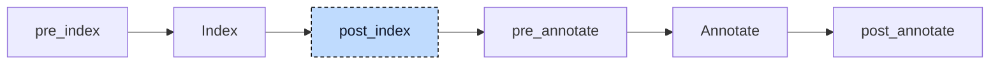

# Retain

`RETAIN` marks storage intended to survive a power cycle. The compiler places retained globals in the `.retain` linker section; the runtime must provide persistent storage. Program members need a rewrite because a linker section applies to a global symbol, not an individual struct field. In

```iecst
PROGRAM Main
    VAR RETAIN
        counter : INT := 5;
    END_VAR

    counter := counter + 1;
END_PROGRAM
```

`counter` is a member of the program instance. The participant moves its storage into a retained global and leaves an alias pointer in the instance. Codegen can then apply its usual rule for retained globals.



The participant runs once at `post_index`. A variable requires retained storage if its block has `RETAIN` or its type contains a retained member. The index follows nested structs, arrays, and aliases, with cycle detection. The participant uses that result.

For each unit, the participant visits globals and then POUs. It appends extracted variables to a `VAR_GLOBAL RETAIN` block, creating one if needed. It then rebuilds the index so that annotation sees the new globals and pointer types.


## Transformation

### Program variables

A program has exactly one instance, so a retained member can become a global of its own without a change in meaning. The variable's type and initializer move to a new global named `__<program>_<variable>__retain`. The variable itself stays in its block with the same name, but its type becomes an alias pointer to the global, and its initializer the global itself. The block loses its `RETAIN` modifier:

```diff
+VAR_GLOBAL RETAIN
+    __Main_counter__retain : INT := 5;
+END_VAR
+
 PROGRAM Main
-    VAR RETAIN
-        counter : INT := 5;
+    VAR
+        counter : __Main_counter__retain_ptr := __Main_counter__retain;
     END_VAR

     counter := counter + 1;
 END_PROGRAM
```

`__Main_counter__retain_ptr` is a named pointer type with automatic dereferencing, the same kind of node the parser produces for an `AT` alias such as `x AT y : INT`. It is registered as a user type scoped to the program. Its name comes from the global and not from the variable: the pre-processor has already extracted inline types under `__Main_<variable>`, so an inline array or struct in the retain block would clash with its own pointer type.

The body is not changed. The resolver treats an alias variable as automatically dereferenced, so `counter := counter + 1` reads and writes through the pointer. The rewrite applies to every block of the program that carries `RETAIN`, `VAR_INPUT` and `VAR_TEMP` included; a retained temporary becomes a local pointer that is set to the global at the start of every call.

### Function block instances

A retained member of a function block is not extracted. A function block can have many instances, and each one lives inside whatever declares it, so the participant keeps the `VAR RETAIN` block of the function block as it is and retains the container instead. A program variable whose type retains transitively is moved like a plain retained variable:

```diff
 FUNCTION_BLOCK Fb
     VAR RETAIN
         a : INT := 5;
     END_VAR
 END_FUNCTION_BLOCK

+VAR_GLOBAL RETAIN
+    __Main_x__retain : Fb;
+END_VAR
+
 PROGRAM Main
     VAR
-        x : Fb;
+        x : __Main_x__retain_ptr := __Main_x__retain;
     END_VAR
 END_PROGRAM
```

The whole instance lands in `.retain`, its non-retained members and its method table pointer included. The same happens for a struct with a member of type `Fb`, for an array of `Fb`, and for an instance nested several function blocks deep.

### Globals

Globals A global in a plain `VAR_GLOBAL` block whose type retains transitively is moved into the retain block; a global declared in `VAR_GLOBAL RETAIN` stays where it is:

```diff
 VAR_GLOBAL RETAIN
     explicit : Fb;
+    implicit : Fb;
 END_VAR

 VAR_GLOBAL
-    implicit : Fb;
     x : INT;
 END_VAR
```

Codegen would place `implicit` in `.retain` even without the move, because it asks the same transitive question for every global it emits. The move makes the answer visible in the lowered tree. A block created by the participant has an internal source location, internal linkage, and public access.

Function blocks, functions, and methods are otherwise left alone. Their `VAR RETAIN` blocks keep the modifier, and a `VAR RETAIN` in a function or method has no effect: the variable stays on the stack and no diagnostic is reported.


## Interactions

The polymorphism lowerer runs before this participant, so the `__vtable` member it adds to every function block ends in the retained instance. The retain flag comes from the parser, which accepts `RETAIN` on every block kind and parses `NON_RETAIN` without a record of it, through the indexer, which copies the flag of a block to each of its members. A struct member declared in a `TYPE` block and a return variable are never flagged themselves.

The [resolver](../pipeline/03-resolver.md) marks the replacement variable for automatic dereferencing. Codegen loads its pointer before each access.

The [init participant](06-init.md) binds each alias to its retained global. For example, the program constructor stores `@__Main_counter__retain` in the `counter` field. The unit constructor also initializes the retained global, so the declared initial value is written at every start. Retention across restarts therefore depends on how the runtime handles initialization.
