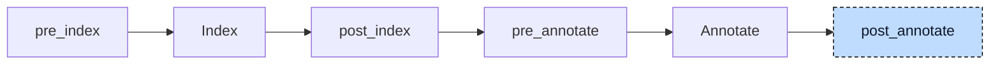

# Generic

A generic function declares an interface with type parameters. Each concrete implementation is a separate function. In

```iecst
FUNCTION times_two<T: ANY_NUM> : T
    VAR_INPUT
        val : T;
    END_VAR
END_FUNCTION
```

the template names the type parameter `T` and constrains it to `ANY_NUM`. Its implementations are ordinary functions such as `times_two__INT` and `times_two__REAL`, written in Structured Text or supplied by a library. Pre-processing creates the scoped type `__times_two__T`. The resolver initially records calls against the template.

Codegen cannot call a template. The generic lowerer works out the concrete type of every type parameter from the arguments and rewrites the call to the implementation name. When no implementation of that name exists, it declares one as an external function and leaves it to the linker to find it.



The participant runs at `post_annotate`. The index supplies template and parameter declarations. Annotations identify each callee and argument type.

Each pass visits call arguments before the call itself and skips generic template bodies. It collects declarations for missing implementations, appends them, and rebuilds the index and annotations. Passes continue until none changes the project. Even a project without generic calls performs one analysis round.


## Transformation

### A call to an existing implementation

A call to an existing implementation changes only the call operator. Arguments for a type parameter contribute candidate types, including through pointer, array, and variadic parameters. The widest candidate wins. The parameter's constraint sets a minimum: `USINT` for `ANY_INT` and `ANY_NUM`, or `REAL` for `ANY_REAL`. Thus `ANY_REAL` selects `REAL` for a `DINT` argument and `LREAL` for a `LINT`. String candidates use `STRING` or `WSTRING` without a length.

The implementation name is the template name, `__`, and the derived type of each type parameter in declaration order, `mix__INT__REAL` for `mix<T: ANY_INT, U: ANY_REAL>`:

```diff
-a := times_two(INT#100);
-b := times_two(2.5);
+a := times_two__INT(INT#100);
+b := times_two__REAL(2.5);
```

### A call without an implementation

A call without an implementation causes the participant to declare one. It copies the template signature, substitutes concrete types, and adds an external declaration to the template's unit. It creates at most one declaration per implementation name:

```diff
-c := times_two(DINT#7);
+c := times_two__DINT(DINT#7);
+
+{external}
+FUNCTION times_two__DINT : DINT
+    VAR_INPUT
+        val : DINT;
+    END_VAR
+END_FUNCTION
```

Later index runs keep the new declaration. Codegen emits `declare i32 @times_two__DINT(i32)`, and the linker must find its definition.

This is how library generics work. The standard library header declares `{external} FUNCTION LEN<T: ANY_STRING> : DINT` and nothing else. A call `LEN('abc')` becomes `LEN__STRING`, the participant declares it, and the linker resolves it against the library. A template marked `{external}` itself changes nothing: its implementations are external whether a hand or this participant declared them. Where the header provides a Structured Text implementation, such as `LEFT__STRING`, that one is used and nothing is declared.

> [!NOTE]
> The rewritten operator keeps the location of the original call, so diagnostics and debug information still point at `times_two(DINT#7)` in the source. The declared implementation takes the location of the template.

### Nested calls

Nested calls need more than one pass. In `times_two(times_two(a))` the inner call is rewritten first, but the annotation of the outer call's argument still says `__times_two__T`, so the outer call would offer a generic type and is left for the next pass. After the re-annotation the argument is an `INT`:

```diff
-a := times_two(times_two(a));
+a := times_two(times_two__INT(a));
```

```diff
-a := times_two(times_two__INT(a));
+a := times_two__INT(times_two__INT(a));
```

The third pass changes nothing and ends the loop. A call whose type parameter gets no offer at all, because no argument is bound to a parameter of that type, is skipped in every pass and stays a generic call.

Two kinds of call are never touched. Built-in generics such as `MUX`, `SEL`, `ADD`, or `SHL` are resolved by the resolver and generated inline by codegen, so there is no implementation to pick. A call inside the body of a generic template works on `T` itself, and a template is never generated; such a call stays as written, and the validator reports it as an unresolved generic type (E064).


## Interactions

Pre-processing gives each type parameter a scoped name and constraint. The index records the template's parameters. The resolver identifies the template at each call and records the argument types. This participant uses those three results to select an implementation.

The resolver and this participant share the same derivation of the concrete types and of the implementation name, so a built-in and a user generic resolve by the same rules. The CFC participant, which runs first, also uses that derivation to infer the types of the temporaries wired to generic blocks.

The [aggregate-return lowerer](09-aggregate-return.md) runs next and expects concrete signatures. It handles generated external declarations like user functions. For example, `MID__STRING : STRING` receives a result-buffer parameter and becomes `declare void @MID__STRING(ptr, ptr, i32, i32)`.

Codegen defines no function for a generic or external implementation and emits a declaration for every external one that is called. The uniqueness check of the validator skips generic functions, so several templates can share a name and differ only in their type parameters.

The pre-processor runs during each new index round and appends generic parameter types again.


## Validation

Before it rewrites a call, the participant checks every argument against the nature of its type parameter. A violation such as a `REAL` for `ANY_INT` is reported as E062, once per call, although the call is visited again in every pass. An integer for `ANY_REAL` is allowed, because it resolves to a real type. A call with a violation is left unresolved, so no implementation is declared for it and no follow-up diagnostic appears.

After rewriting, the call names a concrete function and no longer carries the template constraints. The participant must therefore check them first.
