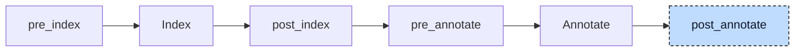

# Aggregate Return

A function or method can return a string, array, or struct. Such a result can occupy many bytes. The compiler passes it through caller-owned storage. In

```iecst
FUNCTION greet: STRING
    VAR_INPUT
        who: STRING;
    END_VAR

    greet := who;
END_FUNCTION
```

the caller writes `s := greet('world')`. The lowerer adds a `VAR_IN_OUT` result parameter to `greet`. At the call site, it allocates a result buffer, passes its address, then copies the result to `s`.



The participant runs once at `post_annotate`. The index identifies aggregate return types and parameter declarations. Annotations identify each callee and its argument types.

For each unit, the participant rewrites POU declarations, implementation bodies, and interface method declarations. It keeps the original index and annotations throughout this pass so that calls still describe the original signatures. It then rebuilds both.


## Transformation

### The callee

The callee gets a leading `VAR_IN_OUT` parameter with the POU's name. The AST keeps the return type but marks it as aggregate; the diff below shows the equivalent signature. The index no longer creates a separate return variable. Assignments to `greet` now write through the result parameter:

```diff
-FUNCTION greet: STRING
+FUNCTION greet
+    VAR_IN_OUT
+        greet: STRING;
+    END_VAR
     VAR_INPUT
         who: STRING;
     END_VAR

     greet := who;
 END_FUNCTION
```

Methods and interface methods are rewritten the same way, so a method `Named.getName: STRING` gets an in-out variable `getName`. Generic functions are skipped; only their concrete instances, which the generic lowerer created before, are rewritten. An inline return type such as `ARRAY[0..1] OF DINT` has already been replaced by the index pre-processing with a reference to a generated type, `__pair_return`, and that is the type the in-out variable gets.

### The caller

The caller gets one temporary of the return type per call. The containing statement becomes an expression list: allocate the temporary, pass it to the callee, then use it in the original statement. The internal `alloca` node is described in [Loop Desugar](01-loop-desugar.md):

```diff
-s := greet('world');
+alloca __greet0: STRING;
+greet(__greet0, 'world');
+s := __greet0;
```

The temporary is named `__<callee><N>` after the last part of the callee's name, so `inst.getName()` gives `__getName3`. `N` is one counter for the whole compiler run, shared by every temporary this participant creates.

The rewrite handles calls in comparisons, `IF` conditions, `CASE` bodies, and other calls. Setup appears before the containing statement. A standalone call leaves a bare reference to the result temporary. Built-ins such as `SEL` and `MUX` keep their own codegen paths.

### Nested calls

Nested calls are moved out from the inside out, because a call walks its arguments before it queues its own allocation and call:

```diff
-s := shout(greet('x'));
+alloca __greet1: STRING;
+greet(__greet1, 'x');
+alloca __shout2: STRING;
+shout(__shout2, __greet1);
+s := __shout2;
```

### Named arguments

When any argument of the call is written with `:=`, the temporary is passed by name too. The name is the return name of the callee, the in-out variable the callee just received:

```diff
-greet(who := 'formal');
+alloca __greet3: STRING;
+greet(greet := __greet3, who := 'formal');
+__greet3;
```

For a call through a function pointer, `fp^(inst)`, the temporary comes second, after the instance argument, and is named `__4` because the operator has no plain name.

### Pinned temporaries

An allocation node records whether its temporary is limited to the statement. Codegen reserves the stack slot at function entry and marks its lifetime from allocation to the end of the expression list. Non-overlapping temporaries can then share a slot.

When the address of the result leaves the statement, inside an argument of `ADR` or `REF` or on the right side of `REF=`, the temporary is pinned instead. It gets no such markers and lives for the whole function call:

```diff
-ptr := ADR(greet('pin'));
+alloca __greet5: STRING;
+greet(__greet5, 'pin');
+ptr := ADR(__greet5);
```

### Output assignments

The participant also rewrites output arguments of functions and methods. Normally, `result => i1` passes the address of `i1` directly. A temporary is needed if the output requires conversion, targets a bit such as `b.%X0`, or uses incompatible string capacities. For strings, this includes a sized/unsized mismatch or a callee buffer larger than the target.

In these cases the argument is replaced by a temporary of the parameter's type, and a copy-back assignment after the call lets codegen do its usual conversion, bit store, or length-capped copy:

```diff
-libFunction(inVar1 := 0, result => i1);
+alloca __libFunction_result6: REAL;
+libFunction(inVar1 := 0, result => __libFunction_result6);
+i1 := __libFunction_result6;
```

The temporary is named `__<callee>_<parameter><N>` and is always statement-scoped. Positional outputs are rewritten the same way. Outputs of aggregate type other than sized strings, literal arguments, and calls to function blocks or programs are left alone; codegen copies those outputs itself.

The allocation and the references to a temporary take the location of the call; the wrapping expression list takes the location of the statement it replaces and a fresh node ID. The in-out variable takes the location of the POU name.


## Interactions

The participant depends on most of the participants before it. The [loop desugarer](01-loop-desugar.md) has moved every loop condition into a guard `IF` inside a `WHILE TRUE` body, so a call in a loop condition is moved out inside the loop and runs on every iteration. The [control statement participant](04-control-statements.md) has split every `ELSIF` into a nested `IF`, so each condition has a statement list of its own for the calls moved out of it. The polymorphism lowerer wraps an interface instance capture in `ADR(...)`, which is one reason why `ADR` pins a temporary.

The [reference-to-return participant](05-reference-to-return.md) has already removed reference returns, so they are skipped here. The [init participant](06-init.md) has added calls such as `Point__ctor(origin)` for struct results. After this rewrite, that constructor fills the caller's buffer through the in-out parameter. Codegen only zero-fills the temporary before the call.

The generic lowerer has replaced a generic call by a call to a concrete instance, so `LEFT(s, 2)` reaches this participant as `LEFT__STRING`. Its return type `STRING[__STRING_LENGTH]` gives a 2049-byte temporary `__LEFT__STRING7: __LEFT__STRING_return`, and the copy into `s` is cut to the length of `s` like any string assignment.

Later stages see an ordinary void function with a pointer parameter. The index registers no return variable for a POU whose return type is marked as aggregate, and the in-out variable is its first declared parameter. Codegen passes `VAR_IN_OUT` parameters as pointers (see [Codegen](../pipeline/05-codegen.md), Functions), so a method `Named.getName` compiles to `void @Named__getName(ptr instance, ptr getName)` and the callee writes its result through the pointer like any in-out variable.

The inheritance lowerer, registered after this participant, descends into the expression lists it created; the array lowerer looks only at the top-level statements of a body and leaves these lists alone.
