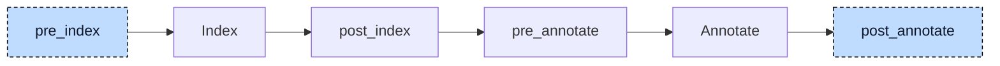

# Inheritance

A function block or class can extend another one and use the members of its base as if they were its own. In

```iecst
FUNCTION_BLOCK Base
    VAR
        counter : DINT;
    END_VAR
END_FUNCTION_BLOCK

FUNCTION_BLOCK Child EXTENDS Base
    counter := counter + 1;
END_FUNCTION_BLOCK
```

the resolver finds `counter` in `Base` and records `Base.counter`. Codegen needs an explicit path through the instance layout. The inheritance lowerer adds a first member, `__Base : Base`, to `Child`, then rewrites the assignment as `__Base.counter := __Base.counter + 1`.



At `pre_index`, the participant inserts a `__<Base>` member into every function block or class with `EXTENDS`. The index and resolver then process it like a declared member.

At `post_annotate`, it uses the index's base-type chains and the annotations on member accesses. The first pass replaces `SUPER`; the second inserts paths through embedded bases. Each reference is visited after its base, so nested accesses are completed from the inside out.

Afterwards the participant sends the project through annotate again. The index is not rebuilt, because this hook changes no declaration. The participant reports no diagnostics.


## Transformation

### Embedded base

The derived block gets a new local variable block with one variable, named after the base with a `__` prefix and typed with the base:

```diff
 FUNCTION_BLOCK Child EXTENDS Base
+    VAR
+        __Base : Base;
+    END_VAR
     VAR
         offset : DINT;
     END_VAR
```

The base member is first, so `%Child = type { %Base, i32 }` starts at the address of its `%Base` part. A chain `C EXTENDS B EXTENDS A` embeds `__B : B` in `C` and `__A : A` in `B`. The `EXTENDS` clause remains for index lookup. The new member and block have internal source locations.

### Inherited members

Inside the derived block, its methods, its actions, and the initializers of its variables, a member declared in a base is reached through the embedded base:

```diff
 FUNCTION_BLOCK Child EXTENDS Base
     VAR
-        offset : DINT := limit;
+        offset : DINT := __Base.limit;
     END_VAR

     METHOD reset
-        counter := 0;
+        __Base.counter := 0;
     END_METHOD

-    counter := counter + 1;
+    __Base.counter := __Base.counter + 1;
 END_FUNCTION_BLOCK
```

The lowerer identifies both the lookup type and the member's declaring type. An explicit base supplies the lookup type; a plain name uses the current POU, or its parent for a method or action. The annotation supplies the declaring type through a qualified name such as `Base.counter`.

If these types differ, the lowerer inserts one embedded-base step per link. For `a` declared in `A`, an access from `C` becomes `__B.__A.a`. Local members such as `offset`, globals, and local variables need no added path. Generated identifiers have internal locations; the original member keeps its source location.

### Access from outside

The same rule applies to an instance, a pointer, or an array element of the derived type, wherever it is used. The base expression has the type `Child`, the member's home is `Base`:

```diff
-child.counter := 3;
-child.step();
-pc^.x := 1;
+child.__Base.counter := 3;
+child.__Base.step();
+pc^.__Base.x := 1;
```

`child.step()` stays a direct call; it now names the method on the embedded part, `Base.step`. `THIS^.counter` inside `Child` is handled the same way and becomes `THIS^.__Base.counter`, because `THIS^` has the type `Child`.

### Method table pointer

Every function block or class carries a pointer, `__vtable`, to its method table, the struct of method addresses that the polymorphism lowerer builds for it. That lowerer adds the pointer only to blocks without a base, so in a derived block `__vtable` is an inherited member with home `Base`. The dispatch the polymorphism lowerer generated and the constructor the init participant generated are rewritten like user code:

```diff
-__vtable_Child#(THIS^.__vtable^).step^(Base#(THIS^));
+__vtable_Child#(THIS^.__Base.__vtable^).step^(Base#(THIS^));
```

```diff
 FUNCTION Child__ctor
     VAR_IN_OUT
         self : Child;
     END_VAR

     Base__ctor(self.__Base);
-    self.__vtable := ADR(__vtable_Child_instance);
+    self.__Base.__vtable := ADR(__vtable_Child_instance);
 END_FUNCTION
```

The call `Base__ctor(self.__Base)` already addressed the injected member when the init participant wrote it. After the rewrite, the one pointer in the root part of a `Child` instance points at the table of `Child`, which is what makes a call through a `REF_TO Base` reach the overriding method.

### `SUPER`

`SUPER^` denotes the base part of the current instance and becomes a reference to the embedded member; `SUPER` without `^` is a pointer to it and becomes `REF(__Base)`:

```diff
     METHOD describe : DINT
-        describe := SUPER^.describe() + 10;
+        describe := __Base.describe() + 10;
     END_METHOD

-    p := SUPER;
+    p := REF(__Base);
```

The base is the super class of the block whose body is walked, the parent block inside a method. The replacement takes the location of the keyword and keeps the original `SUPER` node as metadata, so that later checks can tell it apart from a user-written `__Base`. The new node is resolved on the spot with a resolver limited to that statement, so the second pass knows its type: `SUPER^.counter` needs no further step, while `SUPER^.z` with `z` declared in the grandparent becomes `__Base.__Grandparent.z`.

`SUPER` in a position where it is not valid, after a dot, as `.SUPER`, or as the target of a cast, is left as it is for the validator. A method called through `SUPER^` is a direct call of the base implementation, because the polymorphism lowerer does not route `SUPER` calls through the method table. This is how an overriding method calls the version it overrides.

### Call arguments

The name on the left of an argument assignment, `child(setpoint := 3)`, is not rewritten even when `setpoint` is declared in `Base`; the lowerer skips the left side of assignments inside a call. The name identifies a parameter, not a place in the struct. The resolver records with each argument how many `EXTENDS` steps lie between the called block and the parameter's home, and codegen emits the path itself.


## Interactions

The index supplies base-type chains. The resolver supplies the declaring POU of each member and the type of each base expression. The lowerer turns this information into explicit member paths.

Before this participant runs, `SUPER^` has no type, and the resolver resolves a member behind it, `SUPER^.text`, like a plain name in the current block. The earlier participants therefore see it annotated and rewrite it: the property lowerer turns `SUPER^.scaled` into `SUPER^.__get_scaled()`, and the aggregate-return lowerer moves `SUPER^.text()` into a temporary. Both results reach this participant as ordinary references and get their `__Base` steps here, so an inherited property read from outside ends as `child.__Base.__get_scaled()`.

Polymorphism uses the embedded base layout. A derived method table already names inherited implementations, such as `ADR(Base.step)`. This participant supplies the path to the table pointer, `THIS^.__Base.__vtable`. Casting the instance to `Base` is valid because that base occupies the first field.

The init participant writes `Base__ctor(self.__Base)` and skips the member during its walk, so the base is constructed exactly once. Every other statement of a constructor, such as `self.offset := self.__Base.limit`, is rewritten like user code.

This participant runs late so that it can rewrite member accesses introduced by property, polymorphism, initializer, and call lowering. Only the [array lowerer](11-array.md) follows.
