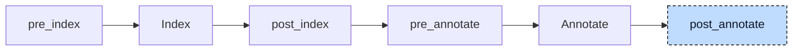

# Array

Codegen can copy an array literal such as `[1, 2, 3]` from one constant. A literal with runtime values needs executable statements instead. In

```iecst
PROGRAM main
    VAR
        readings: ARRAY[0..2] OF DINT := [sample(), 0, sample()];
    END_VAR
END_PROGRAM
```

the init participant moves the initializer into `main__ctor` as `self.readings := [sample(), 0, sample()];`. The array lowerer then splits it into element assignments. Large repeated segments can become loops.



The participant runs once at `post_annotate`, after all other participants. It uses the index for target array types, evaluated bounds, and constant names. It does not need annotations.

For each unit, it first resolves the `(N)(value)` repetition form in declarations and bodies. It then lowers array literal assignments at the top level of each body. Finally, it adds a `VAR_TEMP` block for generated loop counters.

The participant rebuilds the index and annotations. Validation and codegen use these final results.


## Transformation

### Element lists

An assignment whose right side is an array literal is lowered only when one element is not constant: a variable, a call, or a struct literal such as `(x := 1)`, which codegen cannot evaluate inside an array. Each element becomes an assignment to its own position, counted from the lower bound of the array. The left side is the original reference with an index appended; the element expression is the parser's node and keeps its location:

```diff
-self.readings := [sample(), 0, sample()];
+self.readings[0] := sample();
+self.readings[1] := 0;
+self.readings[2] := sample();
```

A literal with only constant elements is left alone and takes the `memcpy` path of codegen. The lowerer decides without the index, so a reference to a constant counts as a runtime value here. Such a literal never reaches it in a constructor, though: the init participant has already replaced it by the version the constant evaluator folded, in which every constant is a number.

### Repetition

The spelling `n(value)` repeats one element `n` times. Fewer than 32 repetitions are unrolled into one assignment each, with the element expression copied into every one of them, so a call is called once per element. From 32 repetitions on, the participant emits a counted loop in the `WHILE TRUE` form that the [loop desugarer](01-loop-desugar.md) would have produced, since that participant will not run again. The counter is a `VAR_TEMP` variable of the POU named `__literal_idx`, one per POU and shared by all such loops in it:

```diff
+VAR_TEMP
+    __literal_idx: DINT;
+END_VAR
-self.big := [40(sample())];
+__literal_idx := 1;
+WHILE TRUE DO
+    IF __literal_idx > 40 THEN
+        EXIT;
+    END_IF
+    self.big[__literal_idx] := sample();
+    __literal_idx := __literal_idx + 1;
+END_WHILE
```

for `big: ARRAY[1..40] OF DINT`. A literal may mix segments, `[2(a), b, 2(c)]`; each segment is lowered on its own at the position it occupies, and the threshold applies per segment, so `[10(v), 10(v), 10(v), 10(v)]` is unrolled into 40 assignments.

### Several dimensions

For `grid: ARRAY[0..1, 0..2] OF DINT`, the positions of the flat literal are converted into one index per dimension, the last dimension varying fastest and every index offset by its lower bound:

```diff
-self.grid := [sample(), 1, 2, 3, 4, sample()];
+self.grid[0, 0] := sample();
+self.grid[0, 1] := 1;
+self.grid[0, 2] := 2;
+self.grid[1, 0] := 3;
+self.grid[1, 1] := 4;
+self.grid[1, 2] := sample();
```

A repetition of at least 32 elements that fills a multi-dimensional array becomes nested loops. Each dimension gets a counter, named `__literal_idx_0`, `__literal_idx_1`, and so on. For `[40(sample())]` on `ARRAY[0..7, 1..5]`, the counters run over `0..7` and `1..5`. The innermost body assigns `self.big[__literal_idx_0, __literal_idx_1]`. A repetition that fills only part of such an array is unrolled.

### Constant multipliers

A constant can specify the repeat count: `[(N)(0.5)]`. The parser treats this as a call to a parenthesized expression. The lowerer looks up `N` in the enclosing POU or globals. If it is an integer constant, the call becomes a repetition node. This also applies to declaration initializers, which can then remain static data.

The generated assignments, loops, indices, and counters carry internal source locations; the copied left side and the element expressions keep the locations they had.


## Interactions

The [init participant](06-init.md) puts non-constant array initializers into constructors or the start of function bodies. These are top-level assignments, where this lowerer can find them. It also handles array literal assignments that the user writes at that level.

The [loop desugarer](01-loop-desugar.md) and the [control statement participant](04-control-statements.md) ran long before, so the generated `WHILE TRUE` loops and single-block `IF` guards are written directly in their final form.
