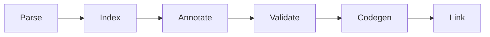
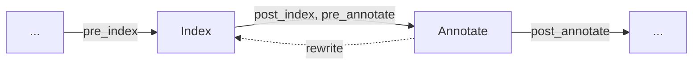

# Driver

The driver loads a project, runs the pipeline, and sends generated objects to the linker. This chapter explains the inputs and execution order.

## Project inputs

A project comes from a build description (`plc.json`) or from the positional arguments of a `plc` call. Its inputs fall into four groups:

1. **Sources** are parsed with internal linkage and compiled.
2. **Includes** (from `-i` or from library headers) are parsed with include linkage: their declarations are indexed, but no code is generated for them.
3. **Objects** are not parsed and go directly to the linker.
4. **Libraries** contribute headers as includes, and names and paths as link options.

## Pipeline

Each stage takes the result of the stage before it by value and returns a new value:

| Stage | Result |
|---|---|
| Parse | One compilation unit (AST) per source file, include file, and library header |
| Index | The units plus the global symbol table |
| Annotate | The units, the symbol table, and the annotation map with the resolved type of every expression |
| Validate | No new data; aborts the run if any diagnostic reached error severity |
| Codegen | One LLVM module per unit, persisted as object files |
| Link | The final artifact: executable, shared object, relocatable object, LLVM IR, or bitcode |

Before the pipeline runs, the driver loads the source files into memory. Later stages use these copies. It selects the diagnostic renderer (`--error-format`) and linker (`--linker`). Parsing is sequential. Indexing, annotation, and codegen process units in parallel, with the thread count set by `--threads`.

By default, codegen creates one LLVM module and object file per unit. The output path mirrors the source path under the build location. With `--single-module` or `-c`, the units are merged into one module. The output format then decides the final step: merge IR or bitcode, copy a single object, or run the linker.

## Participants

Participants lower language features by rewriting the AST. They receive the project at fixed *hooks*, points where the driver gives them access to the current result. A participant can read the project or return a rewritten one.

The solid edges name the hooks. Each stage has one hook before it and one hook after it. `pre_index` and `post_index` surround indexing. `pre_annotate` and `post_annotate` surround annotation. `pre_generate` and `post_generate` surround code generation. A participant implements only the hooks it needs. The dashed edge shows that a rewrite makes the index and the annotations stale, so the participant must run both stages again before it returns.

There are two kinds of participants:

- **Mutating participants** take the project by value and return a new one. They are the lowerers above and use the four hooks around index and annotate. The diagnostics they collect while they rewrite are gathered after the last `post_annotate` hook and reported with the validation diagnostics.
- **Read-only participants** get a shared reference and cannot change the project. They see all six hooks, plus one call per generated module. The only one by default is the codegen participant, which writes the modules to disk and links them.

The driver registers twelve mutating participants. Hook order determines when they run; registration order determines their order within a hook. Later participants can depend on earlier rewrites. The [Participants](../participants/README.md) chapters follow the registration order.

> [!NOTE]
> **Developer note.** The participant model started small. It gave a simple way to lower inheritance without a dedicated
> intermediate representation, and thus without a large architectural change. But the number of participants
> grew quickly, and today they are technical debt. Other compilers do not lower in the syntax tree, and the
> reasons are visible here:
>
> - **Order dependence.** All participants change one tree, and each one can depend on the rewrites before it. A different registration order can change the behavior of the program.
> - **Generated nodes.** Lowering adds constructors, normalized loops, and result parameters. Validation, diagnostics, and debug information must distinguish these nodes from source constructs through locations and metadata.
> - **Repeated analysis.** A rewrite can make a new index or a new annotation map necessary for the whole project. A plain build runs both stages nine times each; nested generics add more rounds.
> - **One tree, two forms.** The AST must hold both source constructs and their lowered forms. Each stage must know which form it gets.
> - **No fixed boundary.** Codegen uses the combined result of all participants, not a separate representation with a stable contract.
>
> Retrospectively a dedicated intermediate representation (IR) would have been the better fit. Today this is a big refactor and depending on whether or not we can allocate time to this, it may change.

## Where it lives

The driver is the `plc_driver` crate under `compiler/` and produces the `plc` binary.

| What | Where |
|---|---|
| Driver | `compiler/plc_driver` |
| Participants | `compiler/plc_lowering`, `compiler/plc_cfc`, `src/lowering/` |
| Project model | `compiler/plc_project` |

## What's next

The driver has loaded the source files. The [Lexer and Parser](01-lexer-parser.md) now turn their text into the tree used by later stages.
