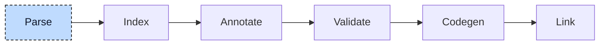

# Lexer and Parser

Parsing turns source text into an abstract syntax tree (AST). The tree records declarations, statement nesting, and operator precedence. Later stages use this structure to interpret the program.



The stage has two halves: the lexer cuts the character stream into tokens, and the parser builds the tree from them. The driver calls the pair once per source file, once per include file, and once for the built-in declarations that ship with the compiler. Every call produces one compilation unit, the tree of one file tagged with its linkage: internal for project sources, include for headers, built-in for the compiler's own declarations.


## Lexer

The lexer groups characters into tokens. In `foo := 1`, `foo` is an identifier, `:=` an assignment token, and `1` an integer literal. Each token records its kind, text, and byte range. The parser uses these tokens without having to recognize names, whitespace, or operators itself.

A table defines each token kind by a keyword or character pattern. Keywords such as `FUNCTION` are case-insensitive. At each position, the lexer selects the longest match. Thus `:=` becomes one assignment token.

Whitespace, comments (`(* *)`, `/* */`, `//`), and unknown pragmas in braces are matched and dropped, so the parser never sees them. The few pragmas the compiler understands (`{external}`, `{ref}`, `{constant}`, `{sized}`) are token kinds of their own.

The lexer is also where the parser's cursor lives. The parser holds a session that owns the lexer, the current token, the previous token, and a stack of closing keywords for error recovery. A step of the cursor pulls the next token and checks a few lexical rules on the way, for example that `END_IF` is written with an underscore.

For this file:

```iecst
FUNCTION compute: DINT
    compute := 1 + 2 * scale(bar, 3);
END_FUNCTION
```

the lexer emits:

| Token | Range | Text |
|---|---|---|
| KeywordFunction | 0..8 | `FUNCTION` |
| Identifier | 9..16 | `compute` |
| KeywordColon | 16..17 | `:` |
| Identifier | 18..22 | `DINT` |
| Identifier | 27..34 | `compute` |
| KeywordAssignment | 35..37 | `:=` |
| LiteralInteger | 38..39 | `1` |
| OperatorPlus | 40..41 | `+` |
| LiteralInteger | 42..43 | `2` |
| OperatorMultiplication | 44..45 | `*` |
| Identifier | 46..51 | `scale` |
| KeywordParensOpen | 51..52 | `(` |
| Identifier | 52..55 | `bar` |
| KeywordComma | 55..56 | `,` |
| LiteralInteger | 57..58 | `3` |
| KeywordParensClose | 58..59 | `)` |
| KeywordSemicolon | 59..60 | `;` |
| KeywordEndFunction | 61..73 | `END_FUNCTION` |
| End | 74..74 | |

Ranges are byte offsets into the file; the gap between `DINT` and the second `compute` is the newline and the indentation. `DINT` is an identifier, not a keyword, because type names are resolved later. An offset becomes a line and a column only when a node's location is created, through a table of newline offsets that the session builds once per file.


## Parser

The parser builds a compilation unit through recursive descent: a parsing function calls other parsing functions for the constructs it contains. A POU declaration can contain a variable block, which contains a variable declaration, which contains a type. The call stack follows this nesting.

The top-level parser dispatches on the current token. POU keywords start POU declarations. `TYPE`, `VAR_GLOBAL`, `VAR_CONFIG`, and `INTERFACE` start their corresponding declaration blocks. `ACTIONS` and `ACTION` start action bodies. A pragma marks the construct that follows: `{external}` sets its linkage, `{constant}` marks it as constant. Unexpected tokens are reported and skipped.

A POU becomes two separate things: the declaration (name, kind, return type, variable blocks, methods, properties) and the implementation (the statement list of the body). Later stages treat them as different objects. In pseudocode, the top level is:

```
loop {
    match token {
        Program | Function | FunctionBlock | Class => parse_pou(),
        Type                                       => parse_type(),
        VarGlobal                                  => parse_variable_block(),
        VarConfig                                  => parse_config_variables(),
        Interface                                  => parse_interface(),
        Actions                                    => parse_actions(),
        Action                                     => parse_action(),
        External | Constant                        => tag_next_construct(),
        EndActions | End                           => return unit,

        other => {
            report("Unexpected token: expected StartKeyword but found {other}");
            advance();
        }
    }
}
```

Expressions get one function per precedence level instead of one per construct. The chain runs from the loosest binding to the tightest: expression list, range, `OR`, `XOR`, `AND`, equality, comparison, addition, multiplication, exponent, unary, and last the leaf (a literal, a reference, a call, or a parenthesized expression). Each level parses its left operand with a call to the next tighter level, then loops while it sees one of its own operators.

This is why `1 + 2 * scale(bar, 3)` becomes an addition whose right side is a multiplication: the addition level hands control down to multiplication, which consumes `2 * scale(...)` as a whole before it returns. A parenthesized leaf calls back to the top of the chain and closes the recursion.

Every node gets a source location and a unique ID from a counter shared by all files in the run. Later stages use the ID to attach information without changing the node. In `foo := bar + 5`, child nodes are created before their parents:

```
Assignment {                                    // id: 7
    left: ReferenceExpr {                       // id: 2
        Member "foo"                            // id: 1
    },
    right: BinaryExpression {                   // id: 6
        operator: Plus,
        left: ReferenceExpr {                   // id: 4
            Member "bar"                        // id: 3
        },
        right: LiteralInteger 5,                // id: 5
    },
}
```


## Output

For this function:

```iecst
FUNCTION compute: DINT
VAR_INPUT
    bar: DINT;
END_VAR
VAR
    foo: DINT;
END_VAR
    foo := 1 + 2 * scale(bar, 3);
    compute := foo;
END_FUNCTION
```

the parser functions are called in this order and nesting. Each line names the function and the token under the cursor when it is entered. The stack is trimmed: a function that only hands the call down to the next level is not shown.

```
                                                       Parsing "FUNCTION compute: DINT"
parse_pou                                              at "FUNCTION"
  parse_return_type                                    at ":"
    parse_data_type_definition                         at "DINT"

                                                       Parsing "VAR_INPUT bar: DINT; END_VAR"
  parse_variable_block                                 at "VAR_INPUT"
    parse_variable_line                                at "bar"
      parse_data_type_definition                       at "DINT"

                                                       Parsing "VAR foo: DINT; END_VAR"
  parse_variable_block                                 at "VAR"
    parse_variable_line                                at "foo"
      parse_data_type_definition                       at "DINT"

                                                       Parsing "foo := 1 + 2 * scale(bar, 3);"
  parse_implementation                                 at "foo"
    parse_statement                                    at "foo"
      parse_expression                                 at "foo"
        parse_or_expression                            at "foo"
          ... one call per precedence level ...
            parse_multiplication_expression            at "foo"
              parse_unary_expression                   at "foo"
                parse_leaf_expression                  at "foo"    // consumes foo, sees ":=", parses the right side
                  parse_additive_expression            at "1"
                    parse_multiplication_expression    at "1"      // left operand of "+", returns after "1"
                    parse_multiplication_expression    at "2"      // right operand of "+", consumes "2 * scale(bar, 3)"
                      parse_unary_expression           at "2"
                      parse_unary_expression           at "scale"
                        parse_call_statement           at "scale"
                          parse_expression_list        at "bar"

                                                       Parsing "compute := foo;"
    parse_statement                                    at "compute"
      ...
```

and produces this compilation unit (locations and IDs omitted):

```
CompilationUnit {
    pous: [
        POU {
            name: "compute",
            pou_type: Function,
            return_type: DataTypeReference "DINT",
            variable_blocks: [
                VariableBlock { variable_block_type: Input(ByVal), variables: [ bar: DINT ] },
                VariableBlock { variable_block_type: Local,        variables: [ foo: DINT ] },
            ],
        },
    ],
    implementations: [
        Implementation {
            name: "compute",
            statements: [
                Assignment {
                    left:  ReferenceExpr { Member "foo" },
                    right: BinaryExpression {
                        operator: Plus,
                        left:  LiteralInteger 1,
                        right: BinaryExpression {
                            operator: Multiplication,
                            left:  LiteralInteger 2,
                            right: CallStatement {
                                operator: ReferenceExpr { Member "scale" },
                                parameters: ExpressionList [ ReferenceExpr { Member "bar" }, LiteralInteger 3 ],
                            },
                        },
                    },
                },
                Assignment {
                    left:  ReferenceExpr { Member "compute" },
                    right: ReferenceExpr { Member "foo" },
                },
            ],
        },
    ],
    user_types: [],
    global_vars: [],
    linkage: Internal,
}
```

`plc --ast <file>` prints this tree and stops before any later stage runs. The dump has more fields than the example above, but it does not print the ID or the location of a statement.

Graphical sources in XML (CFC, Continuous Function Chart) are not handled here. A separate crate reads the XML and produces the same compilation unit type, so from the index stage on both kinds of source look alike.

> [!NOTE]
> The unit stores `compute` twice: its declaration in `pous` and its body in `implementations`. The split exists because of actions. An action is a body that belongs to a POU, but the source can place it outside the POU, in an `ACTIONS` block. For
>
> ```iecst
> FUNCTION_BLOCK Counter
>     VAR
>         count: DINT;
>     END_VAR
>
>     count := count + 1;
> END_FUNCTION_BLOCK
>
> ACTIONS Counter
>     ACTION reset
>         count := 0;
>     END_ACTION
> END_ACTIONS
> ```
>
> the unit holds one POU, `Counter`, and two implementations, `Counter` and `Counter.reset`. Both bodies use the variables of `Counter`. One declaration owns several bodies, and each body is stored the same way, regardless of where it appears in the source. Two lists model this directly.


## Error handling

The parser does not stop at the first error. It collects the diagnostics in the session and continues, so that one run reports as many problems as possible.

Recovery works on regions. When a function starts a construct with a known end, such as a variable block that ends with `END_VAR` or a parenthesized expression that ends with `)`, it pushes the closing tokens on the session's stack. If parsing inside the region fails, the parser skips tokens until it finds one that closes the current region or an outer one, reports what it skipped, and continues after the region. A missing operand becomes an empty statement node, so the shape of the tree stays valid. For

```iecst
PROGRAM main
    VAR
        i: DINT
        text: STRING;
    END_VAR

    i := 1;
END_PROGRAM

FUNCTION scale: DINT
    scale := 2 *;
END_FUNCTION
```

the parser expects a semicolon after `i: DINT` and finds `text: STRING` instead. It reports the tokens it skips, continues with the body of `main`, and therefore also finds the missing operand in `scale`. One run reports both problems, here in the one-line format of `--error-format=clang`:

```
broken.st:4:9:{4:9-4:21}: error[E007]: Unexpected token: expected KeywordSemicolon but found 'text: STRING'
broken.st:11:17:{11:17-11:18}: error[E007]: Unexpected token: expected expression but found ;
error: Compilation aborted due to critical parse errors
Unexpected token: expected KeywordSemicolon but found 'text: STRING' at: broken.st:3:8:{3:8-3:20}:
Unexpected token: expected expression but found ; at: broken.st:10:16:{10:16-10:17}:
```

After a file is parsed, its diagnostics go to the diagnostician. If one of them has error severity, the stage aborts the whole run with "Compilation aborted due to critical parse errors". The abort carries the diagnostics of the file, which the last two lines print again. No unit reaches the index stage, not even the units of the files that parsed cleanly.


## Where it lives

| What | Where |
|---|---|
| Lexer | `compiler/plc_lexer` |
| Parser | `src/parser.rs`, `src/parser/`, `compiler/plc_parser` |
| AST | `compiler/plc_ast` |
| CFC | `compiler/plc_cfc` |


## What's next

The tree records syntax, but `scale` and `bar` are not yet connected to declarations. The [Index](02-index.md) collects those declarations into one symbol table. It also gives inline types such as `STRING[80]` names that later stages can look up.
