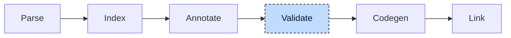

# Validation

After resolution, the index describes declarations and the annotation map describes expressions. Validation uses both to check language rules. In

```iecst
PROGRAM main
    VAR
        sintVar : SINT;
        dintVar : DINT;
    END_VAR

    sintVar := dintVar;
    sintVar := unknown;
END_PROGRAM
```

the first assignment narrows a `DINT` to a `SINT`, which can lose data. The second uses an undeclared name. Validation reports a warning for the downcast and an error for the unknown reference.



The stage receives the annotated project: the units after all lowering, the global index, and the annotation map. It produces no new data. Its only output is the list of diagnostics, which it hands to the diagnostician as it goes. If any diagnostic reached error severity, the run stops after the walk with "Compilation aborted due to critical errors"; otherwise the project goes on to codegen unchanged. `plc --check` runs the pipeline up to here and exits.


## Two sources of facts

The index describes declarations, such as parameter lists, constant variables, and base types. The annotation map identifies expressions and their types. Some checks need both. A private-member check uses the annotation to identify the member and the index to determine whether the current POU may access it.

The validator carries both, with the name of the POU it is in, in a small context that travels down the walk:

```rust
pub struct ValidationContext<'s, T: AnnotationMap> {
    /// What every expression is and what it should become
    annotations: &'s T,

    /// What every name declares
    index: &'s Index,

    /// The POU whose declarations or body are being validated
    qualifier: Option<&'s str>,

    // ... other omitted fields
}
```

Every failed check produces a diagnostic. Trimmed to what matters here, it is a message, an error code, and where in the source it applies:

```rust
pub struct Diagnostic {
    /// The description of the problem, as shown to the user
    message: String,

    /// The code that identifies the rule, such as E037
    error_code: &'static str,

    /// Where the problem is
    primary_location: SourceLocation,

    /// Other places that take part in it, such as the second declaration of a duplicate name
    secondary_locations: Option<Vec<SourceLocation>>,

    // ... other omitted fields
}
```

The validator only collects these; what a code means for the build is decided later, see Severity and reporting below.


## Global validation

Some rules concern the project as a whole and cannot be checked file by file. For

```iecst
(* a.st *)
FUNCTION scale : DINT
END_FUNCTION

(* b.st *)
FUNCTION scale : DINT
END_FUNCTION
```

neither file is wrong on its own; the conflict only exists in the merged index. Global validation therefore runs once, before any unit is walked, and reads only the index. It checks that:

- **Names are unique** within their group: callables, types, and global variables. Every declaration of a duplicate is reported, with the others as secondary locations. Built-in names such as `ADD` count too.
- **Data structures are finite.** A struct that contains itself by value, an alias chain that loops, or interfaces that extend each other are reported.
- **Template variables** (`AT %I*`) are configured exactly once in a `VAR_CONFIG` block.
- **Overflowing constants**, such as `TOO_BIG : SINT := 300`, get the reason the index stored reported as a warning.


## Per-unit validation

Everything else is checked unit by unit, in the order in which the units were parsed. Inside a unit the walk follows the shape of the compilation unit: the POU declarations first, then the user types, the `VAR_CONFIG` blocks, the global variable blocks, the implementations, and last the interfaces. Declarations and bodies are validated separately, as they are stored.

POU checks depend on the kind. A program cannot return a value, and a class cannot have input or output parameters. Inheritance checks require existing base types and interfaces, matching method signatures, and implementations for abstract methods.

Variable checks cover declared types, initializer compatibility, constant array bounds, and names that shadow base members. They also check restrictions on constant function block instances. The statement visitor checks initializers because they are expressions.

An implementation is walked statement by statement. The visitor is recursive and mirrors the tree: it visits the children of a node first, then applies the checks for the node itself. A reference is checked for resolution, visibility, and pointer access. An assignment compares the type of the value with the hint the resolver attached to it. A call is matched against the parameters of the callee from the index: argument count, direction of `:=` and `=>`, by-reference arguments, and required `VAR_IN_OUT` arguments. Control statements check their conditions and walk their bodies. For

```iecst
FUNCTION_BLOCK Buffer
    VAR_INPUT
        limit : INT;
    END_VAR
    VAR_IN_OUT
        target : DINT;
    END_VAR
    VAR
        count : DINT;
    END_VAR
END_FUNCTION_BLOCK

ACTIONS Buffer
    ACTION reset
        count := 0;
    END_ACTION
END_ACTIONS

PROGRAM main
    VAR CONSTANT
        MAX : DINT := 10;
    END_VAR
    VAR
        bufferInstance : Buffer;
        i : DINT;
        text : STRING;
    END_VAR

    MAX := 11;
    text := i;
    bufferInstance(limit := 5);
    bufferInstance.count := 3;
    bufferInstance.reset;
END_PROGRAM
```

the body of `main` produces one diagnostic per statement, each from a different combination of the two sources:

```
    MAX := 11;
    ^^^                           E036  annotation: main.MAX is a constant variable
    text := i;
    ^^^^^^^^^                     E037  annotation: i is DINT, its hint is STRING; the index says the types are not compatible
    bufferInstance(limit := 5);
    ^^^^^^^^^^^^^^                E030  index: Buffer has the VAR_IN_OUT target, and no argument was matched to it
    bufferInstance.count := 3;
                   ^^^^^          E049  annotation: Buffer.count is a local variable; index: main is neither Buffer nor a child of it
    bufferInstance.reset;
                   ^^^^^          E095  annotation: the reference resolves to the action Buffer.reset, but the statement is not a call
```

Declarations with external or include linkage belong to another compilation and are skipped. Generated nodes with internal locations are trusted. Built-ins use placeholder parameter types, so general argument checks do not always apply. Built-ins such as `ADR`, `REF`, and `SEL` provide their own validation rules.


## Severity and reporting

Every diagnostic carries an error code, and the code decides how serious it is. A registry maps each code to a default severity: `E048` (unresolved reference) is an error, `E067` (implicit downcast) is a warning, `E060` (a hint to use direct access) is informational, and a few codes are ignored by default. `plc explain E067` prints the description behind a code. The defaults can be overridden per project with a JSON file passed as `--error-config`:

```json
{ "error": ["E067"], "ignore": ["E048"] }
```

With this file the downcast in the introduction aborts the compilation and the unknown name is not even printed.

The validator reports diagnostics after global validation and after each unit. The diagnostician assigns severity, resolves source locations, and renders messages in the selected `--error-format`. The stage keeps the highest severity across batches and stops after the last unit if it is an error.


## Validation in participants

Some checks must run before lowering removes the original construct. Properties become methods, interface variables become pointer structs, and generic calls become concrete calls. The final validator cannot recover all original rules from those forms.

Those rules are checked by the participant itself, before it rewrites the tree. The participant keeps its diagnostics until the last `post_annotate` hook has run, and the stage handles them before global validation, so they appear at the top of the output.

> [!NOTE]
> **Developer note.** Participants rewrite the source tree in place. Checks that need the original construct must run before that rewrite. The [Driver](00-driver.md) chapter explains the hook order.


## Where it lives

| What | Where |
|---|---|
| Validator | `src/validation.rs`, `src/validation/` |
| Diagnostics | `compiler/plc_diagnostics` |


## What's next

If no error stops the run, the lowered project proceeds to [Codegen](05-codegen.md). Its expressions have types and conversion hints, but still need memory layouts and LLVM instructions.
