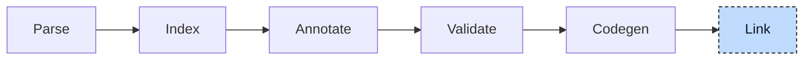

# Linker

Linking joins the object files that codegen produced into one artifact. For

```iecst
(* scale.st *)
FUNCTION scale: DINT
    VAR_INPUT
        value: DINT;
    END_VAR

    scale := value * 2;
END_FUNCTION

(* main.st *)
PROGRAM main
    VAR
        i: DINT;
    END_VAR

    i := scale(i);
END_PROGRAM
```

the object for `main.st` contains a call to `scale`; the object for `scale.st` defines it. The linker combines the objects and libraries, resolves symbols, and writes an executable, shared object, or combined object.



The compiler does not link by itself. It assembles a command line and runs a linker that is installed on the system, in the same way a C compiler driver does. The stage receives the objects that codegen persisted, together with the objects and libraries named by the project, and returns the path of the artifact.


## Inputs

The linker receives generated objects, object files supplied directly, and libraries. It finds libraries through `-l` names and `-L` or project search paths. Include files supplied declarations during parsing; the corresponding library binaries supply their definitions here.


## Output formats

The output format is chosen on the command line and decides whether a linker runs at all:

| Flag | Result | How |
|---|---|---|
| default | executable | linker, `-o <output>` |
| `--shared` | shared object | linker, `--shared -o <output>` |
| `--relocatable` | one object combining all inputs | linker, `-r -o <output>` |
| `-c` | one object, no linking | the single object is copied to the output path |
| `--ir`, `--bc` | one LLVM IR or bitcode file | the modules are merged in memory and written; no linker |

A shared object is linked with `--no-undefined`, so that a symbol nobody defines fails the build instead of the load of the library; `--allow-undefined-symbols` turns this off for libraries whose loader provides the missing symbols. `--fno-pic` on an executable adds `-no-pie`, so that the linker accepts the fixed-address code codegen emitted.


## Choosing the linker

Without a `--linker` flag the compiler looks for a linker in a fixed order: `cc`, then `clang`, then `ld.lld`, then `ld`. The first two are compiler drivers: they know the platform's startup files and default libraries and add them on their own, so an executable linked through them can start. The last two are direct linkers that take only what they are given. `--linker <command>` skips the search.

The compiler checks a candidate driver by linking an empty C program with the selected `--target` and `--sysroot`. Cross-compilation requires the target's libraries in the sysroot.

A direct linker receives `--linker-arg` values unchanged. A compiler driver receives them through `-Xlinker`. With a driver, `--nocrt` and `--nolibc` omit startup files and default libraries for targets that supply their own.


## The command line

The command starts with the driver and the arguments it needs itself, then the supplied and generated objects, then the `-L` paths and the `-l` libraries. The sysroot and implicit search paths follow, then linker options, mode, and output path. For the two-file example with a library:

```
cc -fuse-ld=lld build/scale.st.o build/main.st.o -L/opt/plc/lib -liec61131std -L. -Lbuild -o out
```

The command is written to the debug log before it runs, and `--log-level debug` shows it. The linker's own output goes to the terminal unchanged, and a non-zero exit code becomes the diagnostic E077, "An error occurred during linking". When the project comes from a build description, the `build` subcommand ends by copying every library marked as `Copy` next to the artifact, so that the result can be deployed as one directory.

> [!NOTE]
> **Developer note.** The linker is an external process, found on the `PATH` at run time. A working installation needs at least one of `cc`, `clang`, `ld.lld`, or `ld`, and the exact behavior of a link depends on which one is found. The `--script` and `--no-linker-script` flags are left over from a built-in linker script that is no longer used; a script is only added to the command when the user passes one.


## Where it lives

| What | Where |
|---|---|
| Linker | `src/linker.rs`, `src/output.rs` |
| Link step | `compiler/plc_driver` |


## What's next

The pipeline has turned source text into an artifact. Along the way, participants introduced constructor functions, method tables, and normalized loops. The [Participants](../participants/README.md) chapters explain those rewrites and the order they require.
