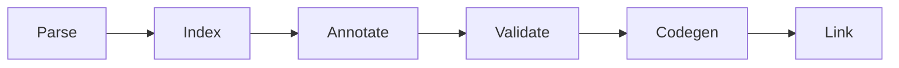

# Pipeline

The pipeline turns source text into machine code. Each stage uses the previous stage's result: syntax first, then declarations, expression types, validation, and generated code. Read these chapters in order to follow that process.

| Chapter | Turns | Into |
|---|---|---|
| [Driver](00-driver.md) | command line and project file | the run of all stages below, with participants hooked in between |
| [Lexer and Parser](01-lexer-parser.md) | source text | one syntax tree per file |
| [Index](02-index.md) | the declarations of all trees | one symbol table for the whole project |
| [Resolver](03-resolver.md) | every expression | an annotation that says what it is and what it must become |
| [Validation](04-validation.md) | index and annotations | diagnostics; errors stop the run |
| [Codegen](05-codegen.md) | the annotated trees | one LLVM module and object file per unit |
| [Linker](06-linker.md) | the object files and libraries | an executable, a shared object, or one combined object |

Every chapter closes with a "Where it lives" table that names the crates and modules of its stage.
