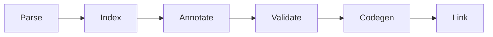

# Pipeline

This chapter walks you through the pipeline, which turns source text into machine code with each stage using the result of the stage before it.

It follows that order. The driver reads the command line and the project file and runs everything; the lexer and parser build one syntax tree per file; the index collects the declarations of every tree into one symbol table; the resolver annotates each expression with what it is and what it must become; validation turns the index and the annotations into diagnostics, where an error stops the run; codegen writes one LLVM module and object file per unit; and the linker joins those objects with the libraries into the artifact.

Read the subchapters from the top to follow one compilation from source to binary. Each of them closes with a table that names the crates and modules of its stage.
