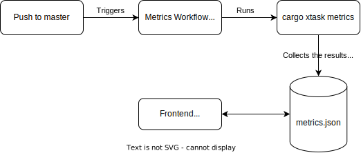

# RuSTy xtasks
This directory contains the following [tasks](https://github.com/matklad/cargo-xtask):
- `metrics`: Runs various benchmarks, collects them and (if ran by a CI) appends the collected data to the [`metrics.json`](https://github.com/PLC-lang/rusty/blob/metrics/metrics.json) file.
 The given JSON file is then used by our [metrics dashboard](https://plc-lang.github.io/metrics/) to track and diplay RuSTys performance over time. Graphically the workflow looks as follow:

    

foo